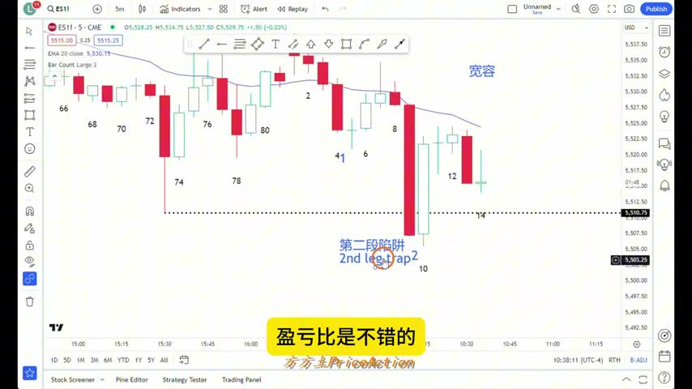
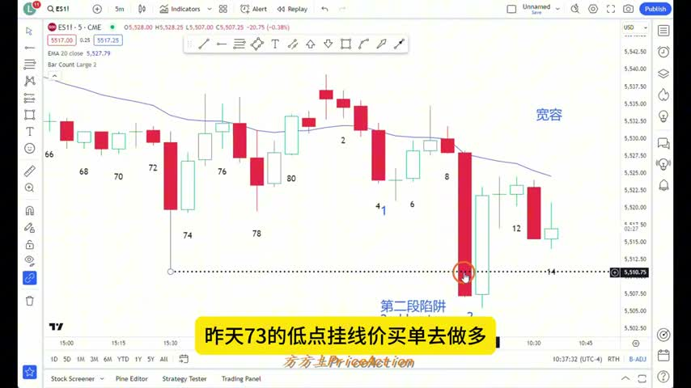
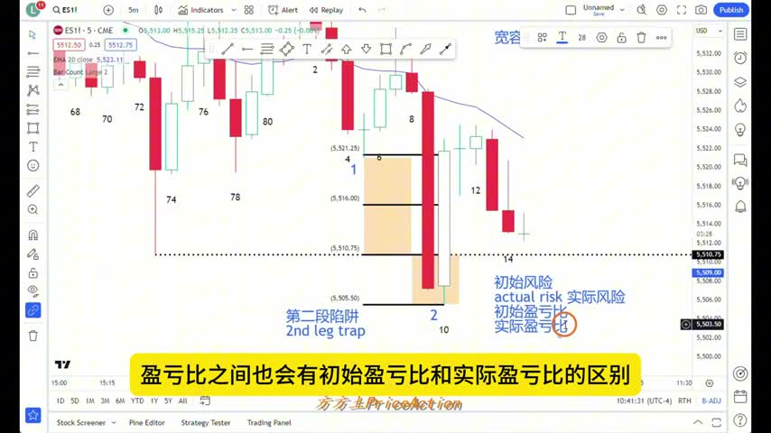
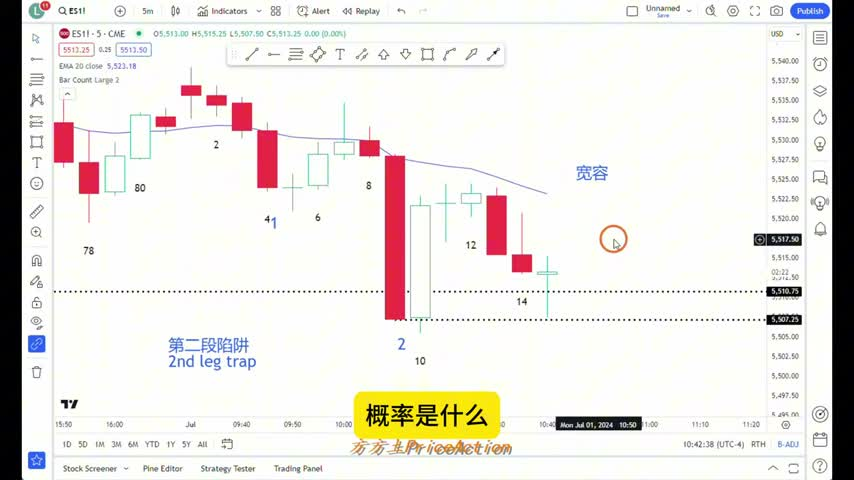

# 《【价格行为学】边做边讲(13): 一个视频彻底搞懂震荡行情》复盘笔记

来源视频：
[YouTube 原视频](https://www.youtube.com/watch?v=1Im5C_y-LVo&list=PLrCXUGuTXtGKrbsxteAGwDwVht1tghRe2&index=21)


说明：
本文基于视频内容和本地自动转录整理而成，重点保留交易逻辑、价格行为判断和复盘价值。个别口语化表述可能与原话略有差异，但不影响核心结论。

## 一句话结论

这期视频的核心不是“预测市场”，而是理解：

**在一个已经很明确的 trading range（震荡区间）里，大多数 breakout（突破）尝试都会失败。**

真正重要的不是看到大阴线或大阳线就追，而是判断：

1. 这根 K 线出现在区间的什么位置
2. 后面有没有足够强的 follow-through（跟随）
3. 多头和空头接下来最可能分别做什么

---

## 视频主线

作者用一笔真实的左侧做多交易，讲清楚了 5 件事：

1. 为什么这根看起来很吓人的大阴线，未必是真突破
2. 为什么在震荡区间下沿，第二段下跌经常是 trap（陷阱）
3. 为什么 trading range 里缺口和极端收盘，常常会被很快回补
4. 为什么大信号 K 线反而经常不是好机会
5. 为什么 50% 回撤位在震荡行情里非常关键

---

## 视频关键截图

说明：
这一版是本地复盘版，下面的截图引用的是当前工作区里的本地图片文件，适合你在本地仓库里直接回看。

下面这几张图直接截自原视频，适合先看画面，再对照后面的复盘要点去理解。

### 1. 震荡区间里的 `second leg trap`



这一张最适合配合下面的“Second leg trap（二段陷阱）”一起看。重点不是大阴线本身，而是它出现在区间下沿附近，并且很容易变成追空盘的陷阱。

### 2. 左侧挂单做多的位置



这里能直观看到作者讲的不是追突破，而是在前低附近用限价单去接，核心前提是：他判断这更像区间下沿的失败突破，而不是趋势启动。

### 3. 初始风险和实际风险的区别



这张图对复盘很有帮助，因为它把 `initial risk` 和 `actual risk` 画得很直观。也能更清楚地理解：为什么大信号 K 线常常会把止损拉得太宽。

### 4. 价格回到关键收盘位附近后的行为



这一张适合配合“回测前低、补缺口、回到关键收盘价附近”的逻辑来看。你复盘时可以重点观察：价格跌破后，市场是否真的给出了顺畅的 follow-through。

---

## 核心图解

### 1. 震荡区间里的假突破

```text
上沿阻力
┌──────────────────────────┐
│                          │
│        震荡区间          │
│                          │
└───────┬───────────────┬──┘
        │               │
   前低/下沿        假突破下破
                    ↓
                 很快收回
```

要点：

- 在成熟的震荡区间里，市场更容易来回拉扯，而不是单边流畅推进。
- 所以“看起来很强”的下破，先不要急着当成趋势启动。
- 先看 follow-through。如果后面没有继续顺畅下跌，这次突破大概率就不可靠。

### 2. Second leg trap（二段陷阱）

```text
第一次下跌 → 反弹 → 第二次下跌

1st leg down   bounce   2nd leg down
     ↓           ↑            ↓
```

作者强调：

- 在震荡区间下沿，第二段下跌看起来往往最吓人。
- 但恰恰因为它“看起来太像要崩了”，很多人会在这里追空。
- 如果这里缺少后续跟随，这批追空盘很容易被套，随后反而推动市场反弹。

### 3. 为什么 50% 是关键价位

```text
大阴线高点
│
│
├──── 50% 回撤位
│
│
大阴线低点
```

50% 关键的原因不是“神奇数字”，而是行为逻辑：

- 在低位追空的人，如果价格回到大阴线 50% 附近，很多人已经能明显减少亏损，甚至接近平出。
- 空头会在这里买回平仓。
- 多头也知道空头会在这里平仓，所以会提前在附近挂买单做 scalp（剥头皮）。
- 结果就是：50% 附近很容易出现反弹。

---

## 这笔实盘交易在做什么

作者当时做的是一笔**左侧做多**，不是追趋势。

入场逻辑主要有两个：

1. 价格来到震荡区间下沿，接近前一天低点
2. 当前下跌很像一次 second leg trap，而不是高质量 breakout

目标逻辑：

- trading range 里不容易留下缺口
- 所以这次下跌留下来的空间，大概率至少会回补一部分
- 目标先看回测前低、补掉缺口

止损逻辑：

- 如果真的是有效突破，就要接受判断错误，及时止损
- 这也是为什么这类左侧交易虽然赔率不错，但执行要求很高

---

## 视频里反复强调的判断标准

### 1. 大阴线本身不等于一定能追空

作者的判断不是“这根 K 线大，所以空”，而是：

- 这根大阴线出现在震荡区间里
- 它的位置靠近区间下沿
- 后续跟随并不强

所以结论是：

**看起来越强的单根 K 线，在震荡区间里越要防它是陷阱。**

### 2. 大信号 K 线，反而可能不是好机会

如果一根信号 K 线太大，会出现两个问题：

1. `stop loss` 会被迫放得很远
2. 目标空间反而不够，导致 reward/risk 不好

视频里的意思很明确：

- 如果一根大阳线或大阴线已经把价格直接打到区间中部甚至靠近另一侧
- 那么再追，往往只剩下差不多 `1:1` 的空间
- 这种机会不值得普通交易者去做

### 3. 震荡区间最典型的特征：极端会被拉回

作者用了非常典型的一句话逻辑：

- 大阴线收盘后容易被买起来
- 大阳线收盘后容易被卖下去

这不是因为市场“神秘”，而是因为：

- 趋势追单容易被套
- 被套的一方会平仓
- 另一边会提前利用这些平仓需求做反向单

### 4. 看不清信号 K，就降级别

如果在 5 分钟图上：

- K 线太大
- 信号太晚
- 止损太宽

那就可以切到更小周期去找更早的入场触发。

这不是为了“更精准预测”，而是为了：

- 把风险压小
- 让入场更合理
- 避免在已经走完一大段后再去追

---

## 对新手最重要的提醒

作者虽然演示了左侧做多，但并不推荐新手直接模仿。

原因很现实：

1. 左侧交易对执行力要求很高
2. 一旦判断错了，必须愿意立刻止损
3. 很多人不是输在分析，而是输在“不认错”

视频里反复提醒的风险点：

- 不要因为震荡区间“通常会回来”，就无脑扛单
- 不要因为“多数突破会失败”，就认为所有突破都会失败
- 不要把理解市场行为，误解成必须复制大资金的做法

作者明确区分了两件事：

1. 你可以理解为什么大资金会这样做
2. 但不代表你的资金规模、执行能力和风险承受力，也适合同样做法

---

## 这期视频最值得带走的 8 条规则

1. 先判断是不是 trading range，再决定能不能追 breakout。
2. 在震荡区间边缘，第二段突破尤其容易失败。
3. 单根大阴线或大阳线，必须配合 follow-through 才有趋势价值。
4. 大信号 K 线如果让止损过大，通常就不是好交易。
5. 50% 回撤位重要，是因为那里会集中出现 trapped traders 的平仓行为。
6. 震荡区间里，前低、前高、前收盘价、50% 回撤位都很关键。
7. 如果高一级别信号太晚，可以降周期找更合理的 trigger。
8. 左侧交易可以有高赔率，但不适合执行力差、止损不坚决的人。

---

## 一页复盘模板

以后你看到“震荡区间里的大阴线/大阳线”，可以直接按下面复盘：

### A. 先问位置

- 这根 K 线出现在区间上沿、下沿，还是中间？
- 如果在区间中间，继续追的空间还大吗？

### B. 再问跟随

- 后面有没有连续 follow-through？
- 还是下一根很快就被反向吞掉？

### C. 再问谁会被套

- 现在追空的人，如果价格回到 50%，他们会不会急着走？
- 现在追多的人，如果价格跌回前收盘，他们会不会恐慌离场？

### D. 最后问自己

- 这笔单的 `reward/risk` 真的够好吗？
- 这是一笔适合我的交易，还是只是“看起来很刺激”？

---

## 我对这期视频的提炼结论

如果把整期视频压缩成一句交易语言，就是：

**在震荡区间里，先读懂 trapped traders，再决定要不要出手。**

因为真正推动短线波动的，很多时候不是“趋势本身”，而是：

- 追错的人怎么解套
- 反向的人在哪里提前埋伏
- 市场是否愿意给出真正的 follow-through

这也是为什么作者一直在讲：

**不要只看 K 线形状，要看它出现在什么位置，以及后面的人会怎么做。**

---

## 适合复盘时反复看的三句话

1. 震荡区间里，多数 breakout 会失败。
2. 大信号 K 线不一定是好机会，尤其当它已经把空间走完时。
3. 50% 回撤位重要，不是因为指标，而是因为人性和仓位行为。
