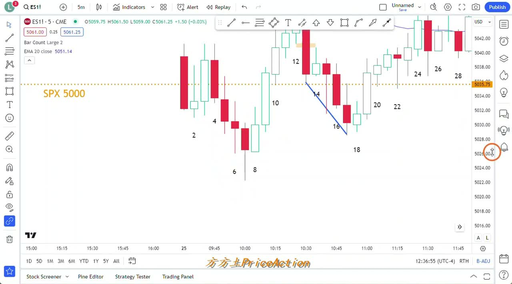
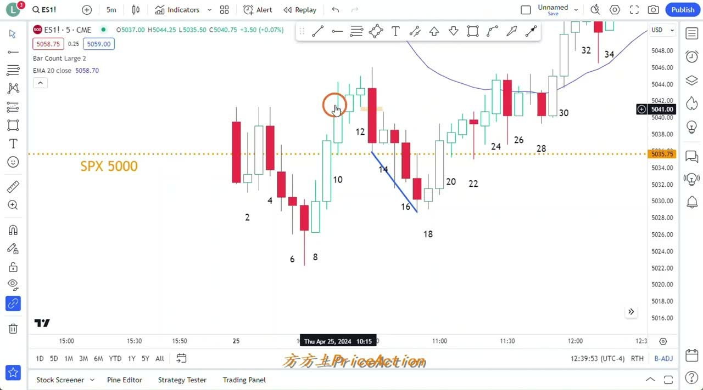
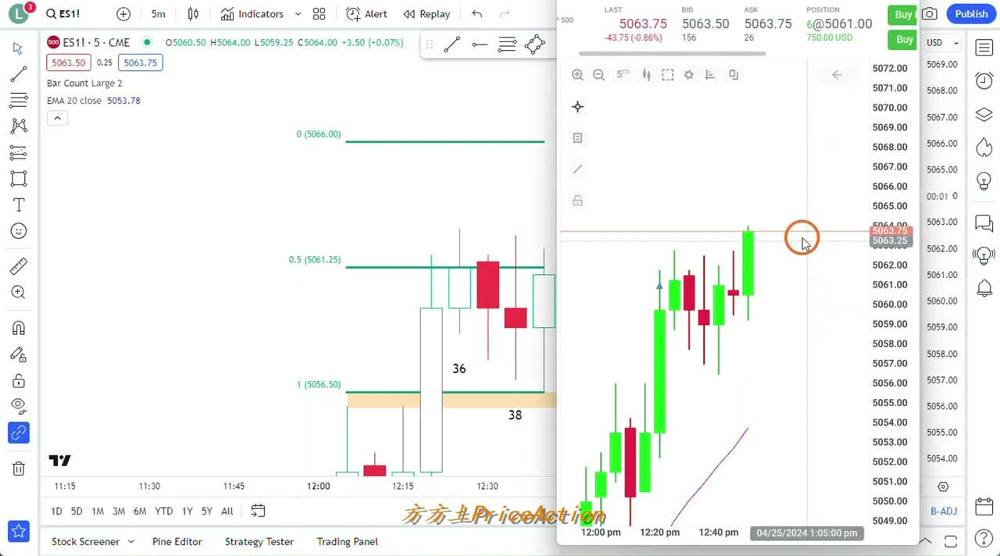
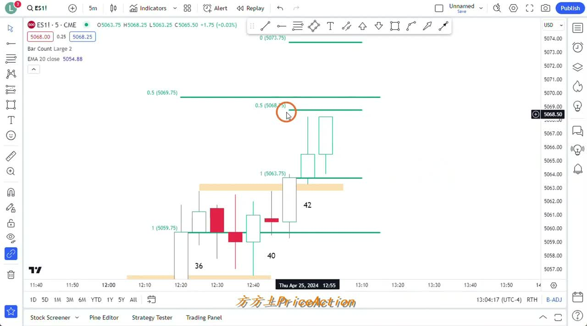

# 《【价格行为学】边做边讲(10)：勇敢牛牛，顺势追涨！冲鸭~~》复盘笔记

来源视频：
[YouTube 原视频](https://www.youtube.com/watch?v=DyejtRiLrJE&list=PLrCXUGuTXtGKrbsxteAGwDwVht1tghRe2&index=21)

说明：
这版按“少量主题框架 + 重点交易决策”来整理。重点保留 3 类信息：

- 这期视频真正想讲的 market condition 是什么
- 盘中哪些位置能做，哪些位置不值得做
- 持仓后为什么能拿、为什么要先走、什么信号说明判断失效

因为原视频没有公开字幕，本文基于本地转写和关键画面手工整理，少量口语细节可能不完全逐字一致，但决策逻辑和图表位置已按可验证内容复核。

## 一句话结论

这期最值得复盘的不是“追涨赚了 10 points”，而是：

**作者把一笔高位追涨，做成了有前提、有失效条件、有止盈计划的交易。**

真正的重点有 3 个：

1. 早盘低开后，为什么他先不追空，反而一直等做多背景
2. 哪些位置他认为是好买点，哪些位置他明确说“不值得追”
3. 持仓以后，他是怎么用 `inside bar / overlap / 收盘位置 / 是否继续创新高` 去判断还拿不拿

---

## 主题主线

如果只看标题，你会以为这期在讲“bull trend 里勇敢追涨”。  
但视频真正讲的是两件事：

1. 什么情况下 `bull trend` 里的追涨是顺势，不是接力
2. 什么情况下市场虽然看起来会涨，但位置并不值得普通交易者去追

作者想证明的不是“看涨就买”，而是：

- 先区分现在是 `trading range` 还是已经转成 `Always In Long`
- 再区分你是在判断方向，还是在找一个可执行的买点

这也是这期最该带走的框架：

**方向可能对，不等于当前位置值得做。**

---

## 操作主线

从实盘内容看，作者真正的逻辑顺序是：

1. 先判断早盘大跌是不是一个值得继续追空的空头趋势
2. 发现不是，于是转为等待低位做多机会
3. 震荡阶段优先考虑低吸，不在区间上沿乱追
4. 等到市场明确转成 `Always In Long`，才接受更差的位置去换更高的确定性
5. 持仓后不是死拿，而是不断检查：
   - 收盘是否还强
   - 是否出现 `inside bar`
   - 是否开始重叠
   - 是否有连续大阴线收在低位
6. 到计划内目标位，先止盈，不把“看对方向”误认为“必须吃完整波段”

所以，这期不是在鼓吹“顺势交易很爽”，而是在讲：

**什么情况下高位追涨仍然可以做，什么情况下应该立刻降低预期甚至先走。**

---

## 本期术语表

为了后面回看更顺，这里把本期高频词一次性放在一起。定义都按这期视频里的实际用法来写，不追求教科书式展开。

- `market condition`：市场当前所处的环境，比如是震荡、转强、还是顺畅趋势。作者整期都先看这个，再决定能不能做。
- `trading range`：震荡区间。典型特征是来回拉扯、突破不流畅、上去容易被卖、下去容易被买。
- `Always In Long`：盘面已经明显偏多，默认优先找做多，而不是反手找空。不是说一定只涨，而是多头暂时掌控主动权。
- `second leg down`：二段下跌。第一段跌完后先反弹，再来第二段下探。作者这里把它当成“空头已经走了一段，后面更容易找反转”的背景线索。
- `higher low double bottom`：抬高双底。第二个低点没有跌破前低太多，说明下方承接更强，是偏多结构。
- `signal bar`：信号 K 线。不是看到它就必须做，而是它能不能放在合适背景里触发进场。
- `trigger`：触发。背景先成立后，真正让你进场的那一下，比如某根 K 线收盘、上破一个 tick 等。
- `swing`：波段单。不是赚 1-2 个点就跑，而是想拿一段相对完整的空间。
- `measured move`：量度目标。把前面某段结构或突破的长度复制出去，当作潜在目标区，不是保证命中，只是参考位。
- `breakout`：突破。关键不是有没有新高/新低，而是突破后有没有站稳、有没有 follow-through。
- `follow-through`：跟随。突破之后，后面几根 K 线有没有继续往同方向推进。没有跟随的突破，质量通常会差很多。
- `reward/risk`：盈亏比。你为了可能赚到的利润，需要先承受多大止损风险。作者整期都很在意这个，而不是只看方向对不对。
- `inside bar`：内包 K。后一根 K 线完全被前一根包住。这期里它最重要的意义不是形态名字，而是提示上涨开始变慢、可能进入重叠。
- `overlap`：重叠。K 线彼此互相包来包去，走势不再流畅推进，通常意味着趋势可能退化成震荡。
- `gap`：缺口。这里更偏价格行为语境，指某些高低点之间没有被完全回测的空间。作者会把它当成趋势强弱或支撑/目标参考。
- `bear bars`：空头 K 线。实体偏空、收盘偏低的 K 线。真正能支持继续看空的，通常不是一根，而是连续强 bear bars。
- `bear close`：偏空收盘。K 线收在较低位置，说明收盘时空头更占优。持多单时如果连续出现这种收盘，要警惕。

---

## 视频关键截图

### 1. 早盘 `second leg down` 完成后，做多背景开始出现

这张图最关键的不是第 8 根 K 线强不强，而是前面已经走完一轮明显的二段下跌。作者的判断是：在大幅低开、又远离 `EMA 20` 的位置，继续追空的 `reward/risk` 已经很差，下方反而更容易出现 `higher low`、`W 底` 或失败下破后的反弹。

### 2. 区间上沿不是普通交易者随便追涨的位置

这张图对应作者最实用的一句提醒：`trading range` 里不要追涨、不要杀跌。哪怕价格新高了，只要收盘不够强、后续站不稳，区间上沿追进去也可能立刻变成被动。

### 3. `outside up` 之后，关键不只是涨，而是后面还能不能继续收强

这里是视频里最像“追涨成立”的阶段。作者不是因为阳线大就兴奋，而是看：

- 已经是 `Always In Long`
- 价格在均线上方运行
- 回调浅
- 突破后还有 follow-through

同时他也开始盯住回撤深度、50% 位置和小周期状态，因为这决定了这单还能不能继续拿。

### 4. 到了预设目标，先兑现，再看下一次机会

这张图最有实战价值。作者不是因为“行情还可能涨”就放弃计划，而是到 `10 points` 左右先止盈。理由很简单：这笔单本来就是高位追涨，继续拿当然有可能赚更多，但也会立刻暴露在高位获利回吐里。

---

## 关键决策节点

### 1. 开盘大幅低开，为什么他不急着追空

盘面背景大致是：

- 前一晚有 `META` 财报影响
- 早盘还有宏观数据
- 市场相对前收大幅低开
- 直接低开到 `SPX 5000` 一带

这里作者的判断很实战，不是“消息利空所以空”，而是：

- 这种位置离 `EMA 20` 太远
- 继续追空的人已经不占优势
- 如果真要继续跌，必须看到非常强的连续大阴线收在低位

也就是说，早盘第一步不是找空单，而是先问：

**空头还有没有足够好的 follow-through？**

作者的答案偏向“没有那么好”，所以后面才会越来越倾向逢低找多，而不是追空。

对自己复盘时，这里最该记的不是“5000 有支撑”，而是：

- 远离均线时，继续追空要更挑剔
- 大幅低开后，先默认容易震荡，再决定方向
- 没有连续强 bear bars，就别把自己当成做空趋势日

---

### 2. 早盘震荡里，真正值得看的不是追涨，而是 8 和 18 这两个做多点

这期视频里，作者后面追涨是结果，但他前面真正认可的做多机会其实更早。

#### 节点 A：8 附近为什么可以考虑做多

作者的逻辑大致是：

- 左侧已经完成 `second leg down`
- 下方有明显买盘
- 6、7 一带长下影说明低位有人接
- 在这种背景下，第 8 根虽然不是完美信号 bar，但它出现在好的背景里

所以这里他接受一种现实：

**信号 bar 不够完美，可以；背景对，才是更重要的。**

这也是很多人复盘容易漏掉的地方。不是所有买点都靠“漂亮信号 K”，很多时候是：

- 背景先成立
- 再用一个及格的 trigger 进场

#### 节点 B：18 为什么是更标准的 swing buy

作者对 18 的评价明显更高，因为这里多了几层确认：

- 左侧三推更清楚
- 结构上更像 `higher low double bottom`
- 双底 neckline 被突破后，有 `measured move` 目标
- 以 8 下方为止损，盈亏比更好

这段是整期里最值得拿去做模板的地方。

因为 18 的意义不是“又一个阳线”，而是：

1. 背景已经从“可能反弹”变成“反弹结构逐渐完整”
2. 进场后可以讲清楚止损放哪
3. 目标也能讲清楚，不是瞎拿

作者甚至直接把它讲成这天最好的 `swing` 机会之一，这比后面的追涨更值得反复看。

---

### 3. 为什么 30 / 31 之后，追涨开始变得合理

作者并不是在任何新高都愿意追。

他愿意提高买入位置，关键是因为 30 / 31 一带，市场行为已经变了：

- 连续几根阳线收在一半以上
- 站上 `EMA 20`
- 整体实体在均线上方
- 留下 gap
- 小回调始终偏浅

这时作者的意思很明确：

**这已经不只是震荡区间里的弹一下，而是一个更明确的 breakout。**

所以 31 收盘附近的追涨，和前面区间上沿那种普通新高，不是同一类东西。

前者是：

- 已经确认转强之后的顺势跟进

后者是：

- 震荡区间边缘的普通试探

这两种位置，不能混在一起复盘。

---

### 4. 他为什么明知会涨，仍然反复说“这里不值得追”

这期很有价值的一点，是作者不断区分：

- “方向可能对”
- “这个位置值得做”

比如在区间上沿、或者已经离低点很远的时候，他不是说多头一定不涨，而是说：

- 止损要放很大
- 普通账户扛不住
- 就算判断对了，`reward/risk` 也不够漂亮

这是非常交易化的思路。

很多人复盘只会写：

- “这里后来涨了，所以当时应该买”

但作者讲的是：

- “这里后来确实涨了，但当时并不是一个对大多数人都友好的买点”

这两句话差别非常大。

以后你自己复盘时，可以强制自己写清楚：

1. 我是在复盘“方向”，还是在复盘“可执行的买点”？
2. 如果我是普通仓位，这里我到底扛不扛得住？

---

## 持仓处理

### 5. 持仓以后，他是怎么判断“还可以继续拿”的

这部分正是你指出来原笔记写弱了的地方。

作者持仓后，不是简单一句 `Always In Long` 就完了，而是在不断检查这几个细节：

#### 1. 收盘是不是还在一半以上

如果一根阳线收在一半以上，他通常会把它先理解成：

- 多头仍然掌控盘面
- 这更像一次小回调，而不是趋势反转

所以你会看到他在 42 附近还在观察：

- 只要收盘别太差
- 只要没出现很强的 bear close
- 就还可以先当作小回调处理

#### 2. 后一根 K 线如果被前一根完全包住，要立刻警惕

这是这期最应该补进笔记的实战点。

作者在 43 那里明确说了一个非常重要的判断：

- 如果 43 被 42 完全包在里面，那就是 `inside bar`
- `inside bar` 的本质不是“一个形态名字很酷”
- 而是它说明开始出现 `overlap`
- 一旦开始重叠，趋势就有可能从顺畅上涨，退化成 `trading range`

这句话很关键，因为它直接决定持仓怎么处理：

- 如果只是小回调，但下一根马上继续往上突破，那还可以拿
- 如果开始 inside、开始重叠、开始横住，就要降低预期

也就是说，`inside bar` 在这里不是拿来做教科书定义的，而是拿来判断：

**趋势还在加速，还是正在失去流畅性。**

#### 3. 只有继续创新高，才能证明多头还没退

作者在 43 之后其实就在等一件事：

- 多头能不能继续向上突破哪怕一个 tick

因为对一个高位追涨单来说，最怕的不是立刻暴跌，而是：

- 涨不动
- 开始重叠
- 上影线变多
- 多头开始陆续止盈

所以继续创新高，不只是“更赚一点”，而是在给原来的持仓逻辑续命。

#### 4. 一旦跌破 44 下方一个 tick，他会先走

这个也很实战。

作者后面明确讲：

- 就算自己刚才没在目标位止盈
- 如果价格跌破 44 下方一个 tick
- 他也会先离场

这里的重点不是 44 这个数字本身，而是：

**当市场已经开始重叠、inside、加速不顺时，持仓逻辑要从“继续拿趋势”切回“先保护已得利润”。**

而且他不是说“离场后今天就不做了”，而是：

- 先走
- 回落后再挂买单
- 或者等新的多头信号再回来

这比死拿要专业很多。

---

### 6. 为什么他在 10 points 先止盈，而不是继续幻想大趋势

作者在这笔单里的止盈逻辑其实非常明确：

- 这是高位追涨，不是低位埋伏
- 高位追涨本来就更容易遇到上影线和多头止盈
- 既然进场前想拿的就是 `10 points`
- 那打到目标先兑现，就是正确执行

更重要的是，他不是因为“怕”才止盈，而是因为：

- 这笔交易的 edge 来自结构 + 执行
- 不是来自一定要吃满整段

对大多数人来说，这反而是最应该学的部分。

---

## 复盘 checklist

以后你复盘这类“低开后转强、后面进入 bull trend”的视频或盘面，可以直接按这 6 个问题过：

1. 早盘大跌后，空头还有没有连续强 follow-through，还是已经不适合追空？
2. 现在是 `trading range`，还是已经开始转成 `Always In Long`？
3. 我现在是在判断方向，还是在找一个普通账户也能执行的买点？
4. 当前这根 K 线只是看起来会涨，还是已经有收盘、gap、follow-through 在支持它？
5. 持仓后有没有出现 `inside bar / overlap / 上影线增多`，说明趋势在失去流畅性？
6. 如果跌破哪个 bar 或哪个 level，我应该先走，而不是继续硬拿？

---

## 这期最实用的 6 条复盘规则

1. 大幅低开且远离均线时，先别急着追空，先确认空头有没有连续强 follow-through。
2. 在震荡早段，真正好的机会通常出现在区间下沿附近，而不是中上部。
3. 一个买点值不值得做，看背景、止损、目标，不只看信号 K 线漂不漂亮。
4. `inside bar` 在高位持仓里的意义，是“开始重叠，可能要转震荡”，不是单纯背定义。
5. 持仓后如果不能继续创新高、上影线变多、重叠增加，就该降低预期甚至先走。
6. 高位追涨单到预设目标先止盈，通常比死拿更符合 `risk/reward`。

---

## 以后怎么把这类视频复盘得更有操作性

如果你想把这篇笔记继续优化到“以后自己能拿来盯盘”的程度，我建议固定用下面这个结构，而不是先写概念：

### A. 先写 3 个真正的交易节点

比如这期就该写成：

1. 8：为什么可以试多
2. 18：为什么是更标准的 swing buy
3. 31 之后：为什么追涨开始合理

### B. 每个节点只回答 4 个问题

1. 当时背景是什么
2. 为什么这根 K 线可以做 / 不可以做
3. 止损大概应该放哪
4. 如果走坏，什么信号说明判断失效

### C. 单独加一个“持仓管理”小节

专门记：

- 哪些收盘可以继续拿
- 哪些重叠说明要降预期
- 哪些位置该先止盈
- 哪些破位该先离场

### D. 把概念只留给结论，不要抢正文

像 `Always In Long`、`inside bar`、`measured move` 这些词，应该服务于操作，不应该喧宾夺主。

---

## 我的结论

你说“这版假大空比较多”，判断是对的。之前那版更像“内容总结”，不够像“交易复盘”。这次我已经把重点改成：

- 哪些位置能做
- 为什么能做
- 为什么别做
- 持仓后怎么看 `inside bar / overlap / 收盘位置 / 破位`
