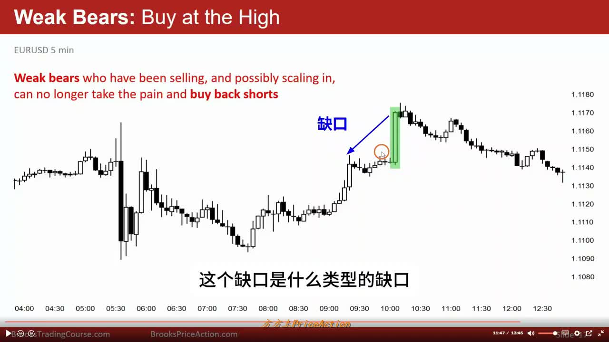
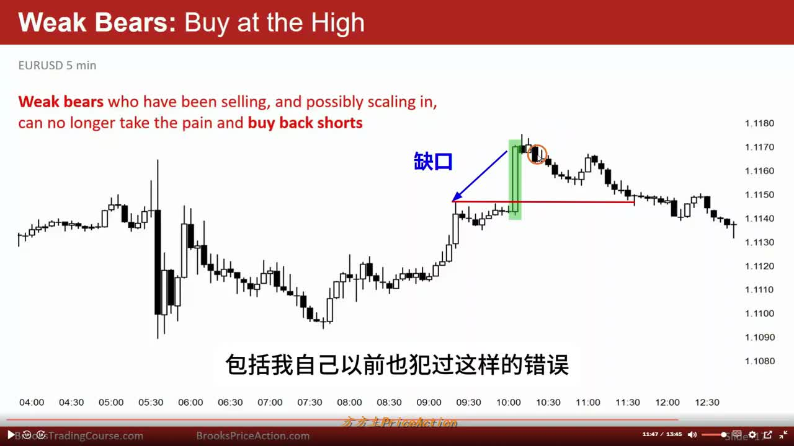
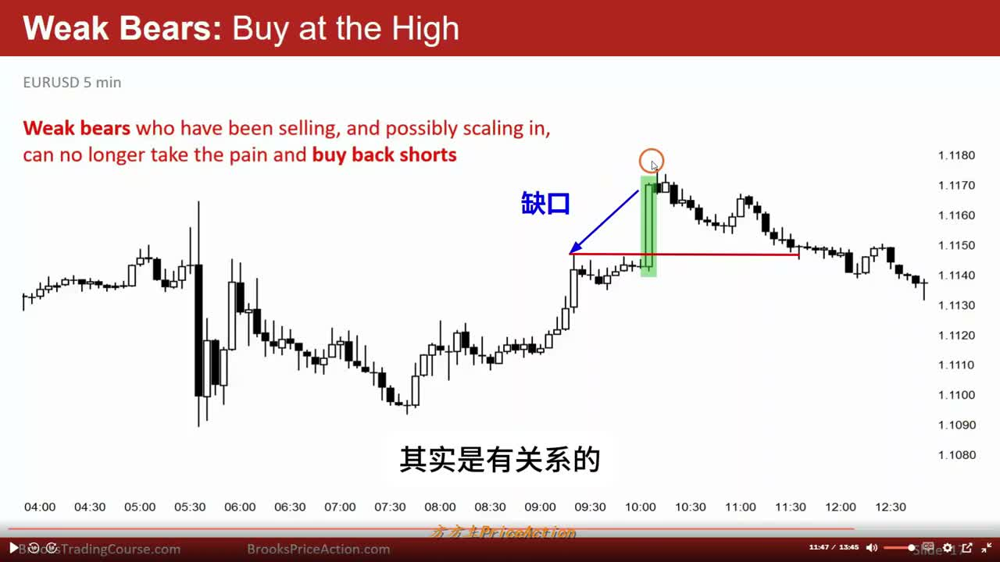
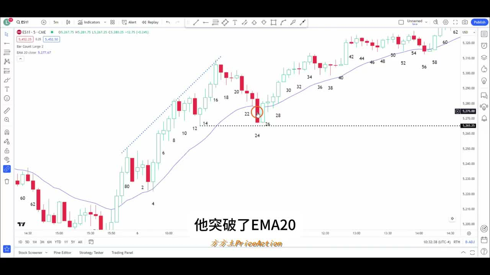

# 《【价格行为学】看对，做不对？交易者的强与弱》复盘笔记

来源视频：
[YouTube 原视频](https://www.youtube.com/watch?v=NWMoEnhWiW4&list=PLrCXUGuTXtGKrbsxteAGwDwVht1tghRe2&index=19)

说明：
这篇按“少量框架 + 重点执行”整理。视频后半段有不少关于翻译项目的说明，这里不展开，只保留前半段真正对交易复盘有价值的内容。

## 一句话结论

这期视频真正讲的不是“谁看方向更准”，而是：

**强交易者和弱交易者，往往会在同一个位置做完全相反的事。**

弱的一方常见问题不是完全看不懂，而是：

- 把 `buy climax` 当成追涨机会
- 把正常回调当成趋势结束
- 因为仓位、亏损、情绪压力，没办法按结构处理单子

强的一方则更像是在做 3 件事：

1. 先分清当前位置到底是 `breakout continuation`，还是 `exhaustion`
2. 提前知道自己要在哪些位置减仓、止盈、反手或等待回补
3. 在回调里继续看 `follow-through`，而不是被单根大阴线吓走

---

## 主题主线

这期的最小框架可以压成一句话：

**看对目标位，不等于做得到目标位。**

作者把“强弱”拆成了 3 层：

1. 价格行为理解上的强弱
2. 心理坚定程度上的强弱
3. 账户规模、资金承受力和仓位管理上的强弱

所以这期不是单纯讲形态，而是在讲：

- 为什么新手常常在最差的位置追进去或砍出去
- 为什么同样一张图，强多头、弱多头、强空头、弱空头会有完全不同的处理

这也是这期最值得带走的框架：

**市场里很多“做不对”，不是因为完全没看懂，而是因为背景、位置、仓位和情绪没有一起处理。**

---

## 本期术语表

- `strong bulls / weak bulls`：强多头 / 弱多头。这里不是道德评价，而是看谁能更按结构执行。
- `strong bears / weak bears`：强空头 / 弱空头。强空头更能等位置、等信号；弱空头更容易在错误的位置被逼空。
- `buy climax`：买入高潮。连续上涨很久之后又来一根特别大的 bull bar，常常意味着趋势接近尾声，而不是更适合追涨。
- `breakout`：突破。关键不是有没有新高，而是突破后有没有真正延续。
- `follow-through`：跟随。突破后后面几根 K 线有没有继续往同方向推进。
- `gap`：缺口。这里主要指价格和前高/前低之间留下的空间，作者会先问它到底是什么性质。
- `measuring gap`：测量型缺口。更偏趋势中继，后面常常还有一段 `measured move`。
- `exhaustion gap`：衰竭型缺口。更偏趋势尾声，缺口后面容易被回补。
- `measured move`：量度目标。把前面某段结构复制出去，当作目标区参考。
- `scaling in`：加仓摊平。价格对自己不利时继续分批加仓。视频里弱空头常常会这样把自己逼进更糟的局面。
- `gift bar`：礼物 K 线。Al Brooks 的说法，指给交易者很明确机会的大 K 线。对强空头来说，它可能是做空礼物；对多头来说，也可能是止盈礼物。
- `pullback`：回调。趋势里的正常回撤，不等于反转。
- `reward/risk`：盈亏比。不是只看最后方向对不对，而是为了那段利润要先承受多少风险。

---

## 操作主线

这期前半段主要用了两个案例：

1. 一个 `third push + huge bull bar + gap` 的例子，讲为什么弱多头会在高位追涨，弱空头会在最差位置止损
2. 一个 `measured move` 目标前的大回调案例，讲为什么弱多头明明看对目标位，却拿不到

作者想证明的不是某个形态名字，而是：

- 强交易者先看背景和位置
- 弱交易者先被当前这根大 K 线刺激

所以这期的重点不是“学一个新形态”，而是：

**同样一张图，谁在高位追，谁在高位卖，谁在回调里扛不住，谁在回调里还能坚持，这背后分别是什么逻辑。**

---

## 视频关键截图

### 1. 先问：这个 gap 到底是什么类型

这张图是整期第一核心问题。作者强调，一看到大涨和 gap，不是先激动，而是先问：

- 这是 `measuring gap`，后面还有一段？
- 还是 `exhaustion gap`，后面更容易回补？

### 2. 大 bull bar 出现在 third push 尾声，更像 `buy climax`

这里作者明确站在反追涨一侧：左边已经有 `trading range` 特征，当前又是上升趋势的第三推，趋势持续时间也够长，再来一根超大 bull bar，更像高潮，不像健康的中继突破。

### 3. 弱空头被逼着在最差位置止损，强空头反而把它当 `gift bar`

这张图最能体现“强弱做相反的事”。弱空头前面卖太早、扛太久，到这里只能忍痛买回止损；强空头则把这里看成一个至少能做回调的空头礼物。

### 4. 回调很深，但没有破关键低点，也没有形成好的空头跟随

第二个案例的重点不在回调大，而在于：

- 回调虽然深
- 但没有跌破上升趋势里的关键低点
- 后续 `follow-through` 很差

这意味着它更像一次把弱多头洗出去的回调，而不是高质量反转。

---

## 关键决策节点

### 1. 为什么这根超大 bull bar 更像 `buy climax`，不是高质量追涨点

作者给的背景信息很完整：

- 左边已经有 `big up big down`，带有 `trading range` 特征
- 当前上涨是 `third push`
- 这段上涨已经持续了 20 多根 bar
- 现在又出现一根本段里体积最大的 bull bar

这些条件叠在一起，他给出的判断是：

- 这根大阳线后面的 gap，更大概率是 `exhaustion gap`
- 后面至少有相当高概率回补缺口
- 价格至少会重新测试前面的突破点

所以这里真正的复盘重点不是“这根 K 线很强”，而是：

**它强得太晚了。**

这就是为什么弱多头会在这里追进去，而强多头不会。

---

### 2. 同一个位置，强多头和弱多头为什么做相反的事

作者这里给出的对比非常清楚：

弱多头会怎么做：

- 看到大 bull bar
- 看到强突破
- 觉得“这下总该起飞了”
- 在最显眼、也最贵的位置追涨

强多头会怎么做：

- 他们其实早就在 `trading range` 底部或更低的位置买了
- 到这里更愿意先止盈一部分
- 因为他们知道：
  - 这已经是趋势尾声概率更高的位置
  - 再追的 `reward/risk` 不好
  - 宁可等回调后再找下一次买点

这段最重要的不是“强多头更聪明”，而是：

**强多头赚的是背景和位置的钱；弱多头买的是情绪和视觉冲击。**

---

### 3. 同一个位置，强空头和弱空头为什么也做相反的事

这部分是整期最有意思的地方。

弱空头的典型路径是：

- 太早开始找理由做空
- 边跌边加仓，或者一直硬扛
- 到真正的高潮 bar 出来以后，情绪彻底撑不住
- 最后在最高点附近买回止损

强空头的处理则完全相反：

- 他们不会很早乱空
- 他们愿意等到更明确的位置
- 看到 `third push + buy climax + likely exhaustion gap`
- 就知道这里至少容易出现一个回调

所以同一根大阳线，对两种空头的意义刚好反过来：

- 对弱空头：是崩溃点
- 对强空头：是机会点

这也是作者说的“市场上强弱双方做的事往往正好相反”最具体的一次示范。

---

### 4. 为什么第二个案例里，弱多头明明看对目标位，却还是拿不到

第二个案例的核心不是进场，而是持有。

作者说很多人已经知道：

- 强突破后可以看 `measured move`
- 比如 4 到 8 这段、13 到 16 这段，都能量出目标

问题在于，知道目标位不代表拿得到。因为中间会出现很深的回调。

这里弱多头最容易犯的错是：

- 本来赚得不错
- 看到 24 这种大阴线就慌了
- 觉得再不走利润就全吐回去
- 结果在最差的位置离场

但作者要强调的是：

- 24 虽然大
- 但没有跌破 13 的关键低点
- 也没有形成好的后续空头跟随
- 所以下方仍然更像有很多人愿意逢低买入

也就是说，这里真正该问的不是“这根阴线大不大”，而是：

**它有没有真正把多头结构打坏？**

作者的答案是：没有完全打坏。

---

## 持仓处理

### 1. 回调很深，不等于一定要走

作者在第二个案例里最想讲的，是心理上的“弱”。

弱多头不是完全不懂 `measured move`，而是：

- 看到回调以后，账户浮盈大幅回撤
- 很在意已经到手又吐回去的钱
- 没办法继续客观看结构

所以他们会把“利润缩水”误当成“趋势反转”。

强多头则会继续看：

- 关键低点破了没有
- 空头有没有 follow-through
- 这次下跌是结构性转弱，还是正常 pullback

只要这几个点没有被破坏，他们更容易坚持到目标位。

---

### 2. 真正该让你走的，不是情绪，而是结构被打坏

这期视频虽然没有像实盘那样给出一个非常具体的 bar-by-bar exit，但逻辑是明确的：

如果你要提早走，至少要看到更扎实的东西，比如：

- 跌破上升趋势里的关键低点
- 跌破之后还有连续空头跟随
- 回抽上不去，开始真正转成空头结构

而不是只因为：

- 这一根阴线很大
- 浮盈回撤让我不舒服

这里的复盘重点非常值得单独记住：

**情绪能解释你为什么想走，但不能证明你该走。**

---

### 3. 为什么“坚定”不是嘴硬，而是有过往成功经验支撑

后面 George 的例子，本质上不是让人去无脑扛单，而是说明：

- 真正的坚定不是喊口号
- 而是你对某种模式已经有足够多成功经验
- 所以你知道中间的回调、拥堵、波动，并不会自动推翻终点

作者用了一个很贴切的比喻：

- 目标位像回家
- 中间会堵车、会绕路、会花很久
- 但如果你对这条路足够熟，你就没那么容易中途动摇

这个例子最适合拿来提醒自己：

**没有经过大量复盘和验证之前，不要把“我应该坚定”误解成“我应该硬扛”。**

---

## 容易犯的错

1. 看到超大 bull bar 就自动联想到“强突破继续追”，却不看它是不是已经发生在 `third push` 尾声。
2. 把 gap 一律当成 `measuring gap`，不先判断它有没有更像 `exhaustion gap`。
3. 太早做空、一路硬扛，最后在真正的高潮点附近止损。
4. 明明知道目标位，却因为回调大、浮盈回撤快，在最差位置被洗出去。
5. 把“坚定持有”理解成情绪忍耐，而不是基于结构和过往验证的客观坚持。

---

## 复盘 checklist

以后你再看这类视频，或者自己盘后复盘时，可以直接问这 7 个问题：

1. 当前这根超大 bull/bear bar，是趋势中继，还是更像高潮？
2. 这个 gap 更像 `measuring gap`，还是 `exhaustion gap`？
3. 这段趋势已经走了多久？是不是已经到 `third push`、通道上沿或趋势尾声？
4. 强多头 / 弱多头在这个位置会分别做什么？
5. 强空头 / 弱空头在这个位置会分别做什么？
6. 当前回调有没有真正破坏关键结构，还是只是把弱手洗出去？
7. 我现在是因为结构变坏想走，还是因为浮盈回撤让我难受才想走？

---

## 我的整理结论

这期最有价值的地方，不是教你一个新 pattern，而是把一个更真实的问题讲透了：

**交易里很多“做不对”，不是因为你完全没看懂，而是你在最该冷静的时候，被位置、亏损、浮盈和情绪牵着走。**

所以这期最该反复看的不是“大阳线很强”这种表面结论，而是：

- 为什么强多头在高位卖，弱多头在高位追
- 为什么弱空头在高潮 bar 被迫止损，强空头反而把它当礼物
- 为什么一个人看到了目标位，却还是拿不到目标位
