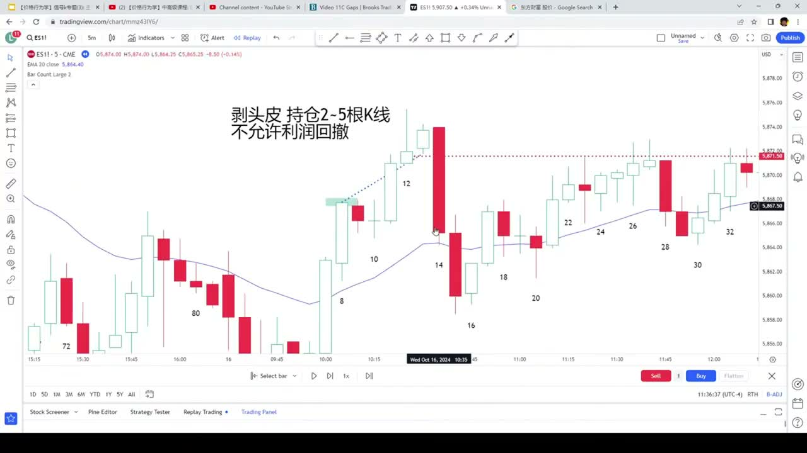
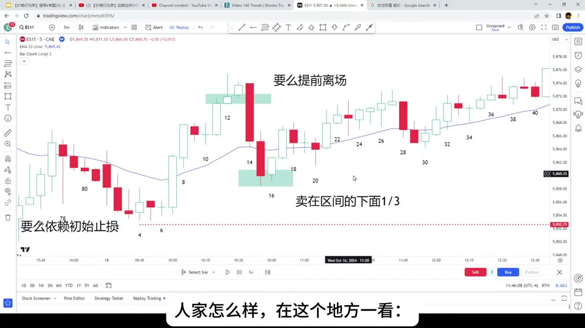
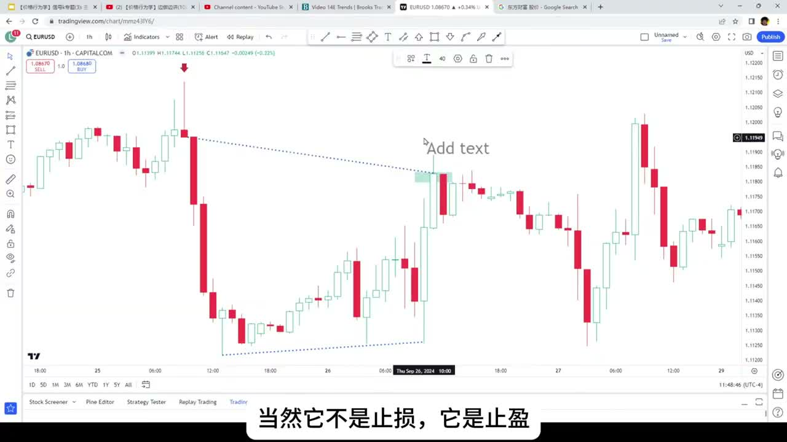
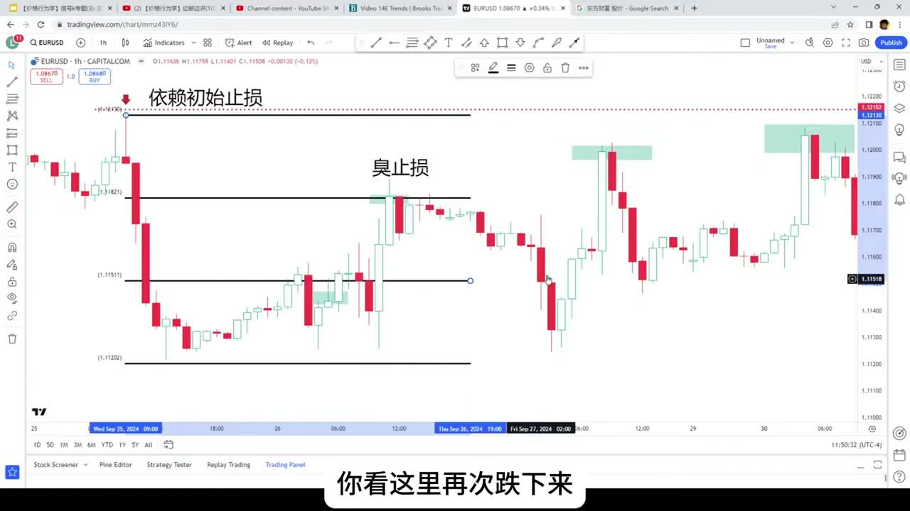

# 《【价格行为学】正确的止损 vs. 臭止损》复盘笔记

来源视频：
[YouTube 原视频](https://www.youtube.com/watch?v=UxPkZ2IbZiA&list=PLrCXUGuTXtGKrbsxteAGwDwVht1tghRe2&index=18)

说明：
这期时长很短，但非常实用。核心不是教你“止损一定要小”或者“永远不能提早走”，而是讲：

- 什么叫合理的 `initial stop`
- 什么叫因为情绪而产生的 `skunk stop`
- 同样一笔单，什么时候应该提前离场，什么时候提前走反而把自己卖在最差的位置

---

## 一句话结论

这期最重要的一句话就是：

**要么提前走，要么依赖 `initial stop`；卡在中间、在最尴尬的位置被情绪逼出去，很多时候就是 `skunk stop`。**

作者真正想纠正的不是“止损这件事本身”，而是：

- 很多人本来已经有不错利润
- 又不愿意按 scalp 的方式尽早兑现
- 又不愿意老老实实扛到结构止损
- 最后在区间边缘、情绪最难受的位置，把自己洗出去

---

## 主题主线

这期的核心框架可以压成一句话：

**错误不在于你止损了，而在于你止损的位置和逻辑都不对。**

作者把“臭止损”讲得很具体：

- 它不是正常的风险控制
- 它往往不是 `initial stop`
- 它也不是一个清晰的提前离场规则
- 它更像是：利润回撤后，你在最难受的位置临时认输

所以这期真正讲的是：

1. scalp trader 为什么可以很早走
2. swing / structure trader 为什么要么扛初始止损、要么扛到结构破坏
3. 为什么在 `trading range` 的下沿卖出多单、或在上沿买回空单，常常是最臭的离场

---

## 本期术语表

- `skunk stop`：臭止损。作者用来形容那种既不是合理初始止损，也不是有纪律的提前离场，而是被情绪逼出来的尴尬离场。
- `initial stop`：初始止损。开仓时就定义好的失效点，应该放在结构真正被破坏的位置。
- `scalp trader`：剥头皮交易者。目标是赚快钱，通常只拿 `2-5` 根 K 线，不允许利润大幅回撤。
- `trading range`：震荡区间。区间下沿更适合买、区间上沿更适合卖，很多突破会失败。
- `big up big down`：大涨大跌。常常意味着市场更像震荡，而不是顺畅趋势。
- `protect profits`：保护利润。已经赚到的钱，能不能通过明确规则保住，而不是等情绪决定。
- `structure`：结构。不是看单根 K 线吓不吓人，而是看关键高低点、区间位置、是否真正破坏逻辑。
- `small double bottom`：小双底。作者用它举例说明，空单如果要提前走，可以基于一个清晰的小反转结构走，而不是等大阳线出来才慌。

---

## 操作主线

这期视频其实就讲了两类情形：

1. 多单已经有利润了，什么时候可以提前走，什么时候在区间下沿卖掉是臭止损
2. 空单已经有利润了，什么时候可以提前走，什么时候在区间上沿买回是臭止损

作者的逻辑很统一：

- 如果你是 `scalp trader`，你本来就不该让利润大幅回吐
- 如果你不是纯 scalp，而是在做结构交易，那你就应该尊重 `initial stop`
- 最糟糕的是：既没有 scalp 的快，也没有 swing 的稳，只在最不该走的位置走

---

## 视频关键截图

### 1. 剥头皮交易：只拿 `2-5` 根 K 线，不允许利润大回撤

这张图对应作者对 `scalp trader` 的定义。既然目标是赚快钱，那就应该早走，不该让一笔本来已经满足最低利润要求的单子，再拖成“希望它回来”。

### 2. 多单如果已经到了区间下沿附近才止盈，往往就是臭止损

这张图最关键。作者直接说：如果把这里当 `trading range` 看，区间下沿三分之一应该更偏向买入区，不是多单被吓得卖出的地方。

### 3. 空单可以在小双底 signal 上方提前走，但不要等大阳线才慌

这张图强调：空单如果要保护利润，应该基于一个清晰的反转结构提前离场，而不是看着利润回吐一大截后，才因为害怕去买回。

### 4. 空单在区间上沿被逼平仓，而不是依赖初始止损，就是另一种臭止损

这里和前面的多单逻辑是镜像关系：如果你本来在做下降趋势，真正重要的高点还没破，你却在区间上沿附近被大阳线吓出场，这种“臭止损”很容易把后面的大行情全丢掉。

---

## 关键决策节点

### 1. 什么情况下提前离场是合理的

作者并不是反对提前离场。

他明确说，`scalp trader` 可以而且应该这样做：

- 满足最低利润目标就走
- 一般不会拿超过 `2-5` 根 K 线
- 不允许利润明显回撤

也就是说，如果你一开始就定义自己做的是短平快，那提前离场完全合理。

这里的重点不是“早走”，而是：

**你是不是从开仓那一刻起，就知道自己做的是哪一种交易。**

---

### 2. 什么情况下提前离场是不合理的

不合理的情况，是作者整期最想纠正的：

- 你开仓时不是按 scalp 做的
- 你也没有说自己只赚几个点就走
- 你的 `initial stop` 还没被打到
- 结果因为利润回吐太难受，在结构最不利的位置走了

这就是他说的 `skunk stop`。

本质上，它既不是：

- 有纪律的快进快出

也不是：

- 有纪律的结构止损

它只是：

**情绪化地不想再看到账面利润缩水。**

---

### 3. 为什么多单卖在区间下沿很糟糕

作者这里给的判断非常实战：

- 如果当前盘面最差最差也只是 `big up big down`，更像 `trading range`
- 那就应该把区间分三等分
- 下沿三分之一更偏向买区
- 上沿三分之一更偏向卖区

所以多单如果已经回撤到区间下沿附近才卖出，相当于你把仓位交给了那些正准备在区间下沿接货的人。

这就是为什么他说：

- 要么更早走
- 要么就老老实实依赖初始止损

而不是在这个中间尴尬位置出场。

---

### 4. 为什么空单买回在区间上沿也很糟糕

空单案例完全是镜像版本。

如果空单已经有不错利润，你有两种合理做法：

1. 看到小双底或反转 signal，提前保护利润
2. 继续持有，直到真正重要高点被突破，或者 `initial stop` 被打掉

最糟的是：

- 前面有很多利润不走
- 一看到区间上沿的大阳线就害怕
- 在最容易再次被卖下去的位置买回

作者这里要你理解的不是“不能止盈”，而是：

**你得在市场还没把你逼到最难受时，就先把离场规则想好。**

---

## 持仓处理

### 1. 先定义自己做的是 scalp 还是 structure trade

这是整期最重要的前置动作。

如果你是 scalp：

- 目标小
- 持仓短
- 不允许利润大回吐

如果你是 structure trade：

- 就别用 scalp 的情绪去处理中途回调
- 要么等关键结构破坏
- 要么等 `initial stop`

很多臭止损，根源就在于这一步没定义清楚。

---

### 2. 不要让情绪决定你在哪个价位离场

作者举的两个例子，其实都在说明同一件事：

- 多单在区间下沿卖出
- 空单在区间上沿买回

这种离场之所以臭，不只是因为卖/买反了，而是因为：

**它不是一个事先计划好的位置，而是你在最难受的时候临时认输。**

所以更好的处理方式是：

- 要么一开始就设好快进快出规则
- 要么一开始就接受要扛到结构失效

不要临场摇摆。

---

### 3. 如果已经有利润，保护利润也要讲结构

这期还有一个很实用的提醒：

保护利润不是看“这根 K 线好大我害怕”，而是看：

- 有没有明确的小反转结构
- 有没有重要高低点被突破
- 当前是区间的哪个位置

也就是说，保护利润不是不要，而是要：

**基于结构保护，不是基于难受保护。**

---

## 容易犯的错

1. 明明不是 scalp，却用 scalp 的心态处理中途回撤。
2. 明明初始止损还没到，却因为利润缩水太难受而临时出场。
3. 在 `trading range` 下沿卖出多单，或在上沿买回空单。
4. 没有在开仓前想清楚自己到底打算拿多久、拿到哪里、怎么走。
5. 把“先保住一点利润”当成合理，其实只是被情绪推着走。

---

## 复盘 checklist

以后你想检查一笔离场是不是 `skunk stop`，可以直接问自己这 7 个问题：

1. 我这笔单从一开始定义的是 scalp，还是 structure trade？
2. 如果是 scalp，我是不是已经满足了最低利润目标？
3. 如果不是 scalp，当前 `initial stop` 或关键结构真的被打坏了吗？
4. 我现在离场，是因为计划如此，还是因为利润回吐让我很难受？
5. 当前这个位置，是区间上沿、下沿，还是中间？
6. 如果我是多单，我是不是卖在了应该有人买的地方？
7. 如果我是空单，我是不是买回在了应该有人卖的地方？

---

## 我的整理结论

这期最有价值的地方，是它把一个很常见但经常被说得很模糊的问题讲清楚了：

**臭止损不是“止损本身”，而是没有规则的、情绪化的、卡在最尴尬位置的出场。**

所以以后你只要记一句就够了：

**要么提前走，要么依赖 `initial stop`；最差的是中间犹豫半天，最后在结构最不利的位置认输。**
