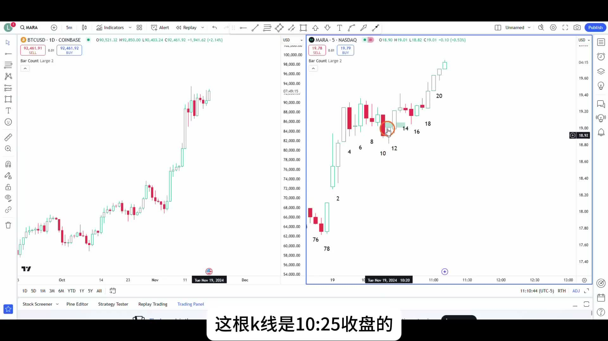
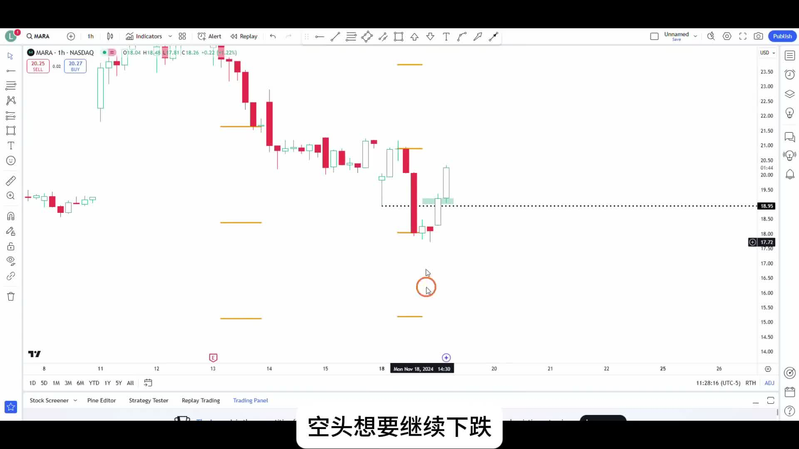
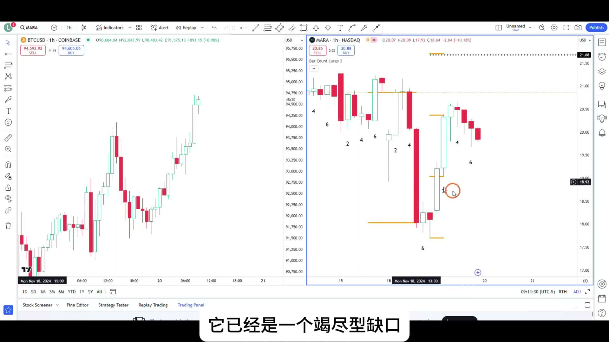
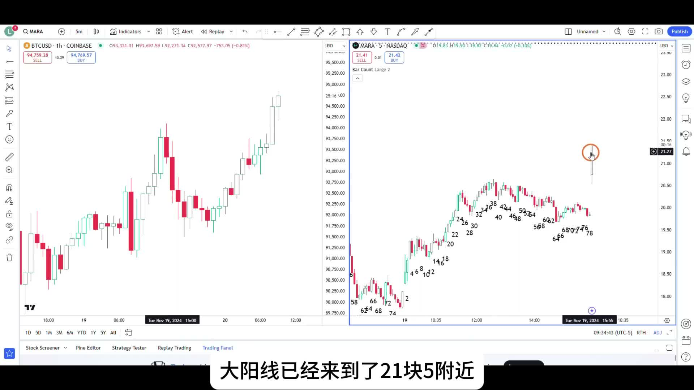

# 《【价格行为学】边做边讲(18): 用期权追涨比特币 +$9550》复盘笔记

来源视频：
[YouTube 原视频](https://www.youtube.com/watch?v=M4dwPhNK5X8&list=PLrCXUGuTXtGKrbsxteAGwDwVht1tghRe2&index=17)

说明：
这期表面上是在讲“看好比特币，所以去买 `MARA` 的 call options”，但真正有复盘价值的不是看多结论本身，而是三件事：

- 当大级别很强、但股票本体 `stop` 太大时，为什么用 `options` 去表达方向
- `MARA` 这一笔为什么不是高位乱追，而是有清晰 `sell climax -> exhaustion gap -> first target` 逻辑
- 到了第一目标位以后，为什么先兑现一部分，再把剩下仓位交给更远的目标

---

## 一句话结论

这期最重要的不是“比特币会不会继续涨”，而是：

**当方向判断很强、但结构止损太大时，可以用 `options` 把最大风险封死；但后面的止盈和持有逻辑，仍然必须按 Price Action 来做，不能因为用了期权就靠希望拿单。**

---

## 主题主线

这期可以压成一句话：

**`BTC` 给方向，`MARA` 给入场，`options` 解决风险上限，`first target / second target` 决定怎么拿。**

作者不是随便找一支币股追涨。他的完整顺序是：

1. 先看 `BTC` 日线，判断大背景是 `Always In Long`
2. 再看 `MARA` 一小时，找有没有一个值得做的反转结构
3. 因为用股票本身做，`initial stop` 太大，所以改用 `call options`
4. 开仓以后，不再纠结“我是不是看对了”，而是直接按：
   - 第一目标位
   - 第二目标位
   - 是否继续有 `follow-through`
   去管理仓位

所以这期真正值得学的，是：

- 什么叫“方向很强，但仍然要等一个像样的做多理由”
- 什么叫“用工具解决风险问题，但不改变交易逻辑”
- 什么叫“第一目标位先兑现，剩下仓位再去赌更远目标”

---

## 本期术语表

- `Always In Long`：市场处于持续偏多状态，优先只找做多理由，不轻易逆势做空。
- `signal bar`：信号 K。不是任何阳线都算，重点是它有没有给出一个足够像样的入场理由。
- `sell climax`：抛售高潮。下跌持续较久后，突然出现异常大的 bear bar，常常意味着空头在最后加速。
- `exhaustion gap`：衰竭缺口 / 竭尽型缺口。突破后没有跟随，很快被补掉，反而说明原来的方向快走不动了。
- `initial stop`：初始止损。开仓时就应该接受的、结构真正失效的位置。
- `actual risk`：实际风险。理论上有初始止损，但如果开仓后价格立刻朝有利方向走，持仓过程中未必真的承受过那段风险。
- `first target`：第一目标位。最先去兑现概率优势的位置，通常是最近、最有把握的那一段。
- `reverse measured move`：反向 `measured move`。价格从反转点启动后，按前一段结构去投射更远目标。
- `time decay`：时间损耗。`options` 和股票最大的不同之一，方向看对了，时间拖太久也可能影响收益。
- `scale out`：分批止盈。不是一次性全平，而是先减一部分，再观察剩余仓位能不能拿更远。

---

## 操作主线

这笔交易的主线很清楚：

1. `BTC` 日线极强，所以只想找多头表达
2. `MARA` 一小时刚好出现可做的反转背景
3. 用 `call options` 把这笔交易的最大亏损锁在大约 `9700` 美元
4. 第一目标先看抛售高潮的起跌点，也就是 `21` 美元附近
5. 如果那里还能继续强势突破，再考虑第二目标，也就是更远的 `reverse measured move`

换句话说，这期不是“因为看好就买”，而是：

**先有大方向，再有局部结构，再有仓位工具，最后才是持仓管理。**

---

## 视频关键截图

### 1. `BTC` 日线给出大方向，`MARA` 5 分钟给出具体入场

左边是作者强调的 `BTC` 大背景，右边是 `MARA` 的实际入场位置。这里最重要的不是“看到大阳线就追”，而是作者先确认自己只想找多头，再等到 `10:25` 这一根收得不错的 bullish signal bar，才在下一根 K 线入场。

### 2. `MARA` 一小时的核心前提：两根大阴线更像 `sell climax`

这一段是整笔交易真正的结构依据。连续下跌后又出现异常大的 bear bar，作者不是把它看成“空头更强了”，而是先警惕这会不会是 `sell climax`，因为下跌已经持续了很多根 K 线，此时再来一次放量式加速，反而容易接近尾声。

### 3. 缺口被迅速补掉以后，`exhaustion gap` 逻辑成立

作者这里的判断很关键。不是只看到“跌得很惨”，而是继续看后手有没有跟随。结果缺口很快被补掉，说明前面的 downward breakout 更像 `exhaustion gap`，于是第一目标自然就看向抛售高潮起跌点，也就是 `21` 美元上方。

### 4. 到了 `21` 美元附近，先兑现 `1/4` 仓位

这张图最有复盘意义的地方，不是他赚了多少钱，而是他怎么处理。作者有 `60` 张合约，先在第一目标位附近卖掉 `15` 张，也就是 `25%` 仓位，把“高概率那一段”先兑现，再留 `45` 张去观察能不能走第二段。

---

## 关键决策节点

### 1. 为什么这笔多单不是高位乱追

很多人第一眼会觉得，这不就是看着 `BTC` 很强，然后去追 `MARA` 吗？

但作者给的逻辑并不是“强就买”，而是：

- `BTC` 日线已经是 `Always In Long`
- 所以大方向上只找多头机会
- `MARA` 自己又刚好出现一个可能的反转背景
- 5 分钟里还有一根像样的 bullish signal bar

也就是说，这笔单不是单靠情绪追涨，而是：

**大方向已经偏多，小结构又给了做多理由。**

如果少了后面这一步，这笔单就会退化成“因为看多，所以什么位置都敢买”。

---

### 2. 为什么作者把两根大阴线理解成 `sell climax`

这是这期最值得复盘的判断。

作者强调的不是“大阴线出现了，所以不能买”，而是：

- 下跌已经持续了至少十几二十根 K 线
- 这时又冒出体积更大的 bear bar
- 新低之后没有继续顺畅 follow-through

这时更该问的是：

**这是不是空头最后一波宣泄，而不是新的趋势刚开始。**

后面缺口被迅速补掉，相当于进一步确认：

- 这里更像 `exhaustion gap`
- 空头虽然制造了视觉冲击，但没有把价格压住

所以作者才敢把第一目标直接看回到 `sell climax` 的起跌点。

---

### 3. 为什么第一目标位是 `21` 美元附近

第一目标不是随手拍脑袋定的，而是结构上最自然的位置：

- 既然把前面的大跌看成 `sell climax`
- 又把后面的缺口看成 `exhaustion gap`
- 那价格至少有较大概率回到这轮抛售高潮的起跌点

这就是 `21` 美元附近的来历。

这类目标的意义不是“它一定到”，而是：

- 它足够近，概率足够高
- 它是结构上最容易先达到的一段
- 所以很适合作为第一批止盈位置

这也是为什么作者会说，哪怕只做到第一目标，这笔交易从数学上也已经非常合理。

---

### 4. 为什么只卖 `25%`，而不是全部平掉

这期最实战的地方就在这里。

作者并没有做成二选一：

- 不是“我相信更远目标，所以一张不卖”
- 也不是“到了第一目标就全部砍掉”

他做的是第三种：

- 第一目标先兑现 `1/4`
- 剩下 `3/4` 继续持有
- 等市场自己告诉他，短期趋势有没有出问题

这样做的好处是：

- 先把大概率那一段锁进来
- 剩余仓位还能保留第二目标的上行想象
- 心理压力也会比“全拿着不动”小很多

对大多数交易者来说，这比非黑即白的全平 / 死拿，更容易长期执行。

---

## 持仓处理

### 1. 这笔交易的风险控制，不是靠小止损，而是靠工具选择

作者讲得很直白：

- 如果直接买股票，结构止损会很大
- 但他又非常想参与这波多头方向
- 所以改用 `call options`

这样处理以后，这笔交易最糟糕的结果就是：

**亏掉期权权利金，而不是因为股票 stop 太远，导致仓位被迫做得过小或情绪过大。**

这也是这期最重要的产品级理解：

- `options` 不是为了放大刺激
- 而是为了把最坏情况事先钉死

---

### 2. 要区分 `initial risk` 和 `actual risk`

作者这里讲得很细，也很值得抄进自己的复盘框架里。

理论上，这笔单当然有 `initial stop`：

- 如果按股价结构算，止损应该在那轮反弹起涨点下方

但实际持仓里：

- 他一买进去价格就往有利方向走
- 所以整个过程中几乎没有真正承受浮亏

所以这笔单的特点是：

- 有 `initial risk`
- 但几乎没有 `actual risk`

这两个概念分开以后，你就不会把“理论上这单风险很大”和“持仓过程其实很舒服”混为一谈。

---

### 3. `options` 让更远目标的持有成本变高

如果这是股票，不考虑时间损耗，作者完全可以更从容地等第二目标。

但期权不一样：

- 它有 `time decay`
- 还受波动率等因素影响
- 同样一个更远目标，拖两天到和拖两周到，结果可能差很多

所以这期一个很实用的结论是：

- 近目标，用短一些的 `options` 也许没问题
- 远目标，尽量用更长期的 `options`，或者直接用股票

这不是技术细节，而是直接决定你能不能把同一个 Price Action 想法执行完整。

---

## 容易犯的错

1. 只因为看好 `BTC`，就忽略 `MARA` 自己有没有像样的入场结构。
2. 把两根大阴线直接理解成“更不能买了”，没有去想会不会是 `sell climax`。
3. 只会定一个模糊的大目标，不会先定 `first target`。
4. 用了 `options` 以后就觉得风险天然更小，忽略了 `time decay`。
5. 到了第一目标位还一张不卖，最后把高概率利润又吐回去。
6. 反过来，刚到第一目标就全部平仓，结果又拿不到真正的大行情。

---

## 复盘 checklist

1. 大级别是不是已经明显偏向某一边，比如 `Always In Long`？
2. 我做的是“看法”，还是“有结构支持的看法”？
3. 如果股票的 `initial stop` 太大，我是不是该换成 `options` 或降低仓位？
4. 当前这个大阴线 / 大阳线，是趋势延续，还是 `climax`？
5. 缺口后面有没有真正 follow-through，还是很快被补掉？
6. 第一目标位在哪里，它为什么是第一目标？
7. 第二目标是不是值得留仓去赌？如果值得，应该留多少？
8. 这笔单如果用的是 `options`，时间损耗会不会改变我的持有策略？

---

## 我的整理结论

这期最值得反复看的，不是作者赚了多少钱，而是他把一笔“很想参与、但 stop 又不舒服”的交易，拆成了一个很完整的执行链条：

- `BTC` 负责给方向
- `MARA` 负责给结构
- `options` 负责把最坏风险锁死
- `first target` 负责先兑现概率优势
- 剩余仓位再去争取更远的 `measured move`

如果把这套顺序练熟，你以后看到类似行情时，脑子里就不会只剩下“要不要追”，而会多出一整套更成熟的问题：

- 方向强不强
- 入场有没有理由
- 风险怎么表达
- 先赚哪一段
- 剩下的仓位怎么拿
