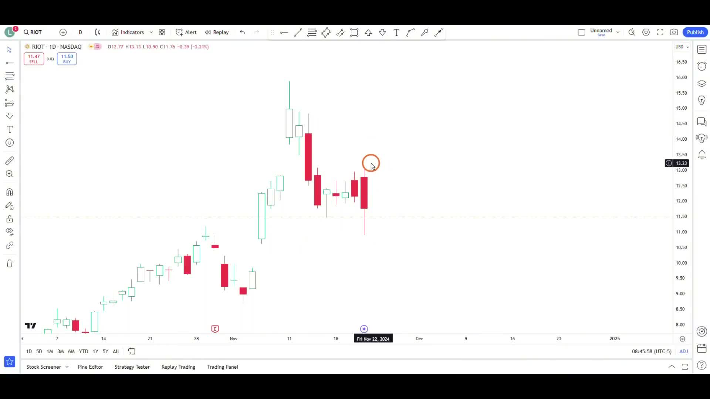
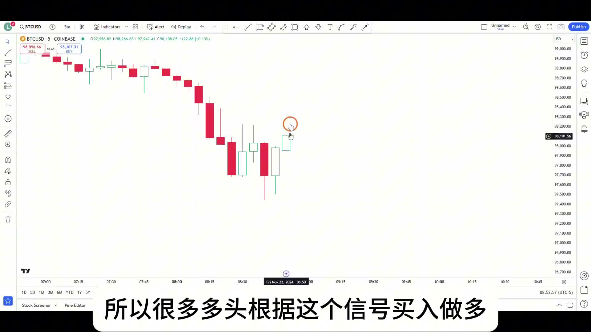
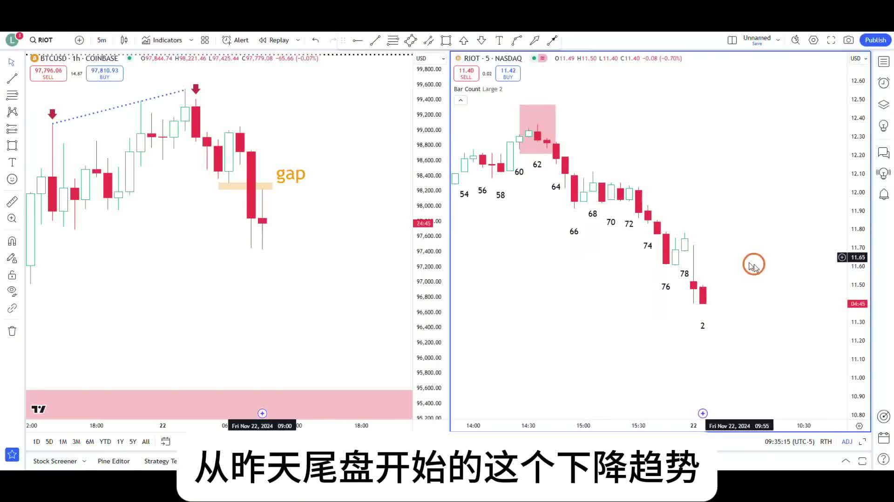
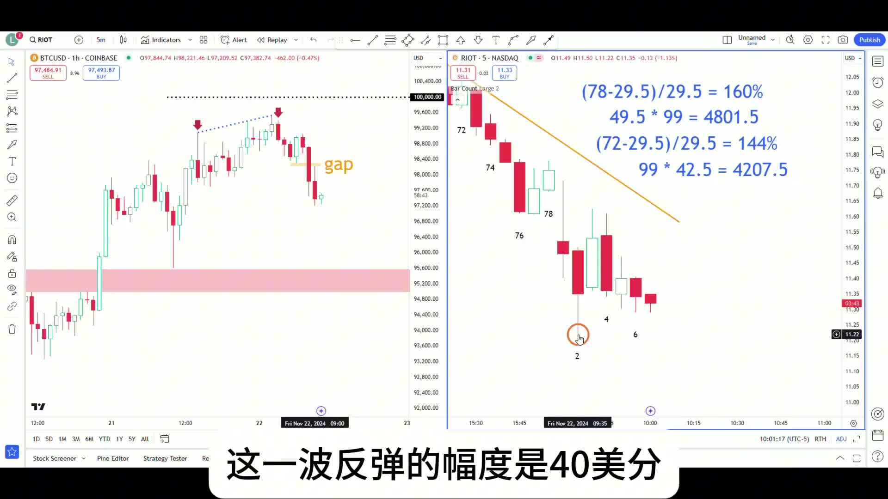

# 《【价格行为学】边做边讲(19): 短期做空比特币，超小仓位末日期权 +$9009》复盘笔记

来源视频：
[YouTube 原视频](https://www.youtube.com/watch?v=qYKEyElOkp0&list=PLrCXUGuTXtGKrbsxteAGwDwVht1tghRe2&index=15&pp=iAQB0gcJCQMLAYcqIYzv)

说明：
这次我按和 `006` 一样的标准重做了。元数据、视频画面、真实持仓截图都已经核对过；同时这次补上了本地全文转写，所以正文不是“画面保守版”，而是基于完整口播重组出来的交易决策复盘。

这期真正有价值的不是“作者在 10 万附近短空又赚了 9000 美金”，而是这四件事：

- 为什么在大级别仍然长期看多的前提下，短线依然可以找做空
- 为什么 `100,000` 附近的 `failed breakout` 会让多头失望
- 为什么这笔单要用 `RIOT` 的末日期权，而不是直接空 `BTC`
- 为什么面对 40 美分反弹、利润回撤接近 4000 美金时，作者没有情绪化乱走

---

## 一句话结论

这期最重要的一句话是：

**10 万附近的突破失败，只给你“可以短空”的理由；真正决定你能不能拿住的，不是判断本身，而是 `position sizing` 和你能不能分清“提早保护利润”和“臭止损”。**

---

## 主题主线

这期可以压成一句话：

**长期看多不等于短线不能空；当 `BTC` 在 10 万附近连续突破失败、开始演变成 `trading range` 时，最弱的矿股和末日期权会把这段短空放大，但也会同时放大你仓位管理上的错误。**

作者这次的逻辑顺序非常清楚：

1. 他前一集依然是非常坚定地看多 `BTC`
2. 但到了 `100,000` 这个关键目标位附近，价格只差 `1%` 就能到，却突然开始回落
3. 这会让大量多头失望，市场就可能从顺畅上涨演变成 `trading range`
4. 在这种背景下，他想抓的是一笔**未来十几个小时、十几根 K 线的回调**
5. 为了放大这段短线回调，他选择去空更弱的 `RIOT`，再用第二天就到期的 `put options` 表达

所以这期真正讲的不是“顶在哪里”，而是：

- 什么时候顺势看多的人也要接受短线可能先跌
- 什么时候 `failed breakout` 会把市场从趋势拉回震荡
- 为什么高杠杆工具必须配合超小仓位和明确的分批离场

---

## 本期术语表

- `failed breakout`：突破失败。这里指 `BTC` 已经非常接近 `100,000`，却没能真正站上去，反而回落。
- `trading range`：震荡区间。作者明确说，连续让多头失望，市场正在演变成 `trading range`。
- `wedge / third push`：第三推。作者把 `BTC` 一小时图理解成第三推后的回调背景。
- `10 bar, 2 legs`：`Al Brooks` 常讲的最小回调目标。这里指至少 `10` 根 K 线、`2` 段式下跌或横盘。
- `0DTE / 末日期权`：很快就到期的期权。这期是第二天周五到期的 `put`。
- `position sizing`：仓位管理。作者整期都在重复：这类交易一定要用亏了也不在乎的钱去做。
- `scale out`：分批止盈。作者把接近 `200` 张期权拆成两半处理。
- `scalp`：剥头皮式快进快出。作者讲到，如果你要保护利润，就应该在反转刚开始时按 `scalp` 逻辑走。
- `skunk stop`：臭止损 / 臭离场。作者虽然没直接用英文，但意思非常清楚：在最差的位置被情绪逼走。
- `follow-through`：跟随。判断这笔短空能不能继续拿，不是看你紧不紧张，而是看空头有没有继续向下跟随。

---

## 操作主线

这笔交易的主线可以重建成这样：

1. `11/21` 下午 `2:30` 前后，作者分两批买入 `RIOT 11/22/2024 12.00 Put`
2. 一共将近 `200` 张，平均成本大约 `29.5` 美元一张
3. 他的判断不是“中线转空”，而是：
   - `BTC` 一小时级别未来十几个小时更可能向下
   - 至少应该有 `10 bar, 2 legs`
4. 选择空 `RIOT` 而不是直接空 `BTC`，是因为：
   - `RIOT` 比 `BTC` 更弱
   - 当 `BTC` 在 10 万附近让多头失望时，弱矿股更容易跌得更快
5. 因为工具是末日期权，所以仓位压得很小，不到 `6000` 美元
6. 第二天早盘利润一度来到 `160%`
7. 作者先在 `78` 左右把一半仓位兑现
8. 剩下 `99` 张继续持有，哪怕后面出现 `40` 美分反弹、利润回撤接近 `4000` 美元，也没有情绪化乱走
9. 最后一半理论上应该继续拿，但因为一边讲解一边操作，挂单从 `90` 改到 `72` 后忘了改回去，意外成交
10. 两半合计大约赚了 `9009` 美元，整体收益大约 `150%`

这条主线里最重要的不是收益数字，而是：

**背景判断 -> 工具选择 -> 仓位压缩 -> 半仓先走 -> 剩余仓位抗回撤**

---

## 视频关键截图

### 1. `RIOT` 日线本身就比 `MARA` 更弱

这张图解释了为什么作者不直接反手去空前面做多过的 `MARA`，而是选了更弱的 `RIOT`。`BTC` 最近一直在涨，但 `RIOT` 只是冲了一下就持续转弱，这种标的在 `BTC` 高位失望回落时，跌幅更有可能放大。

### 2. 低级别不是直接追空，而是等反弹吸引多头再观察失败

作者这里明确说，很多多头会根据这个 signal 去买。真正有价值的地方，不是“我猜它会跌”，而是：他知道这里会吸引买盘，如果这些买盘接不住，空头就更容易继续向下。

### 3. `BTC` 一小时图的关键背景：第三推、冲击 10 万失败、下方 `gap`

这张图把整期短空背景讲清楚了。作者不是因为一根大阴线才临时想空，而是把一小时图理解成：

- 第三推后的回调背景
- 接近 `100,000` 的突破失败
- 市场更像开始向 `trading range` 演变

### 4. 第一半先走以后，剩下的一半才有资格继续拿

这张持仓图最有复盘价值。前一半已经锁定利润以后，剩下 `99` 张期权还能继续让利润奔跑。否则，后面 `40` 美分反弹带来的利润回撤，很多人根本扛不住。

---

## 关键决策节点

### 1. 为什么在长期看多的前提下，短线依然可以空

这是这期第一个容易被误解的地方。

作者并没有从“长期 bullish”突然翻脸成“全面 bearish”。他自己说得很清楚：

- 他前一集依然非常坚定地做多
- 甚至相信 `BTC` 很快会去 `100,000`

但真正的问题是：

- 离 `100,000` 只差一点点
- 市场没有顺利冲上去
- 反而在这么近的地方突然回落

这就会让多头非常失望。

所以这期的重点不是“观点反复横跳”，而是：

**大级别长期看多，和短线抓一笔失望性回调，并不冲突。**

---

### 2. 为什么 `100,000` 附近的失败，会让他想到 `trading range`

作者这里的判断非常 Price Action：

- 创新高失败，令人失望
- 刚创新高立刻回来，令人失望
- 连续尝试突破失败，还是令人失望

连续让多头失望，本身就是市场从趋势转向 `trading range` 的特征。

他还用 `Al Brooks` 的规则去约束自己的预期：

- 既然是一小时图第三推后的回调
- 最小目标就不该只是“跌一下就结束”
- 而应该是 `10 bar, 2 legs`

也就是说，他不是在赌一个 tick 顶，而是在赌：

**未来十几个小时，市场更像要进入一段双腿回调或双腿横盘。**

---

### 3. 为什么选择空 `RIOT`，而不是直接空 `BTC`

这期很实战的一点是“表达工具”的选择。

作者给的理由很直接：

- `RIOT` 和 `MARA` 一样，都是比特币挖矿概念股
- 但 `RIOT` 比 `BTC` 本身更弱
- `BTC` 涨的时候它都不够强
- 那 `BTC` 在 10 万附近失望回落时，它更可能跌得更厉害

这就是典型的：

- 看空大背景
- 但用更弱的关联标的去放大这段回调

所以这笔单不是“想空什么就空什么”，而是：

**先判断谁最弱，再用那个最弱的东西去表达看空。**

---

### 4. 为什么这笔单必须用超小仓位

这期最关键的不是信号，而是仓位。

因为他用的是第二天就到期的 `put options`，所以这类工具有两个非常鲜明的特点：

- 优点：杠杆大、盈亏比非常好，盘中稍微一跌就能赚很多
- 缺点：时间限制极强，如果第二天不跌，甚至下周才跌，这笔钱也可能先亏光

作者说得很清楚：

- 末日期权盈亏比好
- 但胜率低
- 所以仓位反而要更小

这也是为什么这笔单的总成本不到 `6000` 美元。

这期真正想教你的不是“末日期权真香”，而是：

**工具越刺激，仓位越要无聊。**

---

### 5. 为什么在 `160%` 附近先走一半

这不是简单的“落袋为安”，而是结构和工具共同决定的。

先看工具：

- 末日期权利润变化太快
- 不及时兑现，回撤会非常夸张

再看盘面：

- 已经实现了第一大段下跌
- 接下来如果出现强反弹，利润会吐得很快

所以作者的处理是：

- 在 `78` 左右先把一半赢掉
- 成本 `29.5`
- 第一半净赚大约 `160%`

这一步做完以后，后面剩下的仓位才更像“让利润奔跑”，而不是“全仓情绪化死拿”。

---

### 6. 为什么 40 美分反弹时，他没有立刻情绪化离场

这是这期最宝贵的地方。

后面的这段反弹，对剩下的 `99` 张期权来说，利润回撤接近 `4000` 美元。

很多人看到这里会本能地想：

- 赶紧跑
- 利润别回吐了

但作者的判断是：

- 开盘 `big down big up`
- 前 `6-12` 根 K 线，`80%` 的概率都处在震荡区间
- 这种时候如果空头在区间上沿被反弹吓出去，很可能就是一个臭离场

他明确给了两种合理处理：

1. 你如果本来就要保护利润，那就应该更早按 `scalp` 逻辑提早走
2. 如果你决定按短空结构继续拿，那就要持有到这个下降趋势真正不成立

最糟糕的是第三种：

**不是提早计划性离场，也不是结构失效后离场，而是在最难受的位置临时认输。**

---

### 7. 为什么最后那 `99` 张在 `72` 成交，并不是理想处理

这期还有一个很真实的细节，反而特别有复盘价值。

作者本来是把剩下的 `99` 张挂在 `90`，想看看能不能更高成交。后来一边讲解一边录制时，把价格改到了 `72`，结果忘了改回去，单子意外成交。

他自己也明确说了：

- 理论上是应该继续持有的
- 只是因为操作上的失误提前出了

这个细节很重要，因为它提醒你：

- 即使方向判断和仓位管理都对
- 真实执行仍然可能因为挂单、改单、讲解分心而偏离最优解

所以复盘不能只看“赚没赚”，还要看：

**哪一段是真正按计划执行，哪一段只是运气好地落在了阶段性低点。**

---

## 持仓处理

### 1. 先解决风险，再谈利润

作者整期最强调的不是预测，而是：

- 要用亏了也不在乎的钱去交易
- 尤其是在你最近做得特别顺、感觉赚钱过于轻松的时候，更要提醒自己

这点很反人性，但特别重要。

很多人越顺越容易放大仓位，觉得自己状态火热；而作者反过来做：

- 越顺
- 越提醒自己不要自大
- 越继续用小仓位

这也是为什么他能承受后面几千美金的利润回撤，而不失控。

---

### 2. 提前保护利润和臭离场，不是一回事

这期把这件事讲得非常清楚。

合理的提前保护利润是：

- 你从一开始就知道自己只拿一段
- 或者在结构刚开始反转时就先按 `scalp` 兑现

臭离场则是：

- 前面一直不走
- 等价格回到一个最难受、最容易形成震荡的位置
- 然后被利润回撤逼出去

所以关键不在于“走得早不早”，而在于：

**你是按计划走，还是被情绪赶走。**

---

### 3. 剩下一半仓位为什么更容易拿住

这也是 `scale out` 的真正价值。

因为前一半已经兑现掉了：

- 第一段大利润已经落袋
- 最差结果也不再是“这笔单全吐回去”
- 所以后一半才能真正按照结构去处理

如果没有前一半这个缓冲，后面 `40` 美分反弹时，绝大多数人都会把结构判断让位给情绪判断。

---

## 容易犯的错

1. 以为长期看多，就绝对不能做一笔短线回调空单。
2. 只因为“快到 10 万了”就主观猜顶，而不是等连续突破失败和失望信号。
3. 看空 `BTC` 却选了并不够弱的标的，没有利用弱矿股的弹性。
4. 用末日期权这种高损耗工具，却还想用大仓位狠狠干。
5. 已经赚了很多以后，不是计划性提早兑现，而是在震荡里被吓出场。
6. 把分批止盈理解成拿不住，而不是理解成让剩余仓位更容易遵守结构。
7. 忽略执行细节，像这期最后这样因为改单失误提前成交。

---

## 复盘 checklist

1. 我看到的是一个真正的 `failed breakout`，还是只是“价格看起来很高”？
2. 这个市场是在继续趋势，还是开始向 `trading range` 演变？
3. 如果我要做短空，最弱的关联标的是什么？
4. 我用的工具是不是时间损耗极快？如果是，我的仓位有没有明显缩小？
5. 这笔单的最小目标，是否至少满足 `10 bar, 2 legs` 这种回调预期？
6. 哪一半仓位应该先走？哪一半仓位才有资格继续拿？
7. 现在离场是在按计划保护利润，还是在区间上沿被反弹逼成臭离场？
8. 如果我要继续持有，结构上什么条件才算真正失效？

---

## 我的整理结论

这期最值钱的，不是“10 万附近短空抓到了”，而是作者把一笔最容易做成赌博的交易，拆成了很完整的一条执行链：

- `100,000` 附近连续让多头失望
- 一小时图第三推后，更像进入 `10 bar, 2 legs`
- 选择最弱的 `RIOT` 去表达
- 再用高杠杆但低胜率的末日期权放大收益
- 同时用超小仓位把最坏情况锁住
- 在利润很大时先走一半
- 后面面对剧烈反弹，不让情绪替代结构判断

如果把这期压成一句可复用的规则，就是：

**突破失败给你做空理由，弱标的给你表达工具，小仓位给你生存空间，分批止盈才给你拿住剩余仓位的资格。**
