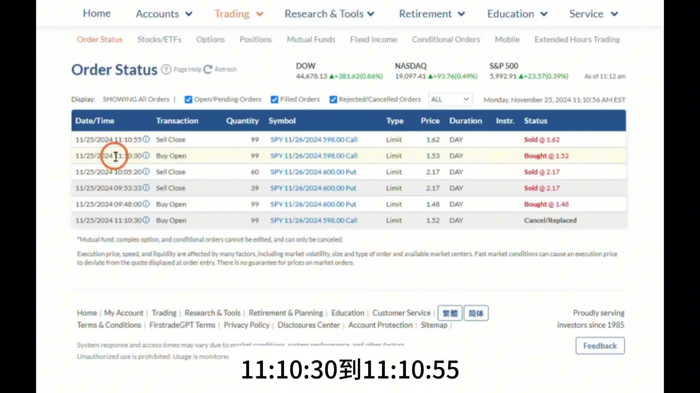
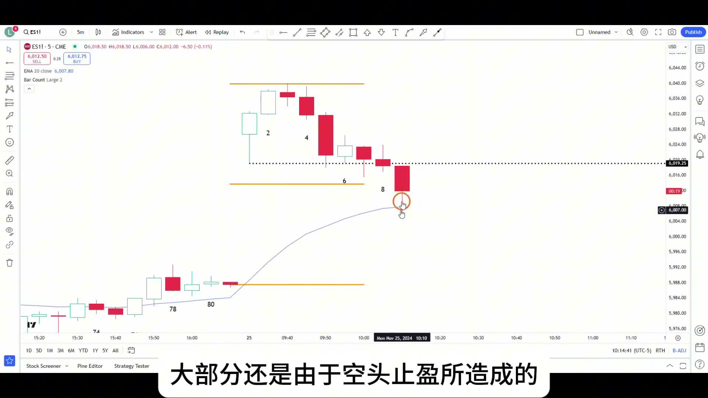
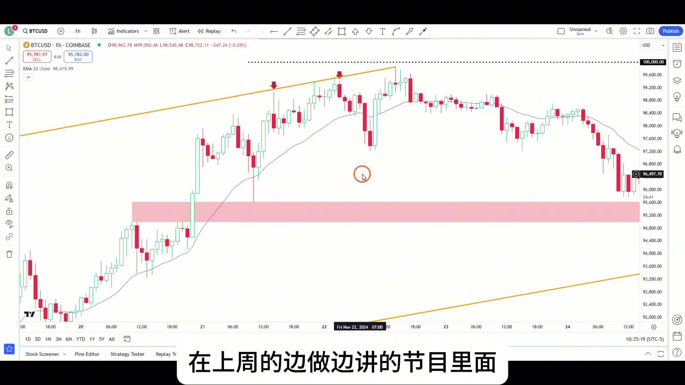
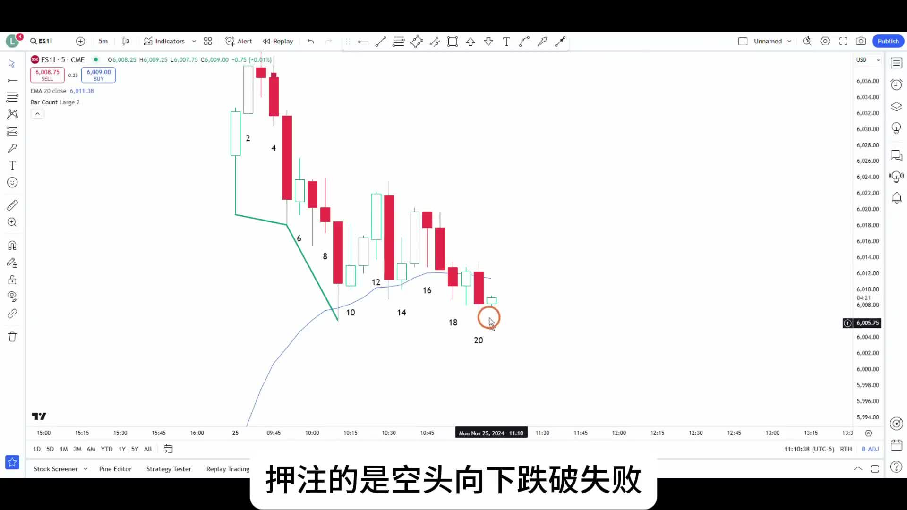

# 《【价格行为学】边做边讲(20): 标普期权日内，小波段 +$6831；25秒剥头皮 +$990》复盘笔记

来源视频：
[YouTube 原视频](https://www.youtube.com/watch?v=Z3qWF7Am7yc&list=PLrCXUGuTXtGKrbsxteAGwDwVht1tghRe2&index=14)

说明：
这期最有价值的不是收益本身，而是作者在同一段早盘里，做了两种完全不同的交易：

- 先做一笔 `SPY put` 的小波段
- 再做一笔只有 `25` 秒的 `call scalp`

这两笔交易看起来方向相反，但底层逻辑并不冲突。前一笔是在震荡区间上沿找空头波段，后一笔是在“跌破没有好跟随”的地方，押注空头向下突破失败。所以这期真正要复盘的是：

- 为什么前半段能空
- 为什么后半段反而要快进快出做多
- 什么时候该用波段心态，什么时候该用剥头皮心态

---

## 一句话结论

这期最重要的一句话是：

**在 `trading range` 里，方向可以变，但逻辑不能乱。能做空，是因为在区间上沿；能反手做多，是因为空头跌破没有跟随。真正决定你赚不赚钱的，不是立场，而是你有没有分清“波段交易”和“25秒 scalp”是两种完全不同的处理方式。**

---

## 主题主线

这期可以压成一句话：

**同一个早盘，先按“区间上沿做空”的逻辑吃一段缺口回补，再按“跌破失败”的逻辑抢一口极短 `scalp`，关键不在于方向切换，而在于你有没有始终尊重当前 market condition 是 `trading range`。**

作者在这期里一直在强调：

1. 当前大背景仍然更像震荡区间，不是顺畅趋势
2. 在震荡区间里，很多看上去很强的单边走势，最后都可能失败
3. 所以前一笔空单，不该幻想成超级顺畅的单边下跌
4. 而后一笔 25 秒做多，也不是看多大趋势，只是押一个很短暂的“向下 break failed”

也就是说，这期不是在讲：

- 我多厉害，能一会儿做空一会儿做多

而是在讲：

- **在震荡区间里，怎么根据 follow-through 的有无，切换交易预期和持仓方式。**

---

## 本期术语表

- `trading range`：震荡区间。这期的核心背景，决定了顺势单不容易走得很流畅。
- `exhaustion gap`：衰竭型缺口。作者认为早盘高开的这个缺口，更像会被回补，而不是测量型缺口。
- `measuring gap`：测量型缺口。如果是测量型缺口，趋势会更容易延续；但这期作者更偏向它不是。
- `follow-through`：跟随。是否有好跟随，是区分“继续拿”还是“先走/反手”的核心依据。
- `EMA20`：20 均线。作者把它当成第二段下跌至少要回踩的最低目标。
- `failed breakout`：突破失败。后一笔 25 秒做多，本质就是押空头向下突破失败。
- `scalp`：剥头皮交易。目标很短，持仓只要几十秒到几分钟。
- `swing`：波段交易。前一笔 `put` 是明显按波段思路进场和管理。
- `gap fill`：补缺口。前一笔空单的重要目标之一，就是把跳空缺口补掉。
- `double top`：双顶。作者在回看自己入场时，明确提到窄震荡区间里的双顶做空。

---

## 操作主线

这期的交易主线可以拆成两段：

1. `9:48` 左右，作者买入 `99` 张 `SPY 11/26/2024 600 Put`
2. 原因不是单根 K 线变弱，而是：
   - 高开之后仍在震荡区间上沿
   - 这个缺口更像 `exhaustion gap`
   - 下方至少要去回踩 `EMA20`，更远则是补掉缺口
3. 这笔空单先在 `2.17` 附近减掉 `39` 张
4. 剩下 `60` 张继续拿，但后来因为跟随不好、价格行为开始重叠，作者选择保护利润
5. 到 `11:10` 左右，又反手买入 `99` 张 `SPY 598 Call`
6. 这笔多单只拿了 `25` 秒，从 `1.52` 买到 `1.62` 卖
7. 核心逻辑不是做多趋势，而是：
   - 空头跌破均线下方没有好跟随
   - 在震荡区间下沿附近，阴线收盘更容易吸引人买入，而不是继续砸盘

所以这期最应该记住的是：

**不是“方向反复横跳”，而是先做区间上沿空，再做跌破失败的超短多。**

---

## 视频关键截图

### 1. 同一期里两笔单的真实成交记录

这张截图很有价值，因为它把整期复盘钉死在真实执行上。前一笔是 `SPY 600 Put`，后一笔是 `SPY 598 Call`，后者持仓时间从 `11:10:30` 到 `11:10:55`，只有 `25` 秒。

### 2. 前一笔空单的核心背景：区间上沿 + 缺口更像要回补

这张图把背景讲清楚了。作者并不是因为高开后两根阳线就追涨，而是先看更大的结构仍在 `trading range` 上沿，所以这个 gap 更可能是 `exhaustion gap`，而不是 `measuring gap`。

### 3. 为什么后面必须把剩余的 `put` 利润先保护掉

这里已经能看到很明显的问题：大阴线之后没有流畅跟随，K 线开始重叠，价格行为更像震荡而不是顺畅单边下跌。作者在这里先走，不是因为看错了方向，而是因为作为日内短线，这里已经重新回到 `50/50` 的地带。

### 4. 25秒做多，不是在翻多，而是在押空头 break failed

这张图直接把后一笔单的本质讲明白了：作者押的是“空头向下跌破失败”。这不是看多整段行情，而是一个对 `follow-through` 失败的极短线利用。

---

## 关键决策节点

### 1. 为什么前一笔 `SPY put` 能做

作者一开始的判断非常典型：

- 高开以后，虽然有两根阳线收在高位
- 但如果回到大背景看，价格仍然处在震荡区间上沿
- 震荡区间里的 gap，大概率会被补掉

所以这笔空单不是在空一个很强的 bull trend，而是在空：

**区间上沿的高开失真。**

他还明确给了两个目标：

- 最低目标是回踩 `EMA20`
- 更远目标是补掉昨天收盘和今天开盘之间的 gap

这就意味着，这笔空单从一开始就不是“拍脑袋看空”，而是有：

- 位置优势
- 目标位
- 缺口性质判断

---

### 2. 为什么这里的胜率不是普通的 40%

作者在回看入场时提到，单看 `18` 这一根收盘做空，按照 `Al Brooks` 的课程内容，一般情况下拿到波段下跌的概率大约是 `40%`。

但他同时说明，这笔交易比普通情况更好，因为它叠加了多个因素：

- 开盘反转的统计倾向
- 震荡区间上沿
- 前方重要高点
- 跳空高开但更像 `exhaustion gap`
- 下方有明确的第一目标和第二目标

所以这笔交易真正的价值，不是某一根 K 本身，而是：

**多个背景同时把这根 K 的做空质量抬高了。**

---

### 3. 为什么在已经赚很多时，还要提前保护利润

这期有个很容易被误解的点：市场后面确实还是跌下去了，那作者为什么要把剩下 `60` 张 `put` 先走？

因为他当时面对的不是事后结果，而是盘中的价格行为：

- 大阴线之后没有好的跟随
- 再次尝试突破时，下影线很长
- `6、7、8` 这几根 K 的实体开始重叠

这意味着什么？

- 即便大方向仍偏空
- 但作为日内短线，眼前这段走势已经更像 `trading range`
- 下一步到底是先反弹还是先继续跌，概率重新接近 `50/50`

所以他离场不是因为“市场不跌了”，而是因为：

**这已经不再是一个值得死拿利润的日内单边。**

---

### 4. 为什么后一笔 25 秒 `call` 反而能做

这笔单特别值得复盘，因为很多人会觉得：

- 你前面不是刚刚才看空吗
- 怎么马上又去做多

但这笔 25 秒多单的逻辑和前面根本不是同一类：

- 前一笔是在做区间上沿的空头波段
- 后一笔是在押空头向下 break 没有好跟随

作者自己讲得很直白：

- 一根 K 收在均线下方，是没有用的
- 如果后面没有好的跟随
- 在震荡区间下沿附近，更多人反而愿意收盘买入，而不是继续卖出

所以这笔单本质上是：

**利用“跌破失败”去抢一个极短暂的反弹。**

它不是看多趋势，也不是想拿很久，所以持仓只需要 `25` 秒。

---

### 5. 为什么这笔 25 秒单必须按 `scalp` 处理

作者自己也说了，这种交易一般不会在边做边讲时做，因为下单必须非常快。

原因很简单：

- 它不是一笔有充足容错的波段单
- 它也不是在大级别多头启动点做多
- 它只是押一个非常局部的“空头 break failed”

所以这种单的正确处理方式只有一种：

**快进快出。**

如果你把它拿成波段：

- 价格一旦拉上去又掉回来
- 你就会陷入“打平走还是继续拿”的尴尬

这也是作者专门提醒的地方：在震荡区间里，这种单子很容易马上给你利润，也很容易马上把利润吐回去。

---

## 持仓处理

### 1. 前一笔空单是 `swing` 逻辑，后一笔是 `scalp` 逻辑

这期最大的学习点之一，就是不要把两笔单混在一起理解。

前一笔 `put`：

- 有大背景
- 有位置优势
- 有第一目标和第二目标
- 可以先减仓再观察

后一笔 `call`：

- 只有极局部逻辑
- 目标非常短
- 没有资格拿成波段

很多人交易一乱，根源就在这里：

- 明明做的是 `scalp`
- 却开始幻想它走成 `swing`

或者反过来：

- 明明已经是不错的 `swing`
- 却被一两根犹豫 K 吓得像 `scalp` 一样乱走

---

### 2. 在震荡区间里，利润保护比“看对方向”更重要

这期前半段最重要的操作，不是开空，而是作者后来愿意先保护利润。

因为震荡区间的本质就是：

- 你可以判断对大方向
- 但途中价格行为会非常别扭
- 大阴线后未必有大跟随
- 反弹也会很突然

所以在这种环境下，交易者最容易犯的错不是方向错，而是：

**明明该保护利润的时候，还拿着单边趋势的幻想不放。**

---

### 3. 极短线交易真正拼的是执行，不是观点

25 秒那笔单特别说明这件事。

这类单子不是靠你“更懂宏观”，也不是靠你“更会预测下午会去哪”，而是靠：

- 你能不能识别当前 break 失败
- 你能不能立刻执行
- 你能不能很快把利润拿走

这类单子一旦犹豫，就很容易从“高质量 scalp”变成“莫名其妙套住自己”。

---

## 容易犯的错

1. 看到高开两根阳线就直接追涨，没有先看是否仍在震荡区间上沿。
2. 把 `gap` 默认当成 `measuring gap`，忽略它可能只是 `exhaustion gap`。
3. 已经出现跟随不好和实体重叠，却还死拿空单当单边趋势。
4. 看到作者反手做多，就误以为他整体翻多了。
5. 把 25 秒的 `scalp` 拿成几分钟甚至更久的波段。
6. 在震荡区间里，把任何一根收在线下或线上的 K 过度神化。

---

## 复盘 checklist

1. 当前市场更像趋势，还是 `trading range`？
2. 这个高开缺口更像 `measuring gap` 还是 `exhaustion gap`？
3. 我做空的位置，是不是处在区间上沿附近？
4. 这笔单至少要回踩到哪里？`EMA20` 还是补缺口？
5. 当前大阴线 / 大阳线之后，有没有真正的 `follow-through`？
6. 如果没有跟随，我现在还在拿趋势单，还是已经回到 `50/50` 的区间逻辑？
7. 我做的是 `swing` 还是 `scalp`？
8. 如果是押 break failed，这笔单有没有资格拿超过几十秒或几分钟？

---

## 我的整理结论

这期非常适合反复看，因为它把“震荡区间里怎么切换交易预期”讲得非常具体。

前一笔空单告诉你：

- 在区间上沿，高开未必是追涨信号
- `gap` 更可能先被补掉

后一笔 25 秒做多告诉你：

- 大阴线也不等于空头一定接管
- 没有 `follow-through` 的跌破，本身就可能是做多的理由

如果把这期压成一句可复用的规则，就是：

**在 `trading range` 里，位置决定你偏向做哪边，跟随决定你还能不能继续拿；而一旦交易从 `swing` 退化成 `scalp`，你的持仓方式也必须立刻跟着变。**
