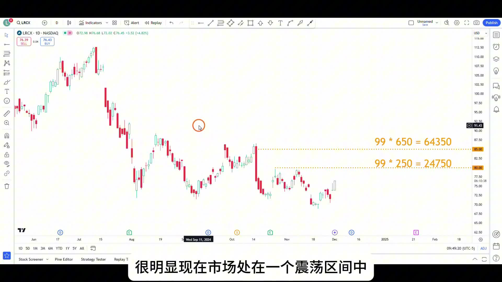
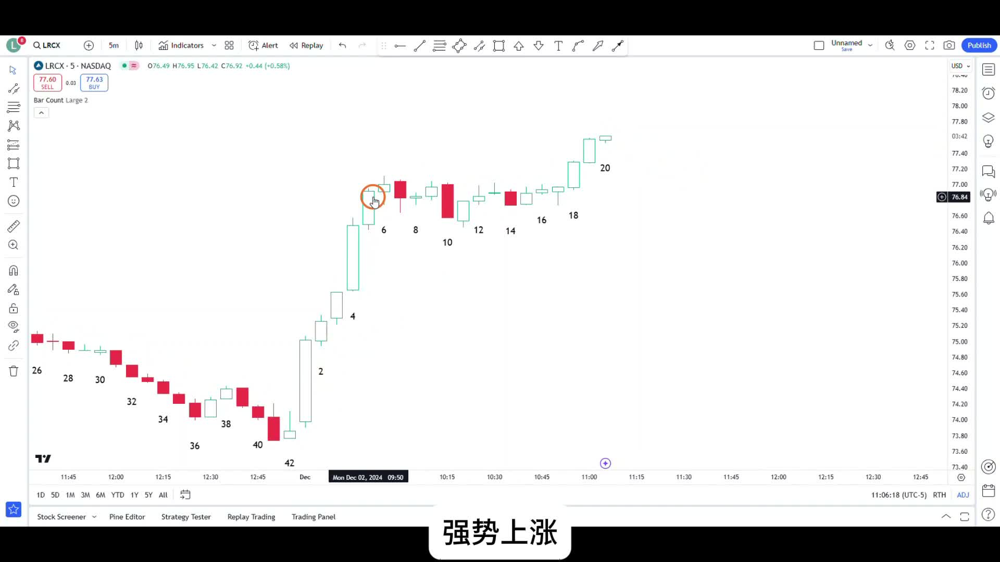
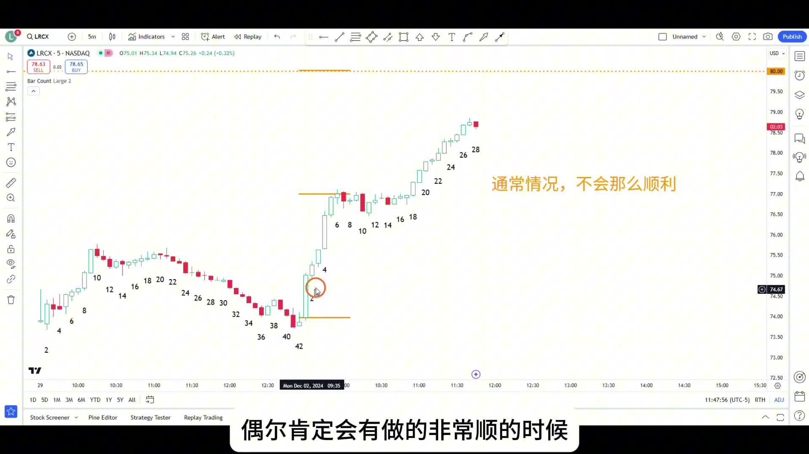
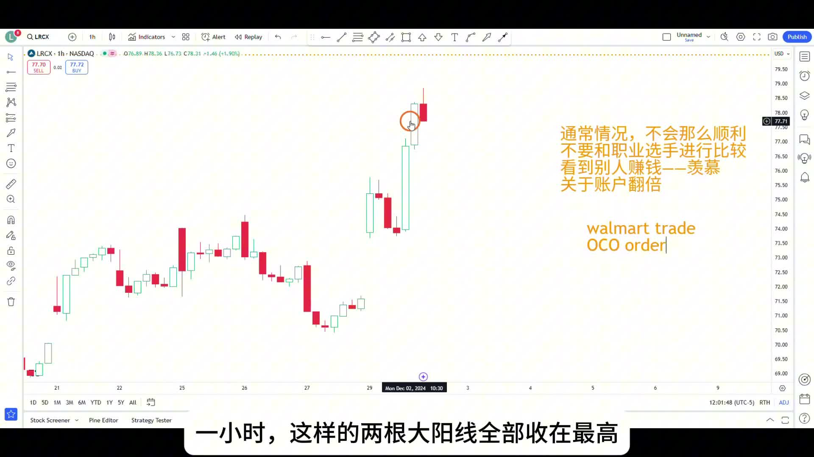

# 《【价格行为学】边做边讲(22): 15分钟利润回撤 $5000，坚定持有！最终盈利 $17100 离场》复盘笔记

来源视频：
[YouTube 原视频](https://www.youtube.com/watch?v=h1XzfIbhoMg&list=PLrCXUGuTXtGKrbsxteAGwDwVht1tghRe2&index=13)

说明：
这期最值得复盘的，不是“最后赚了多少钱”，而是作者怎么处理一笔本来计划拿几天的 `swing`，却在当天很快浮盈很大、随后又快速回撤的持仓。

这期真正的学习点是：

- 为什么这笔 `LRCX call` 本身值得做
- 为什么明明浮盈回撤了 `5000` 美金，仍然不能因为难受就乱走
- 为什么后面又要开始减仓，而不是无脑死拿到最后

---

## 一句话结论

**这期的核心不是“扛回撤”，而是先用日线和行业背景拿到一笔有位置优势的多单，再在盘中回到价格行为本身，区分“只是第一次小回调”还是“交易逻辑已经坏了”；最后再根据 `theta`、`delta` 和走势从趋势变成通道/震荡，主动降低持仓复杂度。**

---

## 主题主线

这期表面上是在讲：

- 盈利很多的时候怎么不被情绪带走

但更深一层，其实是在讲三件事情怎么连起来：

1. **为什么这笔交易存在**
2. **为什么利润大回撤时还不能乱动**
3. **为什么后面又必须开始减仓**

作者的处理并不是一句“相信自己”这么空，而是有非常明确的链条：

- 大背景仍然是 `trading range`
- 入场位置在区间下半部偏低位置
- 半导体板块本身也在重要支撑附近反弹
- 当天 5 分钟开盘后连续强势上涨，增加了 `bull trend day` 的概率
- 所以这是一笔值得拿成小波段的 `call swing`

后面的关键就在于：

- 浮盈回撤很难受，不等于交易错了
- 但当期权已经深度 `in-the-money`，`delta` 很大、`theta` 也开始明显吞利润时，又不能把“坚定持有”理解成什么都不做

这才是这期最有价值的地方。

---

## 本期术语表

- `trading range`：震荡区间。作者对 `LRCX` 日线的大背景判断。
- `wide bear channel`：宽熊通道。作者提到也可以勉强这样看，但本质上已经和震荡区间没有区别。
- `sell climax`：抛售高潮。作者把前面那根大阴线当成一个重要参考，因此预期至少会回到它的起跌点附近。
- `bull trend day`：上涨趋势日。开盘后连续强势阳线，提高了当天偏强的概率。
- `Walmart trade`：开仓后用 `OCO order` 设好止盈和止损，然后离开屏幕，不盯盘做微操。
- `OCO order`：One Cancels the Other，一边止盈一边止损，触发一个后另一个自动取消。
- `theta`：时间损耗。期权持有时间越久，即使标的价格不动，期权价值也会继续下降。
- `delta`：标的价格每变动 1 个单位时，期权价格大致变化多少。深度价内后，`delta` 变大，利润波动也会更快。
- `50% pullback`：50% 回调。作者后面确认回撤只是小回调时，用到的一个关键位置。
- `EMA20`：20 均线。回调正好同时回踩 `EMA20`，增加了“只是小回调”的判断。

---

## 操作主线

这笔交易的主线很清晰：

1. `9:48` 左右，作者买入 `Lamb Research (LRCX)` 的看涨期权
2. 这不是日内乱追，而是按日线去做一笔几天级别的 `swing`
3. 目标先看区间中部附近的前高，再看前面大阴线的起跌点，约在 `85-86`
4. 到 `11:05` 左右，5 分钟图已经出现很强的连续上涨和窄震荡后的向上突破
5. 到 `11:43` 左右，浮盈一度到 `17000+`，但作者没有因为短期顺利就乱减仓
6. 随后利润快速回撤约 `5000`，但他仍判断这更像第一次小回调，不是反转
7. 到 `12:33` 左右，确认回调大致是 `50% pullback + EMA20` 后，才开始主动减掉一部分仓位
8. 减仓的原因不是害怕，而是：
   - 期权已经深度价内
   - `delta` 很大
   - `theta` 开始持续侵蚀利润
   - 走势从流畅趋势转向通道/震荡，继续全拿的管理复杂度变高

所以这期不是单纯的“扛单教学”，而是：

**交易逻辑没坏的时候不被情绪赶下车，交易结构开始变复杂的时候再主动降复杂度。**

---

## 视频关键截图

### 1. 开仓背景不是追涨，而是区间下半部做日线多单

这张图把这笔交易的起点讲清楚了。作者不是因为今天涨了就追，而是先在日线里看到：

- 市场更像 `trading range`
- 入场位置在区间下半部
- 上方有两个明确目标位：区间中部附近和前面大阴线的起跌点

这决定了这笔单从一开始就是“有目标、有位置”的 `swing`。

### 2. 窄震荡后向上突破，为什么更应该继续拿

从 `6` 到 `17` 形成一个很窄的震荡区间，然后向上突破。事后看谁都知道该拿住，但作者专门提醒：真正难的是你坐在盘前时，会被每根 5 分钟 K 的来回跳动影响，开始想“要不要先保护利润”。

### 3. 赚钱特别顺的时候，最容易让人误判自己

这张图值得保留，因为作者在这里反复强调：

- 这种特别顺的走势不是常态
- 看到职业交易员短时间赚很多，不代表你也该冲动放大仓位
- 真正该学的是处理方法，不是收益数字

### 4. 利润回撤后为什么还能拿，以及后面为什么又要减仓

这里是全片最关键的节点之一。作者一边提醒可以用 `Walmart trade` 避免盯盘微操，一边用 1 小时图说明：连续两根大阳线都收在高位时，第一次明显回调大概率仍只是小回调。

---

## 关键决策节点

### 1. 为什么这笔 `LRCX call` 值得做

作者的入场逻辑不是单点，而是多层背景叠加：

- `LRCX` 日线更像震荡区间，而不是顺畅下跌
- 他买入时的位置处在区间下半部分，位置不差
- `SPY` 创新高，临近年底存在偏强的季节性氛围
- 半导体龙头和板块内其他股票也在重要支撑附近反弹
- 当天 `5m` 开盘后连续 `5` 根阳线几乎收在最高，增加了 `bull trend day` 的概率

所以这笔单不是简单的“行业看多”，而是：

**日线位置 + 大盘背景 + 板块支撑 + 当天盘面强度** 一起支持的多单。

---

### 2. 为什么窄震荡后向上突破时，真正难的是“拿住”

`11:05` 左右，作者专门讲了一个很常见的问题：

- 事后看，窄震荡后向上突破，当然应该拿
- 但盘中盯着每根 `5m` K，浮盈一会儿多两千、一会儿少三千，人会非常不舒服

问题不是你不知道趋势强，而是：

- 你太在乎浮盈数字
- 你对目标位没有真正的信心

于是大脑会自动编理由，让你提早离场来换取“舒服”。

这就是为什么作者推荐：

- 开仓后直接设好 `OCO order`
- 离开屏幕

它不是鸡汤，而是直接解决“看对了却总拿不住”的执行问题。

---

### 3. 为什么浮盈回撤 `5000` 美金时，仍然不能乱走

这期最核心的复盘点就在这里。

从结果上看，利润从 `17500+` 很快掉到 `12000+`，任何人都会难受。但作者并没有按“损失了 5000 浮盈”去处理，而是重新回到价格行为本身：

- 如果看 1 小时图，前面是连续两根收在高位的大阳线
- 在这种背景下，第一次明显回调大概率仍只是小回调
- 更可能演变成某种震荡区间或牛旗，而不是立刻反转

也就是说，这里不能因为数字难受，就把一次正常回调误判成逻辑失效。

真正该问的不是：

- 我回吐了多少钱

而是：

- 当前这段回调，有没有把我原来的交易逻辑破坏掉

作者当时的答案是：**还没有。**

---

### 4. 为什么到 `12:33` 左右又必须开始减仓

很多人看到这里会走向另一个极端：

- 既然前面都说了回调只是小回调，那是不是应该一直死拿

作者后面的处理恰恰说明，不是这样。

到 `12:33` 左右，他确认：

- 这段回调大致是 `50% pullback`
- 同时正好回踩 `EMA20`
- 价格也重新涨了回来

这时他开始减掉一部分仓位，但原因不是害怕，而是期权结构变了：

- 行权价 `76` 已经明显变成深度价内
- `delta` 变大，利润波动会非常快
- 每天 `theta` 还会继续吞掉时间价值
- 如果后面走势从顺畅趋势转成通道或震荡，全拿的管理难度会高很多

所以这里的减仓，本质上是在做：

**把一个越来越难管的期权头寸，主动降回更容易管理的状态。**

---

### 5. 这期最该学的不是“扛”，而是“分清哪种回调该忍，哪种复杂度该降”

这期最容易被学歪的地方，就是只记住：

- 浮盈回撤很多也别动

但真正更完整的版本应该是：

- 只要交易逻辑没坏，就不要因为浮盈数字难受而乱动
- 但当工具属性和走势结构都开始让持仓复杂化时，也不能假装什么都没变

前半段学的是：

- 不要被情绪赶出好交易

后半段学的是：

- 不要把“坚定”误解成“拒绝管理”

---

## 持仓处理

这期的持仓处理分成三个阶段：

1. **开仓阶段**
   - 把它当日线 `swing`，不是普通日内快进快出
   - 所以仓位允许比日内单更大，但前提仍是用“亏了也不在乎的钱”交易

2. **浮盈很大但逻辑没坏的阶段**
   - 不因为 `P&L` 跳动而提早下车
   - 重点回到：趋势有没有坏，目标位还有没有意义

3. **期权已经深度价内、走势变复杂的阶段**
   - 开始部分减仓
   - 必要的话，后续更适合换成略微价外、结构更干净的期权重新管理

这三步合在一起，才是完整的持仓思路。

---

## 这期最实用的复盘 checklist

- 我现在做的是 `scalp`、日内 `swing`，还是日线级别 `swing`？
- 我的入场逻辑，来自单根 K，还是来自位置 + 板块 + 大盘 + 当天强弱？
- 我现在想离场，是因为价格行为变了，还是因为浮盈数字让我不舒服？
- 这次回调有没有真正破坏原来的交易逻辑？
- 如果我用的是期权，现在是不是已经进入 `delta` 很大、`theta` 明显吞利润的阶段？
- 我该继续持有原仓，还是先减仓/换更容易管理的结构？

---

## 总结

这期真正高级的地方，不是“赚了 `17100`”，而是作者把三件经常被混在一起的事拆开了：

- **交易逻辑**：为什么这笔多单存在
- **情绪处理**：为什么 `5000` 浮盈回撤不能吓走你
- **头寸管理**：为什么后来又必须减仓

所以这篇最该记住的一句话是：

**回调本身不可怕，把正常回调误判成逻辑失效，或者把坚定持有误解成拒绝管理，才是真正会伤交易的地方。**
