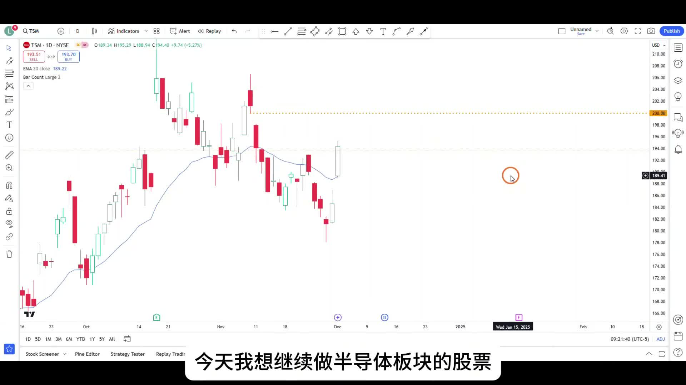
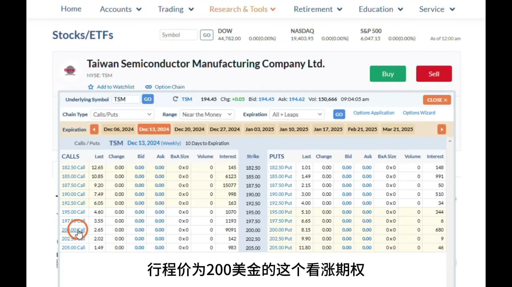
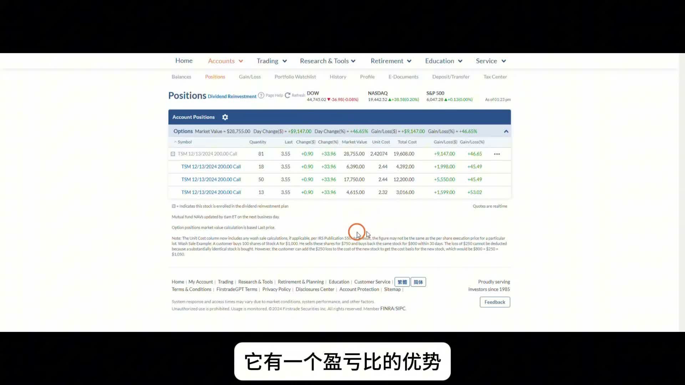
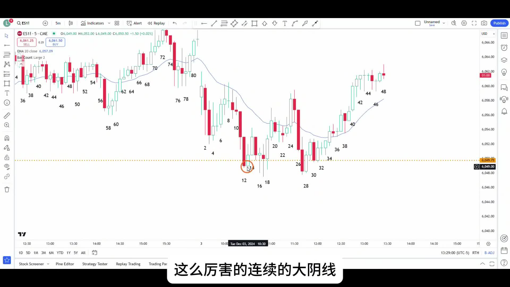
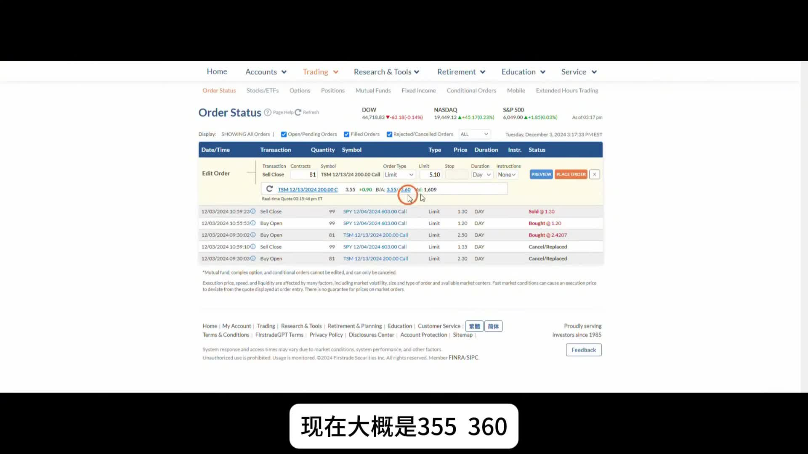

# 《【价格行为学】边做边讲(23): 追涨心爱的台积电！+$9550；ES剥头皮+$990》复盘笔记

来源视频：
[YouTube 原视频](https://www.youtube.com/watch?v=FOaPOP1GO_Q&list=PLrCXUGuTXtGKrbsxteAGwDwVht1tghRe2&index=12)

说明：
这期表面上像是在讲“追涨台积电”，但真正值得复盘的不是“敢不敢追”，而是三件事：

- 这笔 `TSM call` 为什么本身是好机会
- 为什么开盘抢进时作者其实犯了一个真实执行错误
- 为什么最后选择日内平仓，而不是为了看多就硬拿隔夜

视频里还顺手带了一笔 `SPY/ES scalp`，它正好和 `TSM` 这笔顺势多单形成对照。

---

## 一句话结论

**这期最重要的不是“追涨”，而是：当你看见高胜率的顺势机会时，可以接受没有完美入场，但必须用仓位、目标位和工具管理把不完美控制住。作者的计划是对的，开盘抬价抢单是错的，后面能赚钱靠的不是这次失误，而是他后续没有把整笔交易管理坏。**

---

## 主题主线

这期最该记住的一条主线是：

**低开给了半导体板块一个继续做多的窗口，`TSM` 的上方缺口回补到 `200` 本来就是清晰目标；真正需要复盘的，不是“敢不敢追”，而是“计划、执行、持仓管理”三者有没有分开处理。**

作者这期其实同时示范了两种东西：

1. 顺势做一笔 `TSM` 的 `call swing`
2. 在震荡区间里，用极短线思路做一笔 `SPY scalp`

这两笔单看起来风格不同，但底层原则是一致的：

- 没有完美入场
- 真正决定结果的，是你如何管理不完美

`TSM` 这笔单里，不完美体现为：

- 开盘怕踏空，主动把买价从 `2.30` 抬到 `2.50`
- 最终成交均价大约 `2.42`
- 事后看，完全可以买得更低

但作者没有因为这个失误就把整笔交易做坏，而是继续围绕：

- 上方缺口回补
- 板块强势
- 持仓工具的 `delta/theta`

去处理后面的交易。

---

## 本期术语表

- `gap fill`：补缺口。这期 `TSM` 上方最清晰的短期目标就是补掉空头缺口，到 `200` 附近。
- `initial position`：初始仓位。作者把开盘买入这部分视为第一层仓位，若有更深回调再考虑低位加仓。
- `perfect entry`：完美入场。作者明确强调不存在这种东西，关键是管理。
- `delta`：期权对标的价格变动的敏感度。盈利后 `delta` 变大，相当于自动放大利润敞口。
- `gamma`：`delta` 的变化速度。作者用它说明期权盈利时会有“自动盈利加仓”的效果。
- `theta`：时间损耗。作者最后选择不过夜的重要原因之一。
- `calendar spread`：卖出不同到期日、相同行权价的另一条腿，来对冲时间损耗。
- `debit spread`：同到期日、不同执行价的两腿组合，也能降低单腿裸多期权的时间损耗压力。
- `trading range`：震荡区间。后半段解释 `SPY/ES scalp` 时的关键背景。
- `vacuum effect`：真空效应。震荡区间里大阳线、大阴线看起来很强，但经常会被迅速拉回支撑或阻力附近。

---

## 操作主线

这期可以拆成两条并行主线：

1. `9:30` 开盘瞬间，作者买入 `81` 张 `TSM 12/13/2024 200 Call`
2. 大逻辑是：
   - 前一天半导体板块整体很强
   - `TSM` 和前一天的 `LRCX` 一样，都是大阳线收在高位
   - 当天受外围消息影响低开，反而给了多头更好的切入位置
   - 上方空头缺口回补到 `200` 是清晰目标
3. 执行层面上，作者怕买不到，把挂单从 `2.30` 抬到 `2.50`
4. 结果虽然方向对了，但买贵了，属于真实执行失误
5. 到中午以后，`TSM` 震荡后继续向上突破，浮盈来到 `8700+`
6. 临近收盘，价格接近 `198` 压力位，期权时间损耗也很大，作者选择在 `3.60` 左右平掉
7. 这笔 `TSM` 单最后盈利大约 `9550`
8. 另外作者还做了一笔极短 `SPY call scalp`：
   - 大概 `1.20` 买入
   - `1.30` 卖出
   - `99` 张合约，利润 `990`

所以这期最该记住的是：

**方向判断对，只是交易的一半；执行有瑕疵时，后续能不能靠管理把它拉回正轨，才是另一半。**

---

## 视频关键截图

### 1. 大计划很清楚：低开不是坏事，反而给了回补缺口的空间

这张图把大背景讲透了。作者做的不是盲目追高，而是看到：

- 前一天强势大阳线
- 当天预期小幅低开
- 上方 `200` 一带存在明显缺口回补目标

所以这笔单一开始就是“低开做强股回补缺口”的思路。

### 2. 选择哪一张期权，本身就是交易计划的一部分

这里能看到作者明确选的是：

- `12/13/2024`
- `200 Call`

他不是随便挑一张最便宜的合约，而是围绕“未来几天大概率先回到 `200`”这个目标去选工具。

### 3. 期权盈利后杠杆会自动放大，这是优势，也是管理要求

这张图对应作者讲 `delta/gamma` 的那段。盈利之后，期权会越来越像“自动盈利加仓”，这也是为什么顺势单一旦跑起来，利润会放大得很快。

### 4. 震荡区间里的 `SPY/ES scalp`，核心不是方向，而是假突破

这张图很适合拿来对照 `TSM`。作者讲得很清楚：

- 震荡区间里，两段看起来很强的连续大阴线
- 往往只是向下假突破

所以这笔 `SPY scalp` 不是在追方向，而是在做震荡区间里的失败突破反手。

### 5. 最后离场不是看空，而是时间损耗开始变得太贵

这张图把最后的执行钉住了。作者在 `3:17` 左右卖掉 `81` 张 `TSM 200 Call`，不是因为不看多，而是因为这张合约隔夜一天就要损失超过 `1000` 美金左右的 `theta`，继续拿的性价比已经明显下降。

---

## 关键决策节点

### 1. 为什么这笔 `TSM call` 本身值得做

这笔单的核心不是“我喜欢台积电”，而是：

- 半导体板块这两天整体都很强
- 前一天 `LRCX` 已经验证过这类强股的顺势机会
- `TSM` 自己前一天也是大阳线收在高位
- 当天因为外围消息低开，反而给了一个更好的短线切入点
- 上方到 `200` 的缺口回补目标非常清楚

所以这笔单存在的原因，不是情绪偏好，而是：

**板块强 + 个股强 + 低开给机会 + 目标位清楚。**

---

### 2. 开盘为什么是一次真实执行失误

这期特别好的地方在于，作者没有把自己包装成“每一步都完美”。

他明确承认：

- 原本挂的是 `2.30`
- 因为怕买不到，改成了 `2.50`
- 最终实际成交大约 `2.42`
- 而事后看，当天完全有机会在更低的位置买到

这说明什么？

- **计划是对的**
- **执行可以是错的**

很多人一旦方向最后对了，就会把执行上的着急合理化。但这期不是。作者把这部分单独点出来，就是告诉你：

- 看对行情，不等于入场做得好
- 好交易也可能被自己买贵

这也是这期最有复盘价值的地方之一。

---

### 3. 为什么“没有完美入场”不等于可以随便追

作者后面引用 `Al Brooks` 的意思其实很重要：

- 市场里不存在一个完美点，能保证你总是买在最低
- 真正的大资金，也是在一根根 K 线上不断买入

但这句话很容易被误解成：

- 那我追高也无所谓

真正完整的意思其实是：

- 如果你买得不够低，`risk/reward` 就会变差
- 那你不能还用低位入场时同样大的仓位

也就是说，不存在完美入场，不代表可以放弃纪律；它真正要求的是：

**入场越差，仓位越要保守。**

---

### 4. 为什么这笔顺势单后面还能拿住

中午以后，`TSM` 在早盘震荡后继续向上突破，浮盈快速扩大。这里作者真正想讲的不是“看吧，我果然对了”，而是：

- 大资金不是只在一个点上买
- 强势行情里，很多 K 线上都有人继续买
- 对普通交易者来说，更重要的是买入后能否让市场把你带到目标位

这也是为什么这笔交易虽然开盘买贵了，但并没有立刻变成坏交易：

- 因为方向和结构仍然站在多头这边
- 后续持仓并没有被自己的情绪打断

---

### 5. 为什么 `SPY/ES scalp` 能做，但不该和 `TSM` 混在一起理解

这笔 `SPY/ES` 小单很容易被忽略，但其实很有价值。

作者想表达的是：

- 震荡区间里，看起来很猛的连续大阴线，经常只是向下假突破
- 如果你能识别这种失败突破，就可以做一笔很短的反手 `scalp`

所以它和 `TSM` 完全不是同一类交易：

- `TSM` 是顺势拿一段板块强势的延续
- `SPY/ES` 是震荡区间里的反向极短线

如果把这两笔混成一个逻辑，就很容易学歪。

---

### 6. 为什么最后日内平仓比硬拿隔夜更合理

这期最后最重要的不是“敢不敢留”，而是有没有算清楚：

- 价格已经接近 `198` 附近的压力位和既定目标区
- 这张 `12/13 200 Call` 的 `theta` 很大
- 如果继续隔夜，光时间损耗第二天开盘就可能先少掉 `1000+`

所以作者选择在当天收盘前了结，不是转空，而是因为：

- **趋势利润已经拿到一大段**
- **继续持有的边际收益，开始被时间损耗明显侵蚀**

这就是为什么他后面又提到：

- 如果真的还想继续拿，可以考虑把单腿多头改成 `calendar spread` 或 `debit spread`

也就是说，他不是简单说“别拿了”，而是在区分：

- 我还看多
- 但我不一定想继续拿这条裸多期权过夜

---

## 持仓处理

这期的持仓处理可以压成三步：

1. **计划阶段**
   - 明确目标是上方 `200` 缺口回补
   - 工具选 `12/13 200 Call`

2. **执行阶段**
   - 开盘着急抬价，承认这是失误
   - 但不因为这次失误就频繁乱调整，反而把后面的注意力放回趋势本身

3. **退出阶段**
   - 价格接近目标和压力位
   - 时间损耗变得昂贵
   - 所以把已经到手的日内波段利润先兑现

这套处理的重点不是“每一步都完美”，而是：

**承认不完美，但不要让不完美一路扩散到整笔交易。**

---

## 这期最实用的复盘 checklist

- 这笔顺势单的目标位，是不是一开始就清楚？
- 我现在做的是“高胜率但盈亏比一般”的交易，还是“低胜率但盈亏比好”的交易？
- 我有没有因为怕错过，主动把自己的成交价买坏了？
- 如果我的入场更差了，我有没有同步缩小仓位？
- 现在继续持有，是在赚趋势的钱，还是在和 `theta` 对赌？
- 如果我还看同方向，是否该换成更适合隔夜的 `spread` 结构？
- 我有没有把震荡区间里的 `scalp`，误当成趋势波段去拿？

---

## 总结

这期最值得记住的不是“台积电又赚了 `9550`”，而是作者把三件常被混淆的事拆开了：

- **计划**：为什么 `TSM` 的低开做多有道理
- **执行**：为什么开盘抬价抢单是失误
- **管理**：为什么最后接近目标后要优先尊重 `theta`

所以这篇最该记住的一句话是：

**好机会不要求完美入场，但只要你的入场不完美，就一定要用后续管理把它约束住；否则“方向对”也照样可能变成一笔糟糕交易。**
