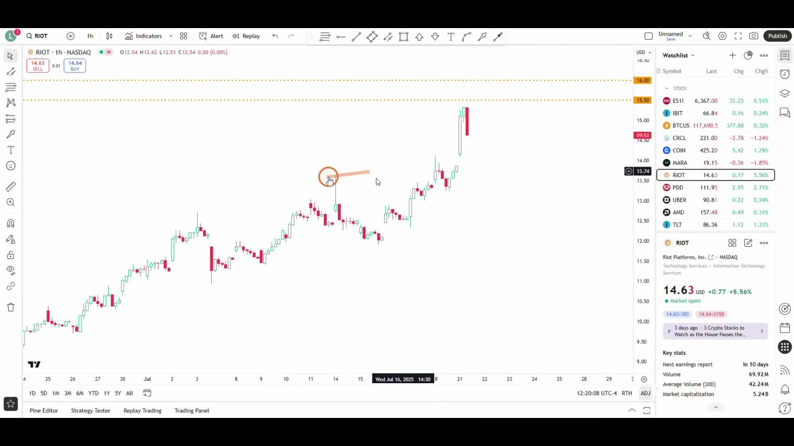
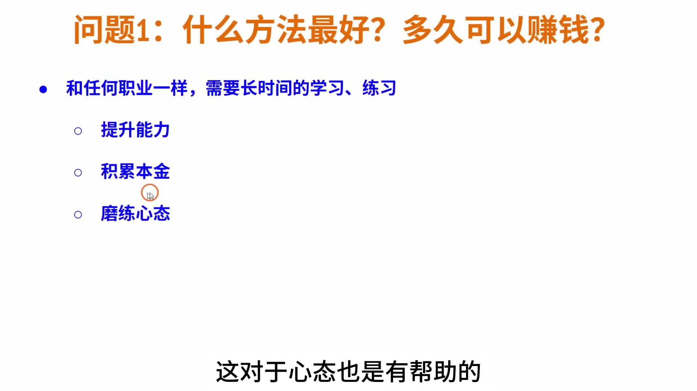
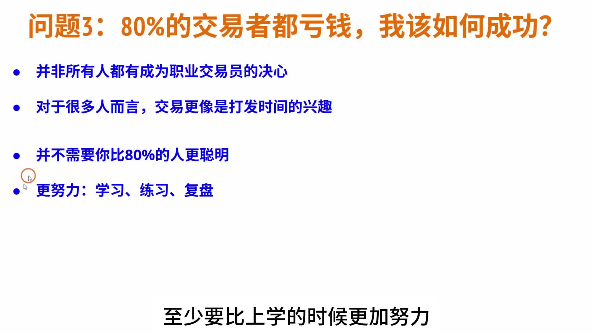
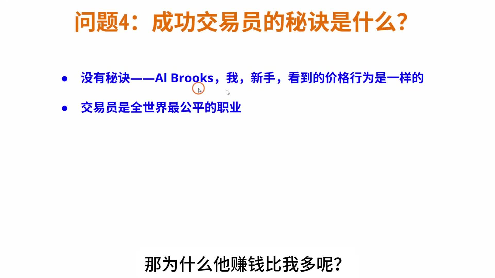
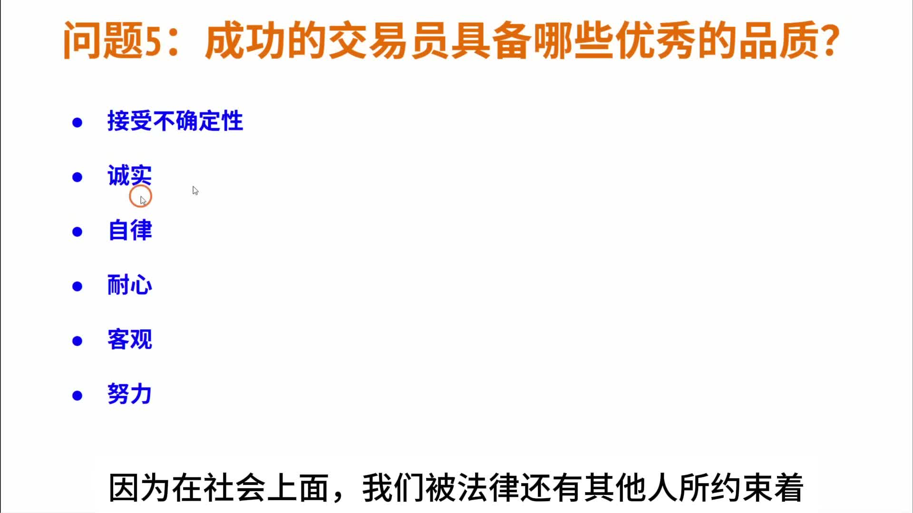
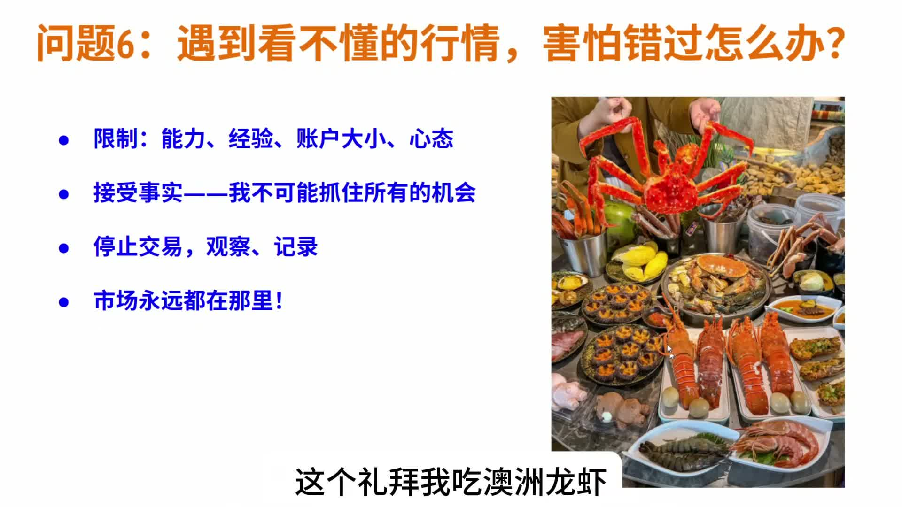

# 《【价格行为学】踏上交易之路(1): 培养正确的交易理念 & 如何开始学习》复盘笔记

来源视频：
[YouTube 原视频](https://www.youtube.com/watch?v=WUGRoGirK6U&list=PLrCXUGuTXtGKrbsxteAGwDwVht1tghRe2&index=11)

说明：
这期不是一节讲形态和买卖点的实盘课，而是一节很重要的“入门防走偏”课。它真正回答的是：

- 新手到底应该用什么预期进入交易
- 为什么很多人一开始就注定会反复亏钱
- 如果真的想走到稳定，应该先建立什么观念和学习顺序

这次我用的是本地转写加视频中的提纲页一起整理。转写里有少量口误和识别误差，我已经按画面上的关键提纲做了校正和重组。

---

## 一句话结论

**这期最重要的一句话是：交易不是“找到一个神奇方法就能很快赚钱”，而是一个需要长期学习、练习、复盘，并不断修正预期的职业。新手最大的问题通常不是方法太少，而是期待太高、练习太少、太想快点证明自己。**

---

## 主题主线

这期视频其实围绕 6 个新手最常见的问题展开：

1. 什么方法最好？多久可以赚钱？
2. 如何在交易中保持良好的心态？
3. 80% 的交易者都亏钱，我该怎么成功？
4. 成功交易员的秘诀是什么？
5. 成功的交易员具备哪些优秀品质？
6. 遇到看不懂的行情，害怕错过怎么办？

作者真正想做的不是给一个“万能答案”，而是先把新手最危险的几种错误观念打掉：

- 以为看几本书、几个视频，很快就能稳定赚钱
- 亏钱后马上怀疑方法，然后不断换方法
- 把亏损全部归因给“机构割韭菜”，而不是自己的预期和能力不匹配
- 觉得成功交易员一定掌握了某种别人不知道的秘密

这期真正的价值，是帮新手先建立一个正确起点：

- 把交易当职业看，而不是当快速致富捷径看
- 把注意力放回能力、资本、心态和复盘
- 承认自己抓不住所有行情

---

## 本期术语表

- `Price Action`：价格行为。作者整套学习体系的核心，不是靠指标堆砌，而是看价格本身在做什么。
- `mindset`：心态。这里不是空泛“要自信”，而是指预期管理、面对亏损和面对不确定性的能力。
- `review / 复盘`：把做过的交易和没做的机会重新拆开看，找出可重复的问题和进步点。
- `FOMO`：害怕错过。视频第 6 个问题本质上就在处理这个情绪。
- `capital`：本金。作者强调积累本金不是羞耻的事情，而是交易生涯的一部分。
- `uncertainty`：不确定性。能不能接受不确定性，是区分成熟交易者和新手的重要能力。
- `discipline`：自律。作者把它列为成功交易员的核心品质之一。

---

## 视频主线

这期最值得保留的主线可以压成四步：

1. 先承认交易和任何职业一样，都需要长期学习、练习
2. 然后承认交易更难，因为它的竞争极其激烈，成功后的回报又太诱人
3. 接着把新手最容易掉进去的坑挑出来：
   - 不切实际的期待
   - 亏损后不断换方法
   - 没有决心，只把交易当短期兴趣
4. 最后给出一套更稳的起步方式：
   - 降低预期
   - 用亏了也不在乎的钱练习
   - 把注意力放在能力、本金、心态、复盘
   - 接受自己抓不住全部机会

所以这期真正不是在讲“怎么一招制胜”，而是在讲：

**如果你的起点观念错了，后面学再多技巧也会一直走偏。**

---

## 视频关键截图

### 1. 开场就把这期真正要回答的问题摆出来了

这张图很重要，因为它说明这期不是零散聊天，而是一节明确面向新手的纠偏课。你后面复习时，可以直接按这 6 个问题回看自己的状态。

### 2. 第一个问题的核心不是方法，而是时间尺度和努力方向

这里是整期最核心的一页之一。作者把“多久赚钱”这件事从幻想拉回现实：和任何职业一样，交易需要长期学习和练习，重点应放在 `提升能力 / 积累本金 / 磨练心态`。

### 3. 关于 80% 亏钱，作者给出的重点不是“你要更聪明”，而是“你要更认真”

这页把很多人的误区打掉了。作者强调，不一定要比别人更聪明，但至少要比大多数人更努力去 `学习、练习、复盘`。

### 4. 关于“秘诀”，作者的回答非常干脆：没有秘诀

这页特别适合反复看。它直接对抗新手很常见的一个幻觉：总觉得别人赚钱，是因为掌握了某种自己还没找到的秘密按钮。

### 5. 成功交易员真正需要的品质，不是激情，而是这些朴素但很难长期做到的东西

这张图把作者认同的品质列得很清楚：接受不确定性、诚实、自律、耐心、客观、努力。它们看起来简单，但长期稳定赚钱的人，往往就是在这些地方比别人强。

### 6. 看不懂行情、怕错过时，最成熟的动作往往是先停下来

这页非常实用。作者给的答案不是“硬上去练胆量”，而是：

- 接受限制
- 接受自己抓不住所有机会
- 停止交易，先观察、记录

这比“怕错过所以也要进去试一把”成熟得多。

---

## 关键决策节点

### 1. 什么方法最好？多久可以赚钱？

作者在这个问题上的立场非常明确：

- 没有一种方法可以让大多数新手快速稳定赚钱
- 交易和医生、律师、工程师一样，都是职业能力
- 所以一定需要长期学习和练习

前半段转写里最关键的一点，是他拿“学医”做类比：

- 不会有人看几本书、几个视频，就觉得自己可以去做手术
- 但一到交易，很多人却会自然失去这种常识

所以这个问题的正确答案不是：

- 去找最强方法

而是：

- 先接受自己需要很长的训练周期

作者还把努力方向压成了三件事：

- 提升能力
- 积累本金
- 磨练心态

这三个比“短期赚多少钱”更重要。

---

### 2. 为什么新手会陷入“不断换方法”的恶性循环？

这是这期前半段特别有价值的一点。

作者指出一个典型链条：

1. 带着不切实际的期待进场
2. 结果很快亏钱
3. 于是觉得不是自己预期错了，而是“方法不行”
4. 然后不断去找新书、新视频、新方法
5. 没练多久又亏，再换一次

这个循环的问题，不是你看的内容不够，而是：

**你一直没有把交易当成需要长期打磨的能力。**

所以这期真正想修正的，是“学习观”本身。

---

### 3. 80% 的交易者都亏钱，我该怎么成功？

这里作者给了几个很残酷但很有用的提醒：

- 并不是所有人都有成为职业交易员的决心
- 对很多人来说，交易更像一种打发时间的兴趣
- 所以“80% 亏钱”这个数字，本身并不神秘

他后面又补了一层特别重要的东西：

- 你不一定要比这 80% 的人更聪明
- 但你至少要比大多数人更努力

努力具体落在哪里？

- 学习
- 练习
- 复盘

这比“天赋”更可执行，也更适合拿来做长期复习标准。

---

### 4. 成功交易员的秘诀是什么？

作者在这一点上的回答非常直接：

- 没有秘诀
- `Al Brooks`、作者本人、以及新手，看到的价格行为是一样的

这句话很重要，因为它把“认知差”从神秘化拉回训练化：

- 成功的人不是看到了别人看不到的市场
- 而是在同样的市场里，做了更长期、更诚实、更自律的训练

他还补了一句很值得记住的话：

- 交易员是全世界最公平的职业

这句话的潜台词是：

- 市场不因为你学历高、背景好、情绪强就给你让路
- 你最后能拿到什么结果，和你的真实能力更直接相关

---

### 5. 成功的交易员具备哪些品质？

视频里列得很清楚：

- 接受不确定性
- 诚实
- 自律
- 耐心
- 客观
- 努力

这里面最容易被忽视的，我觉得有两个：

1. **诚实**
   - 对自己的能力诚实
   - 对自己的亏损原因诚实
   - 不拿“机构割我”当默认借口

2. **接受不确定性**
   - 不是每次都能看懂
   - 不是每次都有机会
   - 不是每次做对都能马上赚钱

如果不能接受这两点，后面的自律和耐心都很难维持。

---

### 6. 看不懂行情、害怕错过怎么办？

这是全片里最实用的一段之一。

作者给的答案非常成熟：

- 先接受自己的限制
  - 能力
  - 经验
  - 账户大小
  - 心态
- 接受事实：我不可能抓住所有机会
- 既然看不懂，那就先不要交易
- 改成观察、记录
- 因为市场永远都在那里

这段的价值在于，它把“错过机会”的恐惧，转成了：

- 你现在该不该参与

而不是：

- 市场动了，所以我也必须动

对新手来说，这是非常关键的一次认知转向。

---

## 持仓 / 执行类逻辑在这期里的对应翻译

这期不是实盘课，但它其实给了很多“执行层”的等价规则：

- **当你还没准备好时，不要强行上场**
  - 对应到交易里，就是别把学习期误当成稳定赚钱期

- **当你看不懂时，观察和记录比乱做更值钱**
  - 对应到盘中，就是不做差交易，本身就是进步

- **当你还在建立方法时，不要被 `P&L` 驱动**
  - 对应到执行，就是把注意力放在过程质量，而不是短期输赢

---

## 容易学歪的地方

### 1. 把“长期学习”听成鸡汤

这期不是在说空话，而是在给一个现实约束：

- 交易的竞争非常激烈
- 成功后的回报又非常诱人

所以它天然就不可能是“轻松速成”的行业。

### 2. 把“没有秘诀”理解成“随便练就行”

没有秘诀，不代表没有门槛。

它真正的意思是：

- 不要去找神奇按钮
- 把精力放到长期训练上

### 3. 把“市场永远都在”听成被动

这不是让你永远不做，而是让你：

- 在能力不到位时先别乱做
- 把机会筛选能力练出来

---

## 复盘 checklist

- 我现在对交易的期待，是职业型期待，还是速成型期待？
- 我最近的亏损，是因为方法本身不清楚，还是因为我还没有给方法足够的练习周期？
- 我是不是又在靠换方法来缓解焦虑？
- 我平时的注意力，是放在 `P&L`，还是放在能力、资本、心态和复盘？
- 我是不是总以为成功的人掌握了某种秘密，而不是做了更长期的训练？
- 看不懂行情时，我能不能停下来观察和记录，而不是怕错过就硬做？

---

## 总结

这期最有价值的地方，不是它给了什么“战法”，而是它先把新手最危险的起点修正了：

- 交易需要长期训练
- 亏损并不自动说明方法错了
- 你不必比别人更聪明，但必须更认真
- 没有秘诀，只有长期训练后的差距
- 看不懂时先停下来，不是懦弱，而是成熟

如果要把这篇压成一句最值得反复回看的提醒，那就是：

**先把自己从“急着赚钱的新手”变成“愿意长期练习的人”，后面的学习才真正会开始。**
