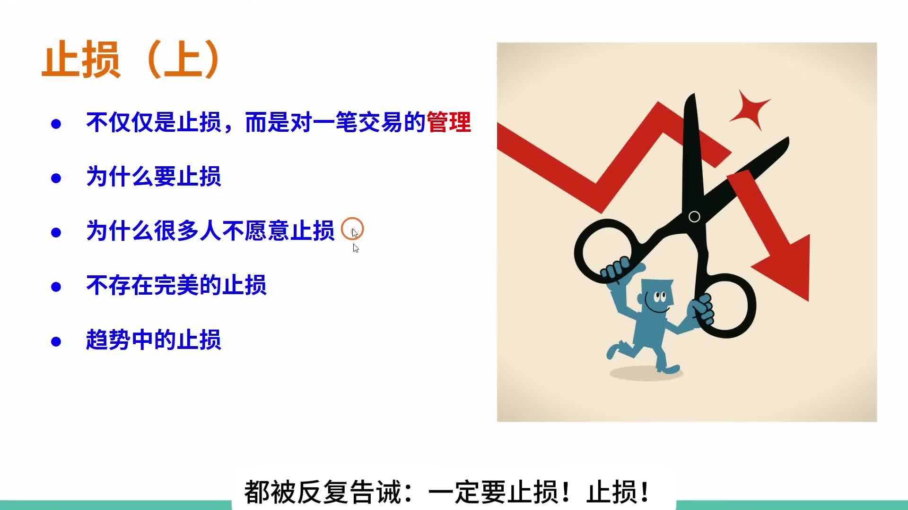
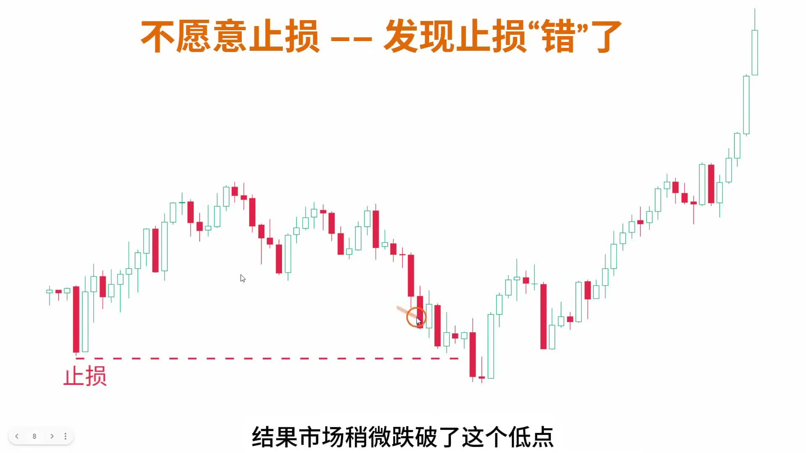
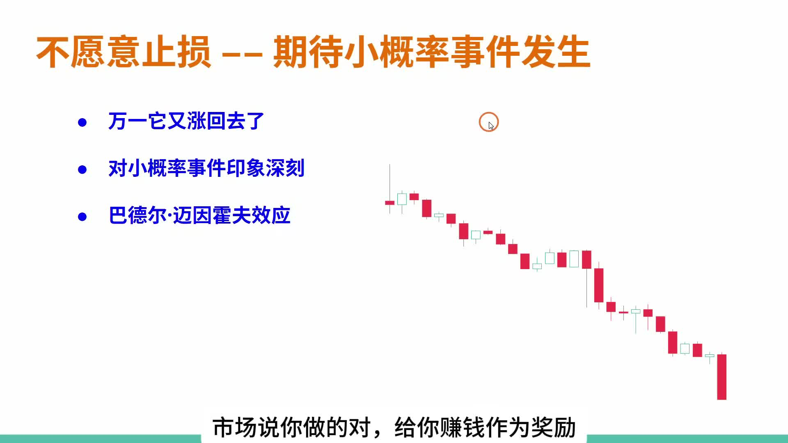
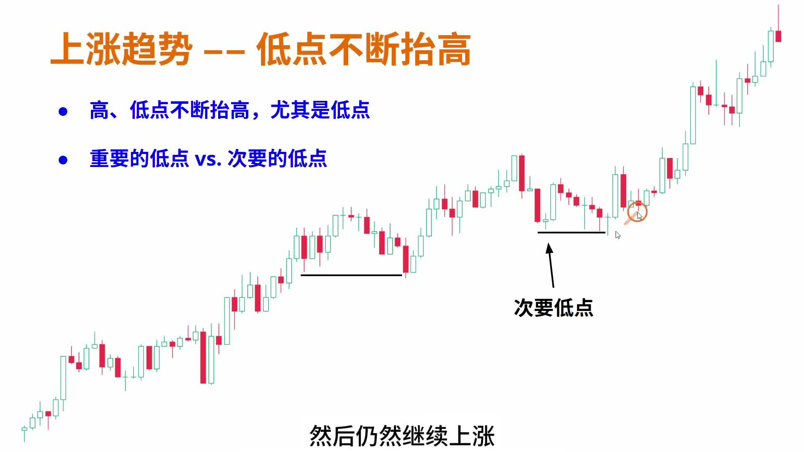

# 《【价格行为学】踏上交易之路(3): 止损(上)》复盘笔记

来源视频：
[YouTube 原视频](https://www.youtube.com/watch?v=GAju8MHzZEE&list=PLrCXUGuTXtGKrbsxteAGwDwVht1tghRe2&index=10)

说明：
这期不是简单讲“亏了要止损”，而是把止损放回到整套交易管理里。作者真正想纠正的是：

- 新手把止损理解成一个孤立动作
- 亏损时不愿承认错，开始找理由拖延
- 被止损后价格又涨回去，于是误以为“止损是错的”
- 在趋势里把止损放到太近的次要低点下方，结果被正常回调洗出去

这篇笔记基于本地转写和视频提纲页整理。转写里把“交易”识别成“教育”、把“止损”识别成“质损”的地方较多，正文已按视频语境校正。

---

## 一句话结论

**止损不是“亏了就砍”这么简单，而是入场后管理交易的一部分。新手最稳的起点，是先练最简单的波段管理：入场前定好目标位和初始止损，入场后少做额外决策；等理解价格行为更深，再学习提前止盈、提前离场、移动止损和更复杂的管理。**

---

## 主题主线

这期可以压成一句话：

**止损的核心不是追求完美，而是在不确定的市场里，用足够好的规则保护账户、释放错误仓位，并保留下一次机会。**

作者把交易员需要具备的能力拆成四块：

- 判断市场现在在做什么，以及接下来更可能怎么做
- 选择什么时候入场、用什么方式入场
- 入场之后管理持仓
- 控制情绪、贪婪和意外情况

这期讲的是第三块：`trade management`，而止损只是其中的一部分。

这点很重要。因为很多新手只盯着“找一个完美买点”，但真正难的是：

- 入场以后，价格没马上按预期走，怎么办？
- 什么时候继续拿？
- 什么时候靠初始止损？
- 什么时候提前走？
- 什么时候承认这笔交易已经不值得继续耗？

所以这期不是一句“要止损”就结束，而是在讲：

**如何把止损放进一套可练习、可复盘、可逐步升级的交易管理流程。**

---

## 本期术语表

- `stop loss`：止损。这里不是孤立的亏损动作，而是交易管理的一部分。
- `trade management`：交易管理。入场之后怎么处理持仓，包括目标位、止损、提前离场、移动止损等。
- `initial stop`：初始止损。入场时就设定的风险边界，新手最应该先练这个。
- `target`：目标位。和初始止损一起构成最简单的波段管理。
- `swing trade`：波段交易。作者建议新手先从目标位 + 初始止损的波段管理开始。
- `scalp`：剥头皮交易。结尾提到重要低点跌破后，波段前提可能失效，但不代表完全没有短线 scalp 机会。
- `important low`：重要低点。上涨趋势里，后面能带来强势突破创新高的低点。
- `minor low`：次要低点。被跌破并不一定说明趋势坏了，把止损放这里容易被正常回调打掉。
- `trading range`：震荡区间。趋势转向反转时，常常先进入让人困惑的震荡过渡。
- `double randomness`：双重随机。入场后的结果不确定，离场后的结果同样不确定。
- `Baader-Meinhof phenomenon`：频率错觉。因为某类小概率事件印象深刻，就误以为它经常发生。

---

## 视频主线

这期内容可以拆成四段：

1. **止损不是独立动作，而是交易管理**
   - 会入场只是第一步
   - 真正难的是入场后怎么管理

2. **新手先从最简单的管理开始**
   - 入场后设置目标位和初始止损
   - 不加仓，不乱移动，不做太多额外决策
   - 要么到目标位止盈，要么打初始止损离场

3. **为什么很多人不愿意止损**
   - 不愿承认自己错
   - 找新闻、博主、论坛观点来合理化继续持有
   - 害怕止损后价格立刻涨回去
   - 对小概率反转印象太深
   - 对自己下一笔能不能赚回来没有信心

4. **上涨趋势里怎么放一个简单的止损**
   - 重点看低点是否不断抬高
   - 但不是所有低点都重要
   - 只有“后面带来强势突破创新高”的低点，才是重要低点
   - 止损尽量跟随重要低点，而不是次要低点

---

## 视频关键截图

### 1. 这期讲的不是“止损按钮”，而是整笔交易管理

这张提纲很关键。作者一开始就把范围拉大：止损只是交易管理的一部分，本期要讲为什么要止损、为什么不愿止损、不存在完美止损，以及趋势里的止损。

### 2. 新手先从最简单的做法开始

这里是新手最该记住的一页。作者建议先把复杂管理拿掉，先练最基本的 `target + initial stop`。尤其是“加仓”先不要碰，因为它会显著增加决策复杂度。

### 3. 止损后价格又涨回去，不等于止损规则错了

这张图对应很多人最痛苦的经历：刚被止损，价格立刻反转大涨。作者用它引出一个关键点：不存在完美止损，离场之后的结果同样不确定。

### 4. 不愿止损，很大一部分是在期待小概率事件

这里讲的是心理层面：交易者会反复记住“止损后立刻涨回去”的小概率事件，于是下次亏损时就用“万一涨回去呢”拖延止损。

### 5. 上涨趋势里的止损，要跟随重要低点

这张图是全片最实用的技术规则：上涨趋势里高点、低点不断抬高，但多头尤其要关注低点。真正适合移动止损的，不是每个小低点，而是后面带来强势突破创新高的重要低点。

---

## 关键决策节点

### 1. 为什么止损不是孤立动作

作者先把交易拆成三个动作：

- 等待并识别机会
- 入场
- 离场

听起来很简单，但真正难的是第三步。

因为入场以后，你会遇到一堆问题：

- 要不要等到目标位？
- 要不要提前止盈？
- 要不要依赖初始止损？
- 要不要提前离场？
- 止损该窄还是宽？
- 什么时候争取打平或小亏离场？
- 要不要加仓？

所以止损不是一个单独按钮，而是 `trade management` 的一部分。它解决的不是“我现在疼不疼”，而是：

**这笔交易是否还值得继续持有。**

---

### 2. 为什么新手要先用最简单的管理方式

作者给新手的建议非常明确：

- 先不要加仓
- 先不要追求复杂移动止损
- 先不要频繁提前离场

最简单的练习方式是：

- 入场前确定目标位
- 入场前确定初始止损
- 入场后不乱动
- 要么目标位止盈
- 要么初始止损离场

这不是因为这种方式最完美，而是因为它最容易训练和复盘。

如果你连一笔交易的基本管理都还做不好，再加上“加仓、移动止损、提前走、换仓位”这些额外变量，错误会变得很难定位。

所以新手阶段真正要练的是：

**把单笔交易从混乱的情绪操作，变成一个可以重复执行的流程。**

---

### 3. 为什么“止损后立刻涨回去”不代表止损错了

这是这期最重要的心理节点。

很多人会因为这种经历变得不愿止损：

- 我刚止损，价格就涨回去了
- 说明我的止损位置错了
- 下次我干脆不止损

作者的反驳是：这其实是误解了交易的不确定性。

交易里有双重随机：

- 入场之后结果不确定
- 离场之后结果也不确定

如果你要求止损后价格必须继续朝不利方向走，才证明止损正确，那你其实是在要求一个不存在的“完美止损”。

但市场没有这种东西。

正确理解应该是：

- 止损只是在当时信息下，执行一个合理的风险边界
- 止损后价格怎么走，不完全由你控制
- 偶尔止损后立刻涨回去，是规则成本的一部分

---

### 4. 为什么很多人明知道该止损，却还是不走

作者把原因拆得很细：

- 不愿承认自己错了
- 大脑会自动找理由把错误合理化
- 会去看新闻、财报预期、社交平台、博主观点
- 希望找到一个“继续持有”的理由
- 害怕止损后又涨回去，变成连续两次犯错
- 对“止损后反转”的小概率事件印象太深
- 对自己后面能不能再赚回来没有信心

这里最该记住的是最后一点。

很多人不止损，表面上是“我觉得会涨回去”，深层其实是：

**我不相信自己后面还能找到更好的机会。**

所以只能把希望压在这笔已经变坏的交易上。

---

### 5. 上涨趋势里，止损为什么不能随便跟每个低点

作者给了一个非常实用的定义：

**如果某个低点之后，价格强势突破并创新高，那么这个低点就是重要低点。**

反过来：

- 如果后面只是小幅突破
- 或者没有强势创新高
- 那这个低点更可能只是次要低点

为什么这个区分重要？

因为在上涨趋势里，多头止损通常放在低点下方。但如果你把止损放在次要低点下方，市场很可能只是做一个正常回调，略微跌破它，然后继续上涨。

这时你会被洗出去，却不是因为趋势坏了。

所以更好的规则是：

- 初始止损先放在真正能代表交易失败的位置
- 随着趋势继续突破，再把止损移动到新的重要低点下方
- 不要因为每个小低点出现，就急着把止损抬得太近

---

### 6. 重要低点跌破后，到底失效的是什么？

结尾作者留了一个很好的问题。

当上涨趋势中的重要低点被跌破时，说明什么？

它不一定说明：

- 市场从此不能做多
- 任何多头机会都不存在

它更可能说明：

- 原来的上涨 `swing trade` 前提不再成立
- 市场可能进入 `trading range`
- 甚至后面可能转成下跌趋势

这就是为什么作者区分 `swing` 和 `scalp`。

重要低点跌破后，多头波段前提可能失效，但在支撑附近仍可能有短线买盘和 scalp 机会。只是这已经不是原来那笔波段多单该继续拿的理由。

这点对复盘很关键：

**不能因为后面还能反弹，就说之前的波段止损错了。**

---

## 持仓处理

这期对应到实战，可以压成三层：

### 1. 新手默认处理

- 入场前定目标位
- 入场前定初始止损
- 入场后少做动作
- 不加仓
- 不频繁移动止损
- 不随便提前离场

目标是训练流程，而不是每一笔都最优。

### 2. 进阶处理

当你对价格行为更熟以后，才开始处理：

- 是否提前止盈
- 是否提前离场
- 是否把止损上移
- 是否从波段心态切换成 scalp 心态

这些都需要更多经验，不适合一开始全部混在一起练。

### 3. 趋势持仓处理

在上涨趋势里：

- 低位入场后，初始止损可以放在趋势起点下方
- 后面出现强势突破创新高，才把止损移动到对应的重要低点下方
- 次要低点被跌破，不能直接说明趋势失败
- 重要低点被跌破，则要重新评估波段多头前提

---

## 容易学歪的地方

### 1. 把止损理解成“证明我错了”

止损不是道德审判，也不是证明你很差。

它只是交易计划的一部分：当信息不支持原交易时，先保护账户。

### 2. 把止损后反弹当成止损无效

止损后价格反弹，是交易中一定会遇到的成本。

如果你因为几次这种经历就不再止损，真正的大亏迟早会来。

### 3. 把止损放得太近，然后怪市场“针对我”

很多时候不是市场针对你，而是你把止损放在了一个正常回调很容易触碰的位置。

尤其在趋势里，次要低点下方不一定是合理止损位。

### 4. 用新闻和别人观点替代交易计划

亏损以后去找新闻、博主、论坛观点，只是大脑在找“继续不止损”的理由。

如果交易逻辑已经坏了，外部观点不能替你修复这笔交易。

---

## 复盘 checklist

- 这笔交易入场前，我有没有先定目标位和初始止损？
- 我现在想继续拿，是因为交易逻辑还成立，还是因为不想承认错？
- 我是不是在找新闻、财报、博主观点，帮自己合理化继续持有？
- 我是不是因为“万一涨回去”而忽视了更大概率的继续亏损？
- 当前低点是重要低点，还是次要低点？
- 这个低点后面有没有强势突破创新高？
- 重要低点被跌破后，我还在拿原来的 swing，还是已经切换成 scalp 思路？
- 我这次止损后价格反弹，是规则问题，还是正常的不确定性成本？

---

## 总结

这期真正要记住的，不是“止损很重要”这句老话，而是这几个更具体的规则：

- 止损是交易管理，不是孤立动作
- 新手先练 `target + initial stop`
- 不存在完美止损
- 止损后立刻反弹，不等于止损错了
- 不愿止损，往往是因为不愿承认错和对未来机会没信心
- 上涨趋势里，要用重要低点管理止损，不要盯着每个次要低点乱移动

最适合反复回看的提醒是：

**交易不需要完美止损，只需要足够好的止损规则，并且长期一致地执行。**
