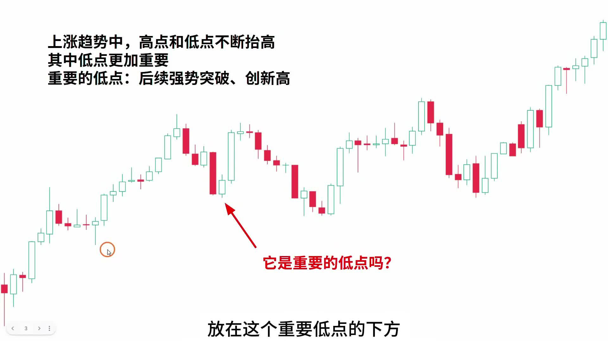
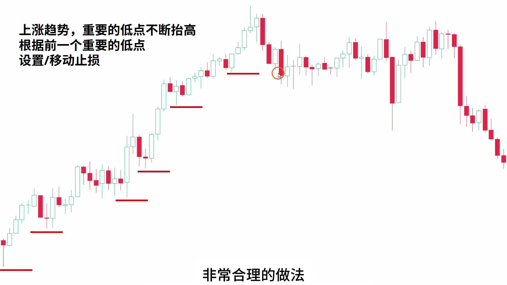
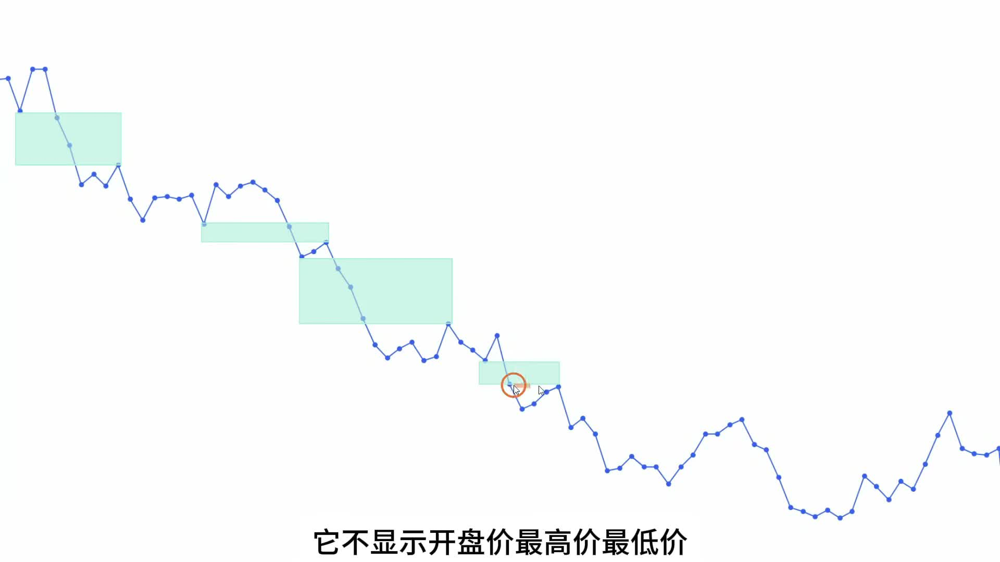
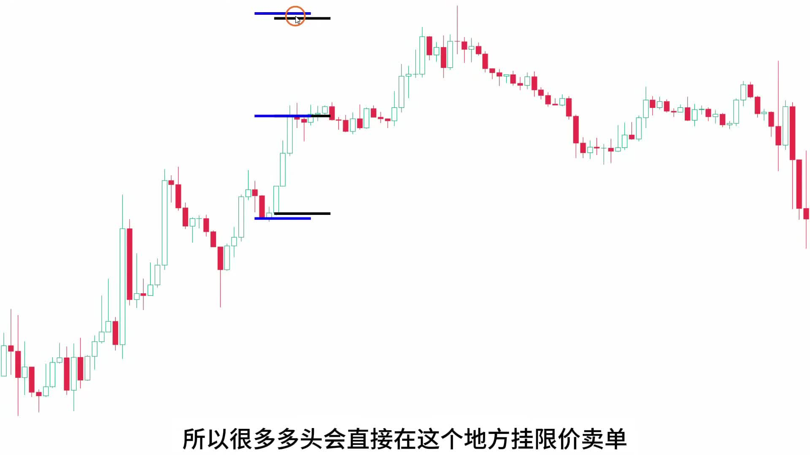
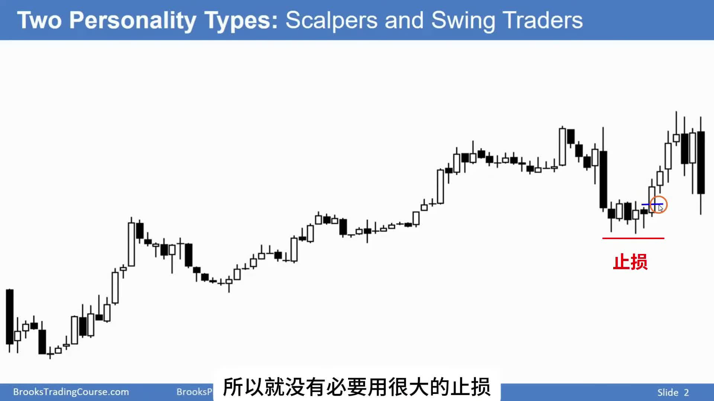

# 《【价格行为学】踏上交易之路(4): 止损(中) —— 超级干货》复盘笔记

视频链接：[YouTube](https://www.youtube.com/watch?v=a3XBfMSRC0E)

## 核心结论

**止损不是单纯“亏了在哪里砍”，而是这笔交易的前提在哪里失效。趋势交易可以依赖重要低点 / 重要高点做 trailing stop，但当价格接近目标位、趋势走到后期、或者第一次反转已经出现时，继续死等保护性止损被打到，很多时候是在把已有利润交还给市场。**

这期是止损专题的中篇，重点不是新手最基础的 `initial stop`，而是：

- 趋势里保护性止损怎么移动
- 什么低点 / 高点才算 `important low / important high`
- 什么时候可以提前离场保护利润
- 为什么强趋势第一次反转大概率失败
- 为什么真正想做反转，通常要等第二次尝试

## 本期术语表

- `trailing stop`：移动止损。随着趋势继续，把止损从原来的结构位置移到新的重要低点 / 高点之后。
- `important low`：重要低点。这个低点之后，市场要有强势突破并创新高，它才有资格成为多头保护性止损参考。
- `important high`：重要高点。这个高点之后，市场要有强势跌破并创新低，它才有资格成为空头保护性止损参考。
- `TBTL`：`Ten Bars Two Legs`，两段十 K。趋势走到目标位或可能反转后，回调常常至少有两段、持续大约十根 K 线。
- `measured move`：量度目标。把前一段突破或区间高度复制出去，用来估算目标位。
- `body gap`：实体缺口。即使影线互相碰到，只要收盘价之间仍有缺口，趋势仍可能保持一定强度。
- `gift bar`：礼物 K 线。趋势后期突然出现很大的顺势 K，常常是持仓者很好的止盈机会。
- `second entry`：第二次入场。强趋势后的第一次反转常失败，第二次尝试才更有交易价值。
- `LLMTR`：`Lower Low Major Trend Reversal`。强下降趋势后，先突破趋势线，再回测低点附近，形成更有意义的大反转尝试。
- `tick failure`：差一个 tick 没成交目标位。看似快到目标，实际订单没成交，容易让已有利润大幅回撤。

## 主题主线

上一期讲的是最基础的止损：入场前定目标位和初始止损，入场后别乱动。  
这一期往前走了一层：**如果交易已经赚钱了，止损还应该只是那个最远的结构失效点吗？**

作者的答案是：不一定。

趋势交易确实可以用 `important low / important high` 做保护性止损，但这套方法有代价：

- 好处是能拿住大波段
- 坏处是利润回撤会很大
- 越到趋势后期，原本合理的结构止损，越可能变成“不值得继续承受的利润回撤风险”

所以这期真正讲的是：**什么时候还应该依赖结构止损，什么时候应该提前离场。**

## 视频关键截图

### 1. 不是所有低点都能放止损

多头的保护性止损通常放在重要低点下方，但“低点”不等于“重要低点”。一个低点后面必须有强势突破并创新高，才说明这个低点真的支撑住了趋势。

如果后面只是出现一根不错的阳线，但没有突破前高，那么把止损马上移到这个低点下方就偏急。市场完全可能先跌破它，再继续上涨。

### 2. 趋势里最标准的移动止损

这张图是最标准的 `trailing stop` 思路：上涨趋势中，高点和低点不断抬高，每次强势突破创新高以后，前一个低点才变成新的重要低点。多头可以把保护性止损逐步上移。

这套做法的优点是能拿住趋势。缺点也很清楚：如果价格离最近的重要低点很远，等止损被打到时，利润可能已经回撤很多。

### 3. 线形图帮助识别实体缺口

作者特别强调 `body gap`。有些 K 线图影线很多，看起来缺口已经被补掉，但切换到线形图后，只看收盘价，就能发现两个收盘价之间仍有空隙。

实体缺口说明趋势仍有力量。如果下降趋势里存在实体缺口，空头继续持有到 `measured move` 目标位的理由会更强。

### 4. 趋势后期，结构止损不一定还是最好选择

强趋势后期，市场经常已经接近多个目标位。这个时候，如果还把止损放在很远的重要高点 / 低点之外，理论上没错，但实际交易上可能很差。

原因很简单：你是在用很大的利润回撤风险，去赌最后一点点延续空间。

### 5. `scalper` 和 `swing trader` 的止损距离不同

这张图来自 Brooks 课程，作者用它说明一个很实用的问题：不同交易类型需要不同止损距离。

如果你做的是 `scalp`，目标近，止损也通常应该更近。  
如果你做的是 `swing`，想拿更大结构，就要接受更远的结构止损。

不能用 `scalp` 的理由入场，却用 `swing` 的止损去硬扛。

## 决策节点

### 1. 什么时候可以移动多头止损

多头移动止损的前提不是“出现一个新低点”，而是：

1. 市场仍然是上涨趋势
2. 回调产生了一个低点
3. 后面出现强势突破
4. 突破创出新高

满足这些条件后，这个低点才更像 `important low`。  
否则它只是普通低点，过早把止损移到它下面，容易被正常波动扫掉。

### 2. 为什么回调常常要等两段

作者反复讲 `TBTL`：趋势冲到目标位、高潮位，或者可能要反转时，回调通常不是“一根阴线就结束”。

更常见的是：

- 至少两段
- 大约十根 K
- 有时是横盘十几根 K，而不是快速大跌

这对入场和离场都有影响。

对顺势入场的人来说，看到第一段回调就急着买，常常偏早。  
对持仓的人来说，看到趋势后期第一根反向 K，不一定要马上恐慌，但要开始准备保护利润。

### 3. 目标位到了以后，为什么可以直接离场

当趋势已经持续很久，并且价格到达 `measured move` 目标位时，最直接的处理就是挂限价单止盈。

这不是胆小，而是因为：

- 很多持仓者会在目标位止盈
- 逆向交易者会在目标位尝试进场
- 目标位本身会形成支撑 / 阻力
- 趋势已经走了很久，继续延伸的边际收益变小

如果目标位很近，但保护性止损还很远，就会出现一个很差的 `reward/risk`：为了多赚一点，冒着回吐一大段利润的风险。

### 4. 第一次反转为什么通常不用太认真

强趋势里，第一次反转尝试大概率失败。  
作者给出的实战判断很具体：

- 下降趋势里，高点持续降低
- 第一次出现高点抬高，通常只是第一次反转尝试
- 空头往往不会立刻离场
- 第二次高点抬高，尤其配合小双底和不错的阳线，才更值得空头保护利润

对应到上涨趋势也是一样：第一次跌破或第一次反向尝试，不一定代表趋势结束；但第二次、第三次，加上目标位和高潮背景，就要认真处理。

### 5. 真正做反转，不能只看止损小

反转交易看起来很诱人，因为止损常常很小。  
但作者提醒：小止损不等于好交易。

反转的胜率本来低。如果你只是看到“止损很小”就反复尝试，前面很多小亏会累积起来，最后一笔大赚也未必能覆盖。

更合理的反转条件是：

- 强趋势已经走了很久
- 达到一个或多个目标位
- 出现第一次趋势线突破
- 再次回测前低 / 前高
- 第二次反转尝试出现更好的 signal bar
- 目标位足够远，`reward/risk` 足够好

这也是这期最值得补进操作手册的新场景。

## 持仓与离场规则

### 继续持有

可以继续持有的情况：

- 趋势仍然强
- 重要低点 / 高点没有被破坏
- 突破后仍有 `body gap`
- 还没到关键 `measured move` 目标位
- 第一波反转尝试很弱

### 减仓或止盈

应该考虑减仓或止盈的情况：

- 价格到达 `measured move` 目标位
- 趋势已经持续很久
- 出现 `gift bar`
- 到达通道上沿 / 下沿
- 多个目标位集中在同一区域
- 目标位只差一点，但保护性止损还很远

### 提前离场

可以提前离场的情况：

- 第一段反向已经出现，第二段反向开始成形
- 出现第二次反转尝试
- 反向 signal bar 收得很好
- `TBTL` 的时间和空间目标都已经有理由成立
- 原交易前提已经不再成立

## 常见误区

1. 把所有低点都当成 `important low`，过早移动止损。
2. 明明目标位已经快到了，还用很远的结构止损去赌最后一点利润。
3. 把第一次反转尝试看得太重，过早放弃强趋势单。
4. 只因为止损小就反复做反转，忽略反转交易胜率低。
5. 用 `scalp` 的逻辑进场，却用 `swing` 的止损硬扛。
6. 把“止损”和“止盈”分得太死，没有意识到它们本质上都是离场。

## 复盘 checklist

1. 我移动止损参考的低点 / 高点，后面有没有强势突破确认？
2. 当前趋势有没有到 `measured move` 目标位？
3. 这是不是趋势后期的 `gift bar`？
4. 我是在等第一次反转，还是第二次反转？
5. 如果继续持有，我承受的利润回撤是否值得？
6. 这笔是 `scalp` 还是 `swing`？止损距离和交易类型匹配吗？
7. 这次离场是因为前提失效，还是因为我想卖在最高点 / 买在最低点？

## 一句话总结

**趋势前半段，止损服务于“拿住”；趋势后半段，止损还要服务于“别把利润还回去”。真正成熟的离场，不是猜最高点，而是判断这笔交易的原始前提还在不在。**
