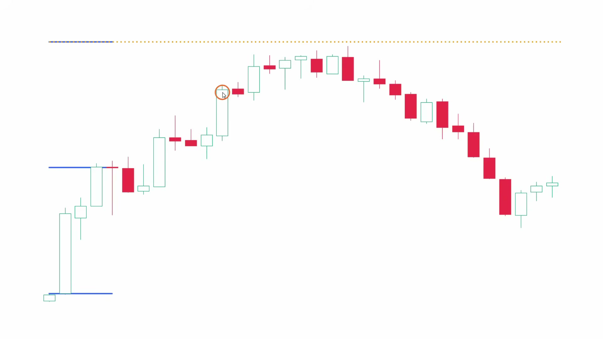
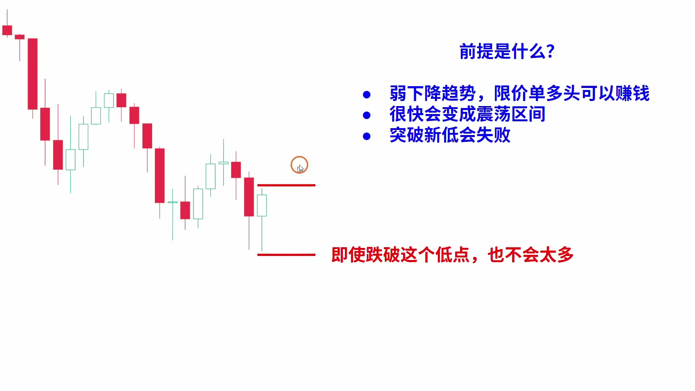
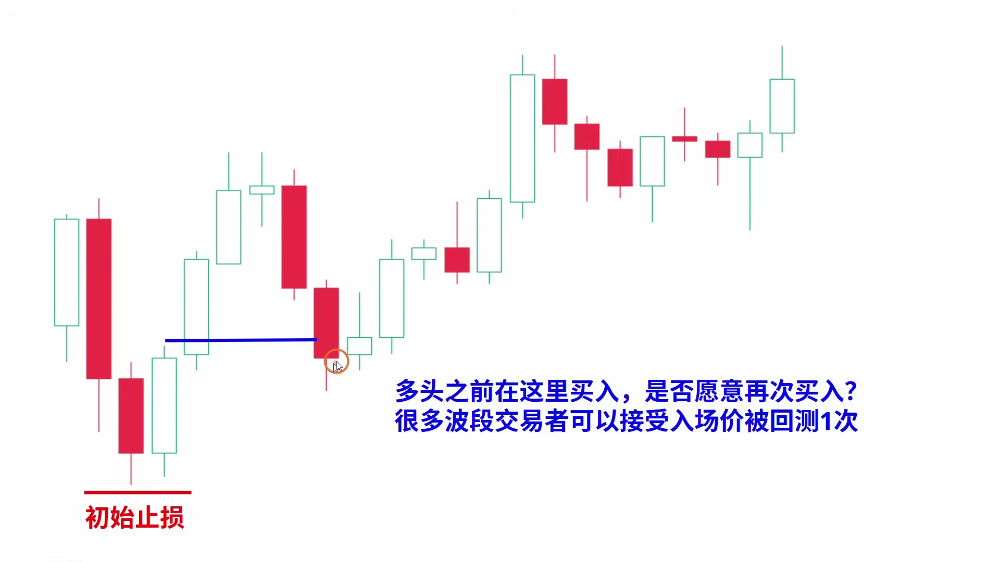
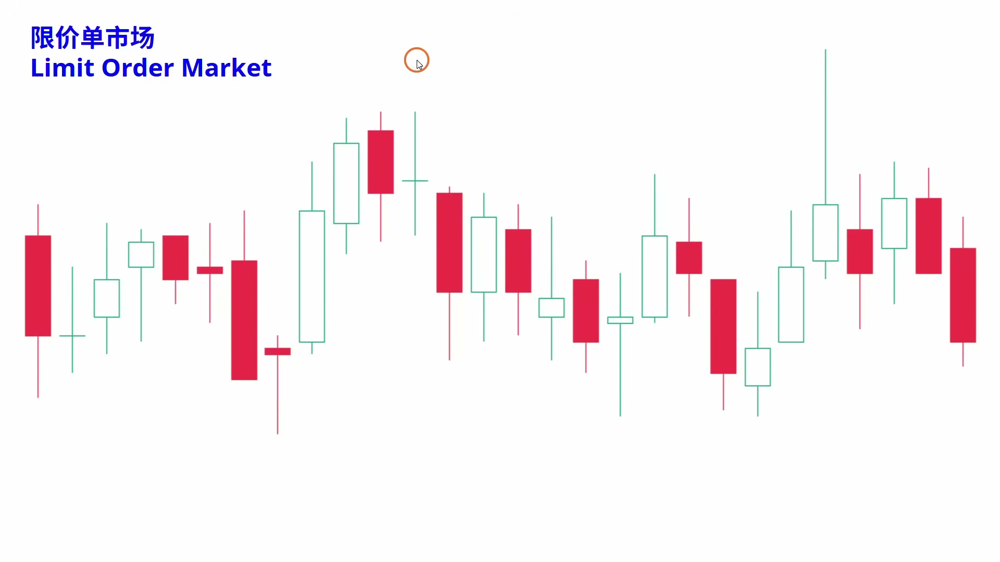
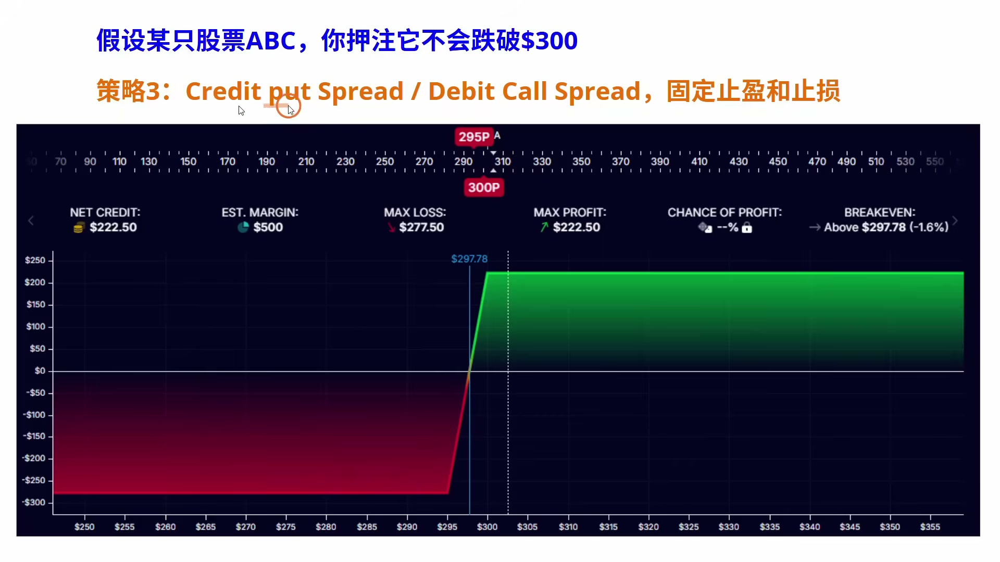
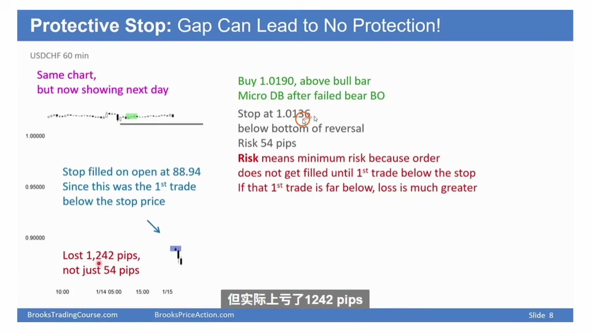

# 《【价格行为学】踏上交易之路(6): 止损(下)——1小时全程干货》复盘笔记

视频链接：https://www.youtube.com/watch?v=iBdMSwiyuRQ  
频道：方方土PriceAction  
发布时间：2025-08-05  
视频时长：1:05:51  
本地素材目录：`notes/assets/014-youtube-trading-stop-loss-part3-review/`

## 核心结论

这期不是单纯讲“止损放哪里”，而是在讲一个更完整的交易问题：

**反转和震荡里的止损，不能只看止损距离小不小；你必须同时知道目标、概率、行情类型、以及利润回撤风险。**

很多新手喜欢做反转，是因为他们只看到“止损小、利润大”，却忽略了第三个变量：`probability`。一笔交易不是因为亏损距离小就合理，而是因为 `risk / reward / probability` 三个东西合在一起合理。

这期最实用的地方有 5 个：

- 做反转前，要先确认你不是在强趋势里随手猜顶猜底。
- `spike and channel` 之后，不要急着反转，先看 channel 强不强、有没有 MTR 条件。
- 宽通道 / 震荡区间里，止损常常需要更宽，但仓位必须跟着缩。
- `breakeven stop` 和 `trailing stop` 不是为了舒服，而是为了控制实际风险和利润回撤。
- `protective stop` 不是绝对保护；遇到跳空、流动性消失、重大新闻，普通止损可能根本成交不了。

## 本期术语表

- `mean reversion`：均值回归。价格偏离均线后可能回到均线附近，但不等于一定反转；横盘也可以让均线追上价格。
- `spike and channel`：先快速突破，再进入通道推进。`spike` 是爆发段，`channel` 是后续顺势但更慢的推进段。
- `MTR`：`Major Trend Reversal`，大趋势反转。重点不是形态名字，而是第一次反向力量足够强，随后原趋势恢复却在前高/前低附近失败。
- `minor reversal`：小反转。常常只能带来小回调，不足以证明趋势已经彻底反转。
- `money stop`：固定金额 / 固定距离止损。比如低点下方 5 ticks、10 ticks，或者按账户风险金额反推。
- `price action stop`：根据价格行为设置止损。比如放在 `measured move` 外侧、前高前低外侧、通道边界外侧。
- `actual risk`：实际风险。不是初始止损距离，而是根据你的实际出场行为和历史交易统计，真实经常亏掉的距离。
- `breakeven stop`：打平止损。价格浮盈后，把止损移动到入场价附近。
- `trailing stop`：追踪止损。随着价格向有利方向移动，逐步抬高多单止损或压低空单止损。
- `limit order market`：限价单市场。震荡区间里常见，向上突破容易被卖、向下突破容易被买。
- `breakout order market`：突破单市场。趋势里常见，突破前高/前低后容易继续跟随。
- `protective stop`：保护性止损单。用于限制亏损，但在跳空或无流动性时不保证能按设定价格成交。
- `credit put spread`：卖出较贵 put、买入较便宜 put 的看涨/保守做多期权组合，盈利和亏损都被限制。
- `debit call spread`：买入较低执行价 call、卖出较高执行价 call 的看涨期权组合，效果上也可表达保守做多。
- `iron condor`：四条腿期权组合，押注价格到期时留在某个区间内。
- `pain trade`：痛苦交易。大量交易者押注低波动或某方向，波动突然放大后被迫止损或对冲，行情因此加速。

## 视频关键截图

### 1. `spike and channel` 后，不要把“第三推”机械当反转

这里的重点不是背“第三推要反转”，而是先判断通道强弱。窄通道里，哪怕看起来已经推了几段，也可能只是强趋势的一部分；宽通道里，第三推、目标位、压力位、卖压同时出现，反转交易才更有讨论价值。

### 2. 宽通道反转，止损可以更宽，但逻辑必须来自行情

如果左侧反复出现“略微跌破前低后反转”，那这次做多时把止损只放在新低下方 1 tick，反而容易被正常噪音打掉。可以用 `money stop` 或 `price action stop` 给假突破留空间，但仓位要按更宽止损重新计算。

### 3. `breakeven stop` 不是万能，第一次回测入场价未必该走

很多人一浮盈就把止损移到入场价，心理上舒服，但未必符合价格行为。对 `swing` 来说，第一次回测入场价可能仍是正常波动；第二次回测，才更容易说明市场让持仓者失望。

### 4. 利润回撤也是风险，要用系统控制

这段讲得很实际：如果一笔交易初始最多亏账户 2%，那么浮盈以后，也可以要求利润回撤不超过 2%。这不是“怕回撤”，而是把浮盈当成真实资金来管理。

### 5. 震荡区间是 `limit order market`，不是追突破市场

在趋势里，突破前高/前低常常能继续；在震荡区间里，突破经常失败。区间上沿大阳线不一定该追多，反而可能是卖点；区间下沿大阴线不一定该追空，反而可能是买点。

### 6. 期权组合把盈亏边界提前固定

这里不是在教你马上交易期权，而是在说明：普通现货/期货交易需要自己处理止盈止损；期权组合可以在建仓时就把最大盈利和最大亏损固定下来，所以特别适合部分震荡区间或事件风险场景。

### 7. `protective stop` 遇到跳空可能失效

止损单不是魔法。如果市场直接跳过你的止损价，中间没有成交，你的订单只能在下一个有流动性的价格成交。你以为风险是 54 pips，极端情况下实际亏损可能变成 1200 多 pips。

## 交易主线

### 1. 新手为什么喜欢反转，却经常亏

新手喜欢反转，通常不是因为他真的读懂了市场，而是因为反转交易看起来很诱人：

- 止损可以放得很近。
- 目标可以想得很远。
- 如果抓到底部或顶部，看起来盈亏比很好。

问题是，这里面常常只看到了 `risk` 和 `reward`，没有看 `probability`。

作者反复强调：`mean reversion` 不等于趋势反转。价格离均线很远以后，有三种常见结果：

- 直接反转回均线。
- 横盘整理，等均线自己跟上来。
- 小幅回调后继续顺趋势。

所以“涨多了会跌、跌多了会涨”不是交易计划。真正的计划至少要回答：

- 我错了在哪里走？
- 我对了先看到哪里？
- 这类结构出现后，大概有多大概率能走到目标？

如果只知道止损放哪里，不知道目标和概率，这不是小风险交易，只是小止损幻想。

## 反转交易里的止损逻辑

### 1. 强趋势里，不能因为小止损就反手

在强上涨趋势里，去前高上方一点做空，看起来止损很小；在强下跌趋势里，去前低下方一点做多，也看起来止损很小。

但小止损本身不是优势。真正的问题是：

- 这里是不是重要目标位？
- 有没有 `measured move`、通道线、支撑阻力？
- 原趋势有没有先出现足够强的反向力量？
- 原趋势恢复时，有没有在前高/前低附近失败？

如果这些都没有，只是因为“止损小”，那其实是在强趋势里硬猜顶猜底。

### 2. `spike and channel` 的重点是市场周期

视频把趋势拆成：

1. `spike`：快速突破、方向明确、动能强。
2. `channel`：继续顺势，但推进开始变慢。
3. 后续可能进入 `trading range`，也可能真正反转。

很多人看到 channel 后的第三推，就急着做反转。但作者的处理更细：

- 如果是窄通道，说明趋势仍强，不能机械做第三推反转。
- 如果是宽通道，且靠近目标位 / 压力位 / 支撑位，第三推才更值得观察。
- 最好还要看到原趋势失败、反向 K 线有力量、后续有跟随。

实战规则：

- `spike and channel` 后，先假设更可能进入震荡，而不是立刻大反转。
- 做反转要等市场证明原趋势开始失败。
- 如果只是小反转，就按 `scalp` 或小波段处理，不要自动升级成大趋势反转。

### 3. `MTR` 不是形态名词，而是失败链条

作者讲 `MTR` 时，重点不是双顶、双底、头肩这些名字，而是下面这条链：

1. 原趋势很强。
2. 第一次反向尝试足够强，说明逆向力量存在。
3. 原趋势恢复。
4. 恢复到前高 / 前低附近时失败。
5. 第二次反向尝试出现，才更像大反转雏形。

所以做大反转，不是看到第一根强反向 K 就进，而是看“原趋势恢复后还能不能继续”。如果恢复失败，这个失败本身就是反转概率提高的证据。

但即使是比较好的 MTR，作者仍然提醒：大幅 swing 的概率也可能只有 40% 左右。剩下 60% 可能是小赚、小亏、打平或继续震荡。

这就是为什么反转交易必须依赖更好的 `reward/risk`。

## 宽通道和震荡里的止损

### 1. 反转止损的默认逻辑

如果你在下降趋势或下降通道里买反转，基本假设是：

> 价格不应该再明显创出新低。

所以最自然的初始止损，是放在新低下方。

反过来，如果你在上涨趋势或上涨通道里卖反转，基本假设是：

> 价格不应该再明显创出新高。

所以初始止损通常放在新高上方。

这套逻辑很直观，但它只适用于“创出新高/新低就说明反转假设失效”的情况。

### 2. 宽通道里可以给假突破留空间

如果左侧结构已经反复告诉你：

- 价格经常略微跌破前低，然后反弹。
- 价格经常略微突破前高，然后回落。
- 每次突破都不是趋势延续，而是宽通道内的噪音。

那么这时止损只放在前低/前高外 1 tick，可能太紧。

可以考虑两种方法：

- `money stop`：固定距离，比如额外 5 ticks、10 ticks。
- `price action stop`：根据结构放在 `measured move` 外侧，或者放在更合理的价格行为失效点外。

但这有一个前提：仓位必须重新计算。止损变宽，单笔数量就要变小，否则你只是把“容易被扫”换成了“亏一次更大”。

### 3. 初始止损和实际风险不是一回事

这期特别值得记的一点是：策略回测或复盘时，真正重要的是 `actual risk`。

比如你的初始止损是 20 点，但大部分错误交易在亏 8 点时就已经出现明显失败信号，你实际经常只亏 8 点就离场。那么策略数学应该按实际风险复盘，而不是只看初始止损。

但这不是让新手随便提前砍。前提是你能稳定识别：

- 入场后本该快速有利，但没有发生。
- 本该守住的 K 线低点 / 高点被强势突破。
- 本该出现跟随，却出现反向大 K。

如果做不到，初始止损仍然是保护你不乱来的底线。

## 利润保护：从“亏损风险”转到“回撤风险”

### 1. 打平止损解决的是心理问题，但不一定解决交易问题

把止损移到入场价，最大的好处是心理舒服：这笔单不会亏了。

但视频提醒：这不一定符合价格行为。

对于 `swing trade`，第一次回测入场价附近，可能只是正常测试。很多优秀交易不会在第一次回测就结束。相反，如果第二次又回到入场价附近，说明市场已经反复让持仓者失望，这时离场理由更充分。

对于 `scalp trade`，逻辑完全不同。既然目标很近，就不能允许利润大幅回吐到入场价，否则这笔 scalp 的定义就错了。

实战规则：

- `swing`：第一次回测入场价，可以更宽容。
- `scalp`：利润回吐太多就该走。
- 打平止损不是默认动作，要和交易类型匹配。

### 2. 浮盈也是钱，利润回撤也要控风险

作者举的例子很关键：

- 账户 100,000。
- 单笔初始风险控制在 2%，也就是 2,000。
- 一笔交易已经浮盈 4,500。

这时如果你还想继续持有，就可以设置一个原则：

> 既然初始亏损风险不超过 2,000，那么利润回撤也不要超过 2,000。

这就是系统化的 `trailing stop`。它不是拍脑袋，也不是“舍不得利润”，而是把未实现盈利当成真实资金来管理。

可以采用的做法：

- 全部止盈：如果当前盈利已经让这笔交易在数学上足够好。
- 分批止盈：先锁定一部分利润，剩余仓位用打平止损或追踪止损。
- 追踪止损：按固定金额、重要低点/高点、或结构变化逐步移动止损。

### 3. 第一次反向不一定走，但“假设被证伪”要走

作者提到自己常见的处理：强势上涨后第一次下跌回调，他通常不会直接止盈，因为强势 move 后常有第二段。

但如果市场本该走第二段，却变成连续大阴线、收在低位、多头打平离场失败，那就不是普通回调，而是 `endless pullback`，也就是反转。

实战规则：

- 第一次回调，不急着把趋势判死。
- 但如果第二段预期失败，而且失败方式很强，要主动减仓或离场。
- 持仓不是死拿，而是不断检查“原来的假设还成立吗”。

## 震荡区间：为什么大多数人最好少做

### 1. 震荡区间是 `limit order market`

趋势里常见的是 `breakout order market`：

- 向上突破前高，多头买入，突破容易成功。
- 向下跌破前低，空头卖出，突破容易延续。

震荡区间里正好相反，更像 `limit order market`：

- 大阳线冲到上方，反而有人卖。
- 大阴线砸到下方，反而有人买。
- 大部分突破都会失败。

这就是为什么在区间里追涨追跌很难。你看到强 K 线才进去，可能刚好成了别人限价反向交易的流动性。

### 2. 区间交易难在三个地方

第一，心理压力大。

看到大阳线去做空，看到大阴线去做多，本身就违背直觉。更麻烦的是，你还常常需要宽止损，甚至分批进场。

第二，真假突破很难定义。

到底突破多少才算真突破？突破后停留几根 K 才算成功？回到哪里才算失败？这些问题没有一个简单答案。

第三，目标位不好设。

区间下沿做多，不代表一定能到上沿。很多时候到中线就反转；区间上沿做空，也不一定能跌到下沿。

所以区间交易表面上是“高抛低吸”，实际执行很难。

### 3. 大部分交易者应该避开窄区间

作者的态度比较明确：大部分交易者应该避开震荡区间，尤其是很窄的震荡区间。

原因不是区间不能赚钱，而是：

- 假突破多。
- K 线重叠严重。
- 止损需要更宽。
- 盈亏比容易变差。
- 情绪压力远高于趋势交易。

如果一定要做，最好满足：

- 位置非常靠近区间边缘。
- 突破失败足够清楚。
- 目标只按 `scalp` 或区间中线处理。
- 仓位按宽止损重新缩小。

## 期权对冲：不是为了复杂，而是为了固定边界

### 1. 为什么震荡区间里期权有优势

作者讲期权，不是为了炫技，而是在解决震荡区间的两个老问题：

- 到底在哪里止盈？
- 如果突然真突破，怎么防止大亏？

比如你认为价格不会跌破 300：

- 直接买股票：上涨赚，下跌亏，需要自己设止盈止损。
- 卖出 put：只要到期价格不低于某区域，就能获得固定利润。
- 做 spread：盈利被限制，亏损也被限制。

在趋势交易里，利润被限制可能是缺点；但在震荡区间里，你本来就只是想赚一段固定空间，所以“利润固定”反而减少决策负担。

### 2. `iron condor` 对应的是震荡区间

如果你认为价格会留在某个区间内，可以用类似 `iron condor` 的结构：

- 下方卖 put / 买更低 put 做保护。
- 上方卖 call / 买更高 call 做保护。
- 只要到期价格留在中间，策略盈利。
- 如果向外突破，亏损也被限制。

这和 Price Action 的区间逻辑是同一件事，只是表达工具不同：

- 图表逻辑：80% 的区间突破会失败。
- 工具逻辑：用期权组合吃“价格留在范围内”的概率。

但它也有局限：

- 期权有到期日，不适合很小级别的 1 分钟 / 5 分钟结构。
- 需要理解波动率、时间价值、执行价。
- 市场周期变化时，仍然要及时识别。

所以这不是新手默认方案，而是理解“为什么某些场景普通止损不够用”的补充。

## `protective stop` 的边界

普通止损单解决的是“有交易、有流动性时”的亏损控制。

它解决不了：

- 重大新闻导致的跳空。
- 盘前盘后流动性稀薄。
- 外汇、股票、期货在极端事件中的无成交区。
- 市场直接跳过你的止损价。

视频里的瑞郎案例很典型：你以为止损是 54 pips，但市场直接跳空，中间没有人接你的卖单，最后实际亏损可能超过 1200 pips。

所以如果真的要防极端跳空风险，普通 stop 不够，只能考虑：

- 降低仓位。
- 避开重大事件。
- 不隔夜持有高杠杆仓位。
- 用期权做保护或对冲。

这点对实盘很重要：止损价是计划，不是成交保证。

## 可以复用的执行规则

### 反转交易

- 不要因为止损小就做反转。
- 先确认位置：目标位、支撑阻力、通道边界、`measured move`。
- 再确认原趋势是否真的失败。
- 强趋势第一次反转大多只是小反弹 / 小回调。
- 更好的反转通常来自第二次尝试，尤其是原趋势恢复失败之后。

### 宽止损

- 宽止损只适合宽通道、震荡区间、假突破频繁的结构。
- 止损变宽，仓位必须变小。
- 宽止损不是“不认错”，而是给正常噪音留空间。
- 如果出现强势失效信号，应该提前退出，不必等保护性止损被打。

### 打平和追踪止损

- `breakeven stop` 要和交易类型匹配。
- `scalp` 不该允许利润大幅回吐。
- `swing` 可以容忍第一次正常回测。
- 利润回撤也是风险，可以按账户风险原则系统控制。
- 如果市场证伪了原先的第二段预期，要主动减仓或离场。

### 震荡区间

- 震荡区间先看位置，不先看方向。
- 上沿大阳线可能是卖点，下沿大阴线可能是买点。
- 中间位置少做，因为没有价格优势。
- 假突破很多，不要把每次突破都当趋势启动。
- 大部分人最好避开窄区间。

### 极端风险

- `protective stop` 不保证成交在止损价。
- 有跳空风险的仓位，不能只靠 stop 管理。
- 重大新闻、财报、央行事件前，要主动降低杠杆或用期权保护。

## 常见错误

- 把 `mean reversion` 理解成“马上反转”。
- 只看止损小，不看概率。
- 在窄通道里机械做第三推反转。
- 在震荡区间中间位置交易。
- 用趋势突破思维去做震荡区间。
- 止损加宽后，仓位不缩。
- 把打平止损当成所有交易的默认最佳解。
- 以为 protective stop 一定能保护自己。

## 复盘 checklist

看完这期以后，每次做反转或震荡交易前，至少问：

1. 我现在是在 `trend`、`channel`，还是 `trading range`？
2. 这笔交易是反转、顺势回调，还是区间高抛低吸？
3. 我是不是只因为止损小就想做？
4. 目标位在哪里？概率大概来自什么证据？
5. 如果是反转，原趋势有没有先失败？
6. 如果是宽通道，止损是否给了正常假突破空间？
7. 止损变宽后，仓位有没有缩？
8. 浮盈后，我要全走、减仓、打平止损，还是追踪止损？
9. 如果出现跳空或无流动性，普通 stop 是否仍然可靠？
10. 这笔交易到底是 `scalp` 还是 `swing`？

## 对操作手册的更新判断

这期需要更新 `price-action-entry-manual.md`。

原因是它补充了两个可复用点：

- `spike and channel` 后的反转，不应该机械看第三推，而要结合通道强弱、目标位、原趋势失败和 MTR 链条。
- 震荡区间是 `limit order market`，如果做区间反转，止损常常需要更宽，但必须通过缩仓控制总风险。

已把这两个点合并进现有手册：优先强化“强趋势后反转”和“trading range 上下沿交易”的场景，而不是单独新增很多薄场景。
