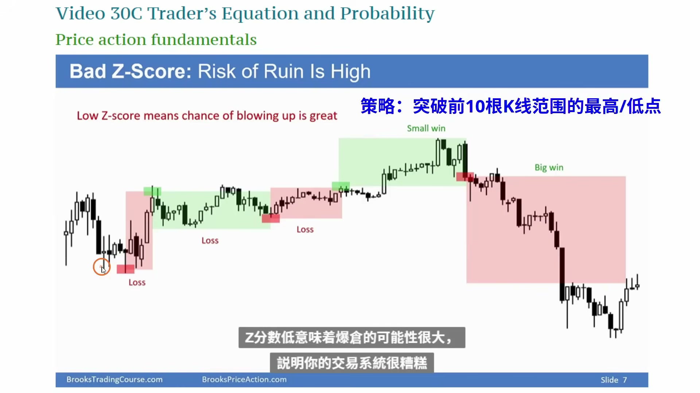
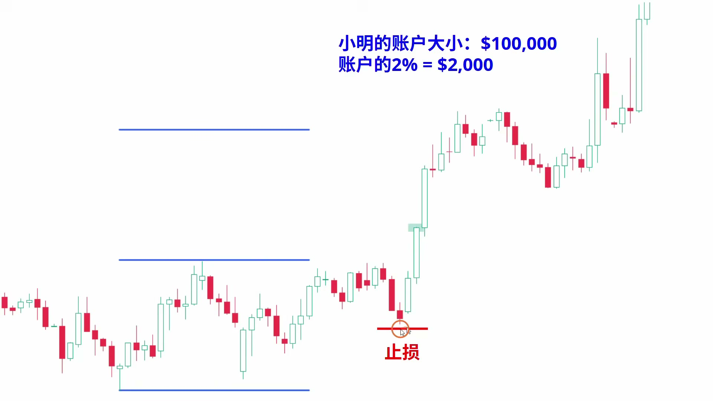
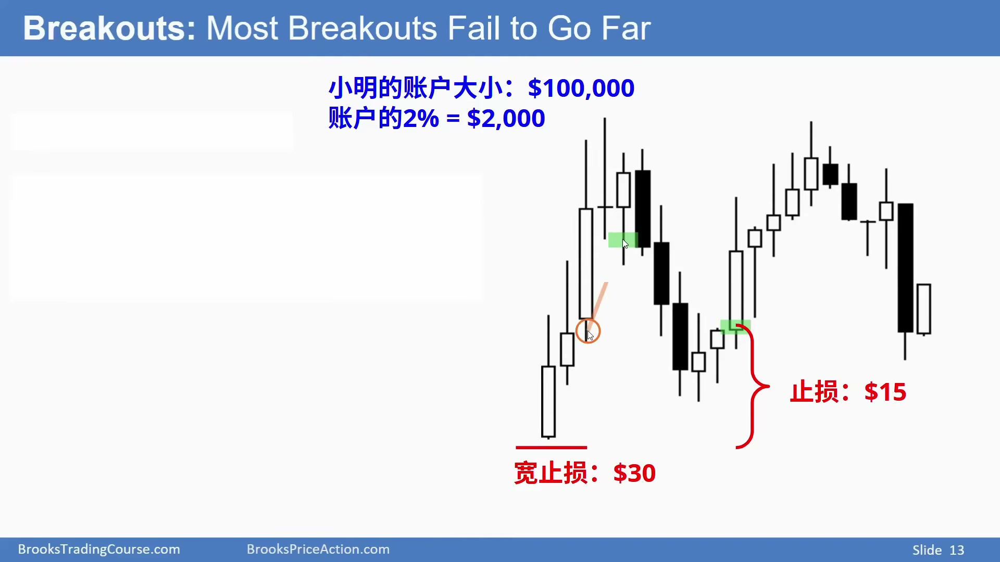
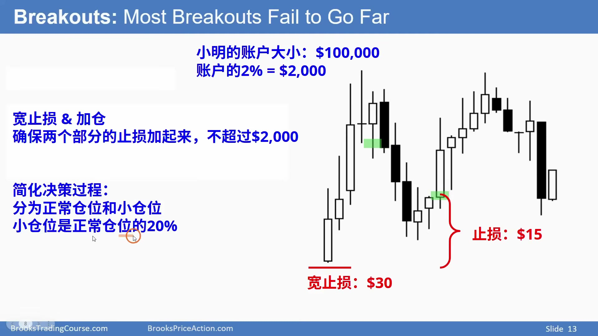
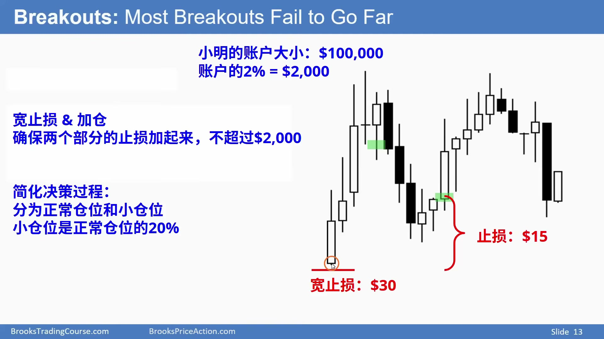
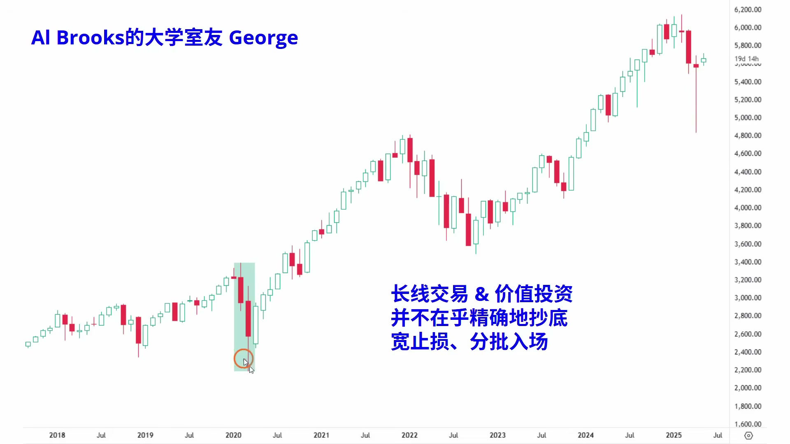

# 《【价格行为学】踏上交易之路(5): 仓位管理》复盘笔记

视频链接：https://www.youtube.com/watch?v=V0za4BdLtE0  
频道：方方土PriceAction  
发布时间：2025-05-17  
视频时长：35:49  
本地素材目录：`notes/assets/015-youtube-trading-position-sizing-review/`

## 核心结论

这期讲的不是“仓位怎么算”这么简单，而是：

**仓位管理决定你有没有能力执行自己的 Price Action 判断。仓位太大时，原本还没失效的交易，会因为心理压力被你提前砍掉；仓位合理时，你才有资格讨论止损、加仓、波段和交易系统。**

最实用的规则有 5 个：

- 单笔交易先定 `initial stop`，再用账户风险反推仓位。
- 不确定时，单笔风险不要超过账户 `2%`。
- 宽止损不是问题，宽止损但仓位不缩才是问题。
- 如果计划加仓，初始仓位和加仓仓位的总风险仍然不能超过原定上限。
- 新手的目标不是快速赚钱，而是用极低成本练出稳定执行力。

## 本期术语表

- `i don't care size`：亏了也不怎么在乎的仓位。不是随便小，而是小到不会干扰判断。
- `position sizing`：仓位管理。根据账户、止损距离、交易系统稳定性决定买多少股或几手合约。
- `initial stop`：初始止损。入场前根据价格行为确定的失效点。
- `measured move`：测量目标。把前一段区间或突破段的高度往目标方向复制，用来估算第一目标。
- `sell stop order`：跌破某价格后触发的卖出止损/突破空单。
- `buy stop order`：突破某价格后触发的买入止损/突破多单。
- `limit order`：限价单。希望在更好价格成交，比如回调到某个低点买入。
- `wide stop`：宽止损。止损距离较远，通常用于波动大、宽通道、长期投资或计划分批入场的场景。
- `scale in`：加仓。价格走到另一个合理位置后增加仓位。
- `z-score`：衡量交易系统稳定性的统计指标。这里重点不是公式，而是判断系统是否过度依赖少数大赚。
- `Sharpe ratio`：夏普比率，衡量收益相对波动是否划算。
- `PDT`：`Pattern Day Trader`，美股日内交易账户规则，通常要求账户资金超过 25,000 美金。

## 视频关键截图

### 1. 只靠少数大赚的系统，手动执行风险很高



这个例子里，前面连续小亏，最后一笔大赚才让系统整体盈利。电脑可以机械执行，但人很可能在连续亏损后停手，刚好错过真正赚钱的那一笔。

### 2. 先定止损，再用 2% 风险反推仓位



这里的流程很标准：先根据价格行为放止损，再计算入场价到止损的距离，最后用账户允许亏损金额除以止损距离，得到仓位。

### 3. 宽止损可以用，但仓位必须变小



同样是账户 2% 风险，如果止损从 10 块变成 30 块，仓位就必须大约缩到三分之一。否则你表面上是在用宽止损，实际上是在重仓硬扛。

### 4. 复杂行情里，用 20% 小仓位简化决策



Al Brooks 的实用建议是准备两档仓位：正常仓位和小仓位。小仓位大约是正常仓位的 20%，用于宽止损、可能加仓、或者你来不及精确计算的场景。

### 5. 宽初始止损不代表必须等它被打



如果盘面已经出现第二次向下反转尝试，而且做空 signal bar 明显变强，多头可以先离场。宽止损只是保护底线，不是禁止你根据新的 Price Action 提前处理。

### 6. 长期投资常用宽止损和分批买入



长期投资者通常不追求精确抄底，而是接受大级别回撤，用小初始仓位和分批入场处理长期上涨趋势里的深度回调。

## 这期真正要解决的问题

很多人以为仓位管理只是数学问题，但视频真正说的是执行问题。

同一套 Price Action 判断，在小仓位下你能客观看；在重仓下，你会被浮亏吓到，然后在交易前提还没失效时提前离场。

所以仓位管理不是交易系统外面的附属品，而是交易系统的一部分。

如果仓位不合适，会发生三件事：

- 你看对了结构，但拿不住。
- 你设置了合理宽止损，但因为仓位太大提前砍。
- 你本来该继续执行系统，却在连续亏损后停手，错过真正的大行情。

## 决策节点 1：交易系统稳定性决定仓位大小

视频开头用一个突破系统举例：

- 突破前 10 根 K 的低点就做空。
- 突破前 10 根 K 的高点就做多。
- 几笔交易里，前面有中亏、小亏、小亏、小赚。
- 最后一笔大赚，才让整个系统盈利。

这类系统对电脑可能可以，因为电脑不会怕，也不会漏单。

但人不一样：

- 连亏三四次以后会沮丧。
- 可能想休息一下。
- 可能因为工作、接孩子、看医生错过下一笔。
- 也可能在大行情刚开始时不敢再进。

所以一个系统不能只看回测总收益，还要看你能不能真实执行。

实战规则：

- 如果系统胜率低、依赖少数大赚，仓位必须更小。
- 如果你经常错过交易，就不要用高度依赖完整执行的系统。
- 如果系统经常小赚、偶尔大亏，也说明不稳定，仓位也要更小。

## 决策节点 2：标准仓位计算流程

视频给了一个非常实用的计算流程。

假设：

- 账户 100,000 美金。
- 单笔风险上限 2%，也就是 2,000 美金。
- 入场价到止损价距离是 10 美金。

仓位就是：

```text
仓位 = 允许亏损金额 / 每股风险
仓位 = 2,000 / 10 = 200 股
```

这个流程的关键不是公式，而是顺序：

1. 先看价格行为，决定 `initial stop`。
2. 再看账户能承受多少亏损。
3. 最后反推仓位。

很多新手刚好反过来：先想赚多少钱，再决定重仓，然后才临时找止损。这会把整个交易系统变成情绪系统。

## 决策节点 3：目标改变时，止损也要跟着结构移动

视频里的突破例子里，第一目标是 `measured move`，大约是 1:1。

如果市场只走到第一目标附近，止盈是合理的。

但如果后续出现连续三根强阳线，说明突破质量比预期更强，就可以：

- 先取消原来的近目标。
- 把目标换到更高的 `measured move`。
- 等市场再创新高后，把止损抬到新的重要低点下方。

这里的重点是：加仓和移动止损必须先满足“总风险不变”。

如果原始 200 股已经没有亏损风险，甚至止损高于入场价，那么再加 200 股，理论上总风险仍然可以控制在 2,000 美金以内。

实战规则：

- 加仓不是因为“赚了所以大胆”，而是因为原仓风险已经下降。
- 加仓后，总体最坏亏损仍然不能超过原计划。
- 止损移动要依据新的重要低点/高点，不是因为害怕就乱挪。

## 决策节点 4：宽止损和加仓必须提前规划

宽止损本身没有错。很多宽通道、回调买入、长期投资，都需要宽止损。

问题在于：宽止损以后，你还用原来的仓位。

视频里的例子：

- 正常止损距离 10 美金，可以买 200 股。
- 宽止损距离 30 美金，就只能买约 60-70 股。
- 如果还买 200 股，风险就从 2,000 变成 6,000。

更危险的是宽止损加仓。

如果你计划在下方继续买，那么初始仓位就不能已经用满 2% 风险。因为之后加仓的风险也要算进同一笔交易里。

实战规则：

- 宽止损时，仓位必须缩小。
- 准备加仓时，初始仓位要更小。
- 初始仓位 + 加仓仓位，总风险仍然不能超过账户风险上限。
- 没算清楚之前，不要加仓。

## 决策节点 5：用“正常仓位 + 20% 小仓位”降低盘中负担

盘中每笔都精确计算仓位，很多人做不到。

尤其是 5 分钟图：

- 止损距离不是整数。
- K 线变化很快。
- 你还要判断趋势、信号、目标。
- 再让你精算仓位，容易大脑过载。

所以视频给了一个简单方法：

- 准备一个正常仓位。
- 再准备一个小仓位，小仓位约等于正常仓位的 20%。

什么时候用 20% 小仓位？

- 止损很宽。
- 可能需要加仓。
- 波动变大。
- 你不确定这笔该用多少。
- 你想先参与，但不想让仓位干扰判断。

这个规则不完美，但它非常实用。它的价值是让你保留判断力，而不是在盘中被计算和压力拖垮。

## 决策节点 6：宽止损不是死扛许可证

视频特别讲了一个容易误解的点：

**设置了宽初始止损，不代表一定要等它被打掉。**

如果后来出现新的 Price Action 证据，比如：

- 第二次向下反转尝试。
- 做空 signal bar 明显更强。
- 大阴线收在低位。
- 市场已经从上涨趋势转向大涨大跌的 trading range。

多头可以提前离场，等更低位置或更清晰信号再进。

这和“情绪砍仓”不一样：

- 情绪砍仓：交易前提没坏，只是仓位太大受不了。
- 结构离场：新的价格行为已经降低了原计划的质量。

实战规则：

- 宽止损保护的是最坏情况。
- 新证据出现时，可以提前处理。
- 提前离场必须来自结构变化，不是来自亏损金额吓人。

## 新手最重要的任务：降低学费

视频后半段的重点很接地气：新手应该用极小仓位练习。

作者甚至建议：

- 可以用很小资金的账户练习。
- 每笔风险控制在 1 美金以内。
- 每个月设定最大亏损预算，比如工资的 10%-20%，或固定 500 美金。
- 亏完就停，等下个月再练。

这里的核心不是推荐某个市场，而是把交易当成需要长期训练的技能。

如果一开始就用大仓位：

- 亏损会伤害生活。
- 家庭压力会变大。
- 自尊和热情会被打掉。
- 还没练出能力，就先被市场劝退。

更好的方式是：

- 用真金白银，但金额小到不痛。
- 让每次错误都是便宜的学费。
- 用大量样本探索自己适合 `scalp`、`swing`、宽止损，还是别的方式。

## 长期投资里的仓位逻辑

长期投资和日内交易不一样。

长期投资者不追求精确抄底，常见做法是：

- 大盘回调 10% 买一部分。
- 再跌 10% 继续买。
- 用宽止损或干脆不用短线止损。
- 通过分批入场承受长期波动。

但这套逻辑只适合大级别、优质标的、低杠杆或无杠杆。

它不能直接搬到高杠杆日内交易里。

实战区别：

- 长期投资：可以用时间、分批、低杠杆处理波动。
- 日内交易：必须严格控制单笔风险和执行纪律。
- 高杠杆短线：不能用“长期会涨回来”安慰自己。

## 账户变大后，要不要马上加仓

作者给出的答案很保守：不要频繁加大仓位。

原因很简单：

- 账户变大，不代表心理承受能力同步变大。
- 仓位一变大，压力会改变你的执行。
- 很多人赚钱后加仓，亏回去时并不会像开仓前想象得那么无所谓。

更稳的做法：

- 找到自己舒服的 `i don't care size`。
- 长时间稳定后，再小幅提高。
- 甚至一年调整一次仓位就够了。

真正重要的是持续能执行，而不是理论上能赚更多。

## 可以复用的执行规则

### 单笔仓位

- 先定止损，再算仓位。
- 单笔风险默认不超过账户 2%。
- 如果系统不稳定、情绪压力大、执行不完整，风险要更低。

### 宽止损

- 止损距离变宽，仓位必须变小。
- 如果计划加仓，初始仓位要预留风险额度。
- 宽止损不是死扛，结构变坏可以先出。

### 加仓

- 只有在总风险仍然受控时才加仓。
- 原仓止损已经抬高或风险已经下降，加仓才更合理。
- 加仓不能来自“想赚更多”，必须来自价格行为和风险空间。

### 新手练习

- 用小到不痛的真实资金练。
- 每笔亏损控制到足够小。
- 每月设置最大亏损预算。
- 先保住热情和样本量，再谈盈利速度。

## 常见错误

- 觉得 2% 太小，所以必须重仓。
- 止损变宽了，仓位却不变。
- 还没预留风险额度，就急着加仓。
- 把宽止损理解成硬扛到底。
- 用模拟盘代替真实情绪训练。
- 赚钱后马上大幅加仓。
- 把“亏回利润”想得很轻松，真正发生时情绪崩溃。

## 复盘 checklist

每次下单前问：

1. 我的 `initial stop` 是根据价格行为定的吗？
2. 入场价到止损价的距离是多少？
3. 如果止损被打，亏损占账户百分之几？
4. 这笔交易有没有超过 2% 风险？
5. 如果止损很宽，我是否已经缩仓？
6. 如果计划加仓，初始仓位是否足够小？
7. 加仓后总风险是否仍然受控？
8. 我现在的仓位是不是 `i don't care size`？
9. 如果连续亏损，我还能继续执行系统吗？
10. 如果账户变大，我是不是过早加仓了？

## 对操作手册的更新判断

这期需要更新 `price-action-entry-manual.md`，但不需要新增单独入场场景。

原因是它主要补强“入场前必须先定 `initial stop` 和仓位”的底层规则，尤其适合加入 checklist 和宽止损相关说明。它不是新的 Price Action setup，而是让已有 setup 能被真实执行的风险层。

