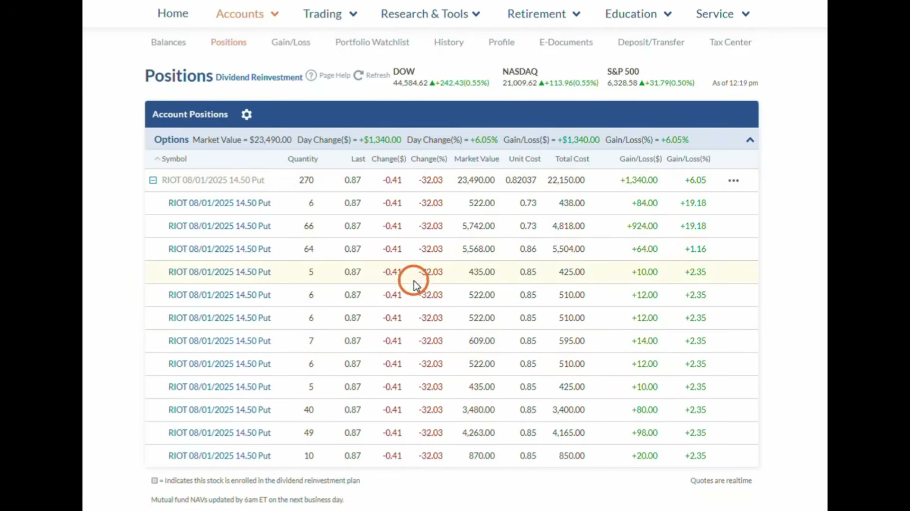
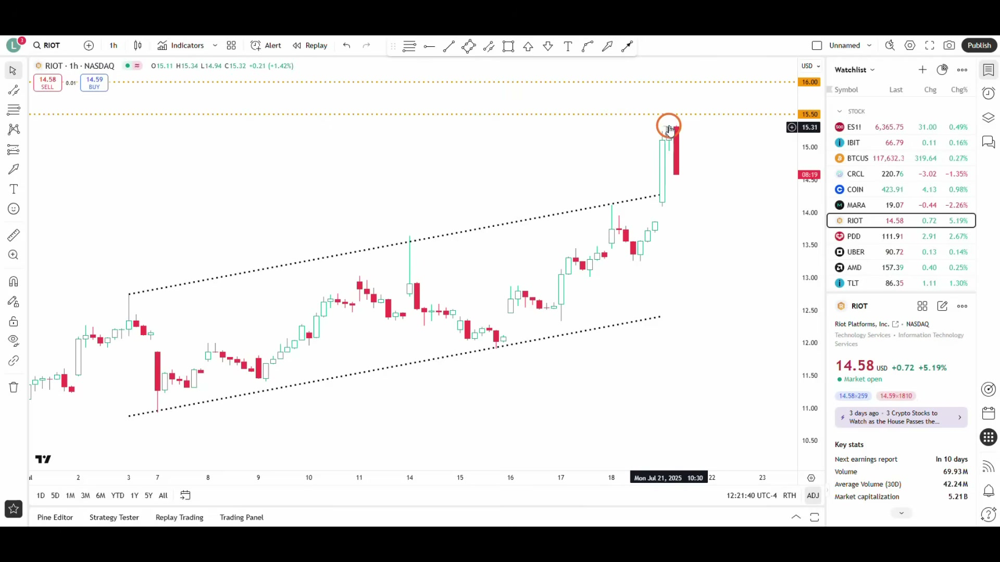
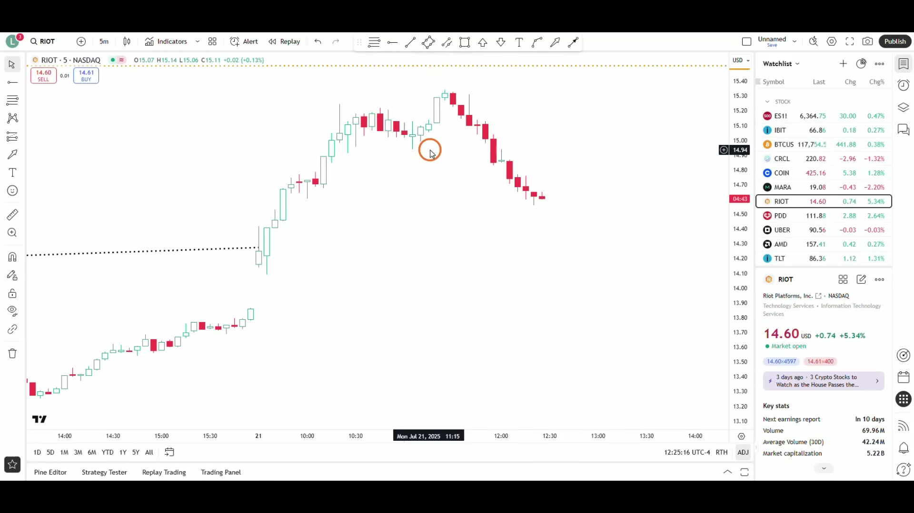
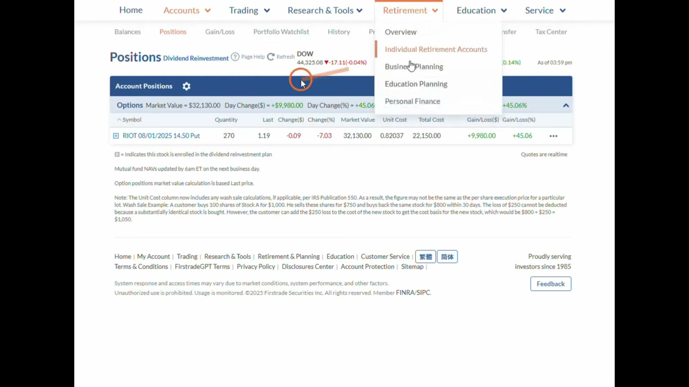
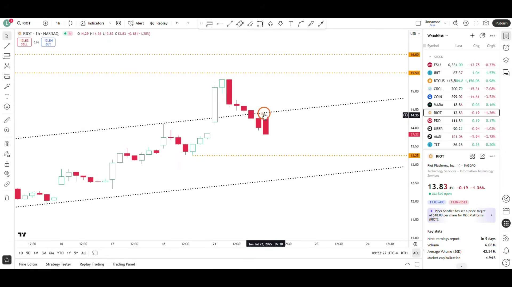
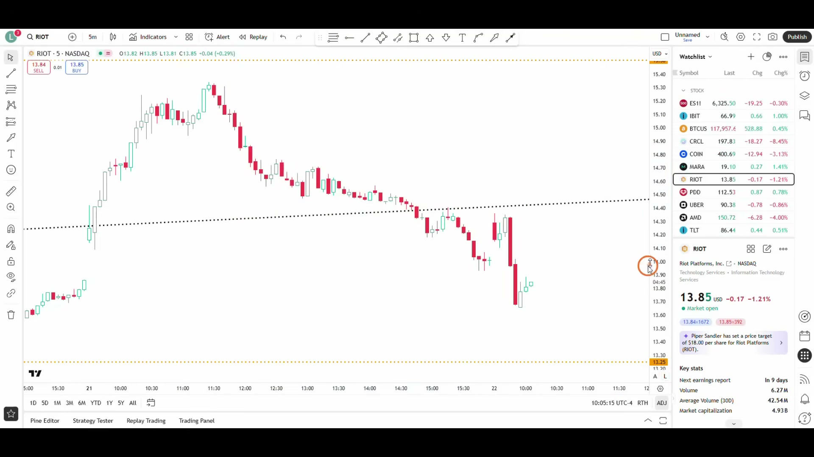

# 《【价格行为学】边做边讲(28): 加速突破失败后的反转波段 +$13,232》复盘笔记

视频链接：https://www.youtube.com/watch?v=Cn6yAnTlke4  
频道：方方土PriceAction  
发布时间：2025-07-22  
视频时长：22:13  
本地素材目录：`notes/assets/016-youtube-price-action-acceleration-failed-breakout-review/`

## 核心结论

这期是一笔完整的 `RIOT` 期权做空复盘，核心不是“赚了多少钱”，而是：

**宽通道里的加速突破，如果在更大时间周期上失败，并且小周期已经转成 `Always In Short`，就可以从“追高突破”切换成“失败突破后的反转波段”。**

这笔交易的执行链很清楚：

- 一小时图看到宽上涨通道尝试向上加速突破。
- 这种加速突破成功率低，常在 5 根 K 内失败。
- 5 分钟图已经转成 `Always In Short`，所以没有等一小时 K 收盘才进。
- 止损放在新高上方，目标先看宽通道下沿和最后买入高潮起涨点。
- 第一天出现强反转，浮盈约 1 万美金，不急着止盈。
- 第二天高开不高走，继续下跌，到区间中部和 5 分钟 `sell climax` 附近分批/全部止盈。

## 本期术语表

- `broad channel`：宽通道。方向上有趋势，但来回摆动大，本质接近倾斜的震荡区间。
- `acceleration breakout`：加速突破。价格尝试脱离原通道、加速往外走。
- `failed breakout`：突破失败。突破后不能延续，反而很快反向。
- `Always In Short`：小周期已经明显偏空，默认应该优先做空或持有空头。
- `TBTL`：`Ten Bars Two Legs`，两段十 K。强反转后，最低预期常是至少两段、约十根 K 的反向走势。
- `wedge`：楔形。三推结构，常用于判断趋势尾声或反转条件。
- `island reversal`：岛形反转。跳空上去后又跳空下来，中间形成孤岛。
- `bull trap`：多头陷阱。看似突破吸引多头追入，随后失败反转。
- `sell climax`：抛售高潮。连续下跌后出现特别大的阴线，常提示空头开始止盈。
- `bid ask spread`：买卖价差。买价和卖价之间的差额，是交易成本的一部分。
- `market maker`：做市商。提供流动性，同时赚取买卖价差。
- `clearing house`：清算/结算公司。交易所和券商之间负责确认、结算交易并降低对手方风险的机构。
- `counterparty risk`：对手方风险。交易对手无法履约带来的风险。

## 视频关键截图

### 1. 入场背景：RIOT 做空，不是主观猜顶

作者不是因为 RIOT 涨多了就空，而是因为判断它是宽通道里的 `bull trap`：尝试向上加速突破，但很快失败。

### 2. 宽通道加速突破失败，是这笔交易的主 setup

宽通道和震荡区间很像，很多突破都会失败。这里的关键规则是：宽通道尝试加速突破，常在 5 根 K 内出现反向 signal。

### 3. 小周期已经 `Always In Short`，所以可以提前入场

一小时图提供 setup，小周期提供执行触发。5 分钟已经跌破重要低点、进入单边下跌阶段，所以作者没有等一小时 K 完全收盘。

### 4. 第一天强反转，不急着止盈

收盘前已经连续多根阴线，而且收在低位，说明原来的做空假设被市场确认。此时虽然浮盈约 1 万美金，但作者判断至少还有第二段下跌。

### 5. 第二天高开不高走，继续验证空头逻辑

第二天虽然小幅高开，但没有高开高走，而是继续下跌。这里考验的是：你是被利润回撤吓到，还是继续按“强反转后通常有第二段”的逻辑处理。

### 6. 区间中部 + 5 分钟 sell climax，适合落袋

当 BTC 已经跌到区间中部，RIOT 5 分钟又出现长时间下跌后的两根巨大阴线，继续追空的盈亏比变差，空头应该开始分批止盈。

## 交易主线

### 1. 方向判断：不是看空 BTC，而是做 RIOT 的失败突破

这笔交易主要看的是 `RIOT` 一小时图的价格行为。

虽然 RIOT 和 BTC、美股大盘有关联，但作者没有把这笔交易简化成“BTC 要跌，所以 RIOT 做空”。他的主逻辑是：

- RIOT 自身在一小时图上形成宽上涨通道。
- 通道末端尝试向上加速突破。
- 这种突破成功率不高。
- 如果 5 根 K 内失败，就会出现反转做空机会。

这点很重要：相关市场只是背景，不是入场触发。真正下单的是 RIOT 自己的结构。

## 决策节点 1：宽通道加速突破失败

作者提到一个 Price Action 规则：

> 宽通道尝试加速突破，成功率可能只有 25%-30%；约 70% 的时候会在 5 根 K 内失败，并出现反向交易机会。

这不是说所有突破都要反着做，而是限定在“宽通道”这个 market condition 里。

宽通道的特点是：

- 有方向，但来回摆动很大。
- 每次冲出通道外，都容易被拉回。
- 本质接近倾斜的 `trading range`。
- 越到通道末端，越要警惕加速突破失败。

所以这笔空单的第一层依据是：RIOT 尝试向上加速，但更像 `bull trap`，不是健康的趋势突破。

## 决策节点 2：时间周期选择

视频里有一个细节非常值得记：

同一个结构，可以在 5 分钟、一小时、日线都看到，但不是每个周期都适合交易。

作者选择一小时，是因为：

- 5 分钟图太小，目标空间太窄。
- 日线图 K 线太少，等待 5 根日 K 会太慢。
- 一小时图的 K 线数量刚好，既能看清宽通道，又能给出可交易波段。

实战规则：

- 先找结构存在的“最大可交易周期”。
- 周期越大，潜在波段越大。
- 但周期太大时，等待和止损都会变得不现实。
- 小周期可以用来入场，但不要让小周期决定全部目标。

## 决策节点 3：为什么没等一小时 K 收盘

作者承认入场已经有点晚，原本想等更高的位置，比如 16 美元附近。

但他没有等一小时 K 收盘，原因是 5 分钟已经：

- 跌破重要低点。
- 转成 `Always In Short`。
- 处于单边下跌阶段。

所以这里是典型的多周期配合：

- 一小时：提供 setup 和目标。
- 5 分钟：提供执行触发。

这不是“看到跌了就追空”，而是大周期已经给出失败突破前提，小周期再确认空头已经接管。

## 决策节点 4：止损和目标

止损逻辑很清楚：

- 如果 RIOT 重新向上突破创新高，说明“加速突破失败”的前提出问题。
- 所以止损应放在新高上方。
- 如果被打掉，预期亏损约 6,000 多美金。
- 这个风险不大于作者平时任何一笔短线/日内交易。

目标也分两层：

- 时间目标：强反转后，最低预期是 `TBTL`，也就是两段十 K。
- 价格目标：宽通道下沿，或者最后买入高潮的起涨点。

这让交易不是“空了再看”，而是下单前已经知道：

- 为什么进。
- 错在哪里。
- 对了先看哪里。
- 用多少仓位能承受。

## 决策节点 5：第一天浮盈 1 万，为什么不止盈

收盘前，RIOT 已经连续多根一小时阴线，且大多收在低位。

这说明市场正在奖励这笔交易：

- 原来的 `bull trap` 判断成立。
- 加速突破失败后出现强反转。
- 强反转通常至少还有第二段。

所以虽然浮盈约 1 万美金，作者没有止盈。

这里的关键是区分：

- 因为账户浮盈很多而想赶紧拿钱。
- 因为价格行为显示目标已经到了而止盈。

第一天的价格行为不是止盈信号，而是持有信号。

## 决策节点 6：第二天高开，为什么不慌

第二天 RIOT 小幅高开，因为 BTC 夜盘从区间底部反弹、再次测试 12 万整数位。

但关键是：RIOT 没有高开高走。

作者真正关心的是：

- 高开后有没有继续向上？
- 昨天强反转后，第二段下跌有没有来？
- 上方反弹 K 是否是好的做多信号？

他的判断是：即使出现强势反弹，也要小心它只是 `trading range` 里的第二段陷阱。尤其当位置在区间顶部，反弹看起来越强，越不能自动当成趋势恢复。

所以他继续持有，而不是因为浮盈回撤就后悔没在前一天收盘出掉。

## 决策节点 7：为什么开始分批止盈

当 RIOT 继续下跌，浮盈到 13,000 多美金后，作者开始先止盈 1/3。

理由不是“赚够了”，而是多个结构重叠：

- BTC 跌到区间中部，空头可能开始止盈。
- RIOT 5 分钟已经连续下跌很多根。
- 出现两根体积很大的阴线。
- 大阴线出现在长期下跌之后，更像 `sell climax`。
- 在大阴线收盘附近，更多人可能买入止盈，而不是继续追空。

这就是非常实用的出场逻辑：

> 好空单不是永远拿，到了别人开始止盈的位置，你也要准备止盈。

## 决策节点 8：为什么最后几乎全部止盈

作者原本挂单卖出 180 手合约，但因为 RIOT 期权流动性不好，成交很零散。

最后剩下 88 张合约没有成交，他降低价格到 126 美元卖掉。

这里学到两个执行细节：

- 期权流动性差时，想一次性平仓未必能完全成交。
- 到了该走的位置，不要为了多 1 美元价格一直等。

作者也复盘说，如果当时少分心、看一眼 5 分钟图，可能能多赚 1,000 多美金。这个不是懊悔，而是指出：执行时讲解、看别的内容，会降低临场反应速度。

## 订单与成本：这期顺带讲了什么

视频中间讲了订单成交、`clearing house`、`bid ask spread` 和 `market maker`。

这部分不是主交易逻辑，但对实盘很有用：

- 你的订单不是简单地和另一个散户直接成交。
- 中间有交易所、券商、清算公司。
- 清算公司降低 `counterparty risk`。
- 期权交易除了佣金，还有买卖价差成本。
- 免佣金不一定更便宜，如果成交价差更差，实际成本可能更高。

作者的态度很务实：这些成本是做生意的成本。只要策略能盈利，合理交易成本不该成为主要矛盾。

## 可以复用的执行规则

### 入场

- 宽通道里，向外加速突破要先警惕失败。
- 失败突破最好发生在 5 根 K 内。
- 大周期负责 setup，小周期负责触发。
- 小周期转成 `Always In Short`，可以提前入场，不必机械等大周期收盘。

### 止损

- 做空失败突破，止损应放在新高上方。
- 如果再创新高，说明原来的失败突破前提出问题。
- 仓位必须让这笔止损亏损仍然在可接受范围内。

### 持仓

- 强反转后，不要因为浮盈大就立刻跑。
- 连续强阴线收低位，通常支持至少第二段下跌。
- 高开不高走，不等于空头逻辑失效。

### 止盈

- 跌到区间中部，空头要开始警惕反弹。
- 长时间下跌后的巨大阴线，可能是 `sell climax`。
- 到了别人开始止盈的位置，自己也要考虑分批落袋。
- 流动性差的期权，不要执着于完美成交价。

## 常见错误

- 看到加速突破就追涨，忽略它发生在宽通道末端。
- 只看 5 分钟，不看一小时的真正 setup。
- 强反转刚开始就因为浮盈大而提前止盈。
- 第二天小幅高开就被吓出空单。
- 跌到区间中部和 sell climax 后还继续贪。
- 做期权时忽略流动性和 bid ask spread。
- 把相关市场背景当成直接入场理由。

## 复盘 checklist

以后看到类似结构，可以按这 10 个问题检查：

1. 当前是不是 `broad channel`，而不是强趋势？
2. 价格是不是在尝试向通道外 `acceleration breakout`？
3. 突破后 5 根 K 内有没有失败迹象？
4. 小周期是否已经转成 `Always In Short / Long`？
5. 这笔交易的大周期 setup 和小周期 trigger 是否分清了？
6. 止损是否放在真正使前提失效的位置？
7. 目标是 `TBTL`、通道另一侧，还是买入/抛售高潮起点？
8. 第一段强反转后，有没有理由期待第二段？
9. 到区间中部或出现 climax 时，是否该分批止盈？
10. 如果用期权表达，流动性和价差是否会影响出场？

## 对操作手册的更新判断

这期需要更新 `price-action-entry-manual.md`。

原因是它提供了一个明确、可复用的新入场场景：**宽通道加速突破失败后的反转波段**。它和已有的“trading range 上下沿做反转”相关，但更具体：重点是通道末端的加速突破、5 根 K 内失败、多周期确认，以及 TBTL/通道下沿目标。

