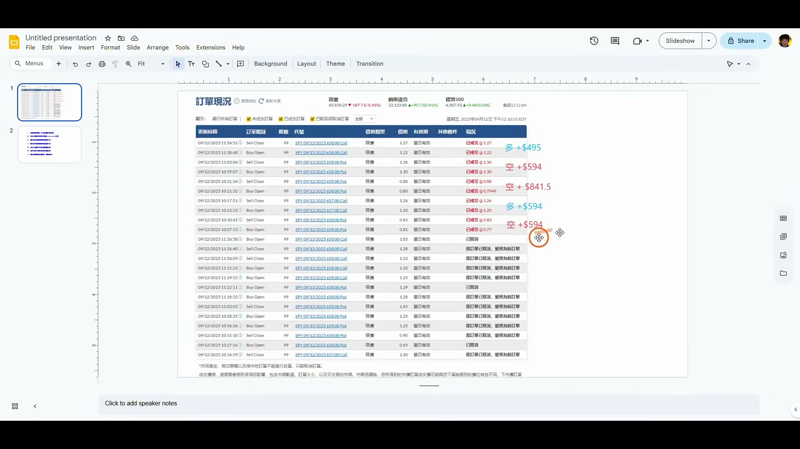
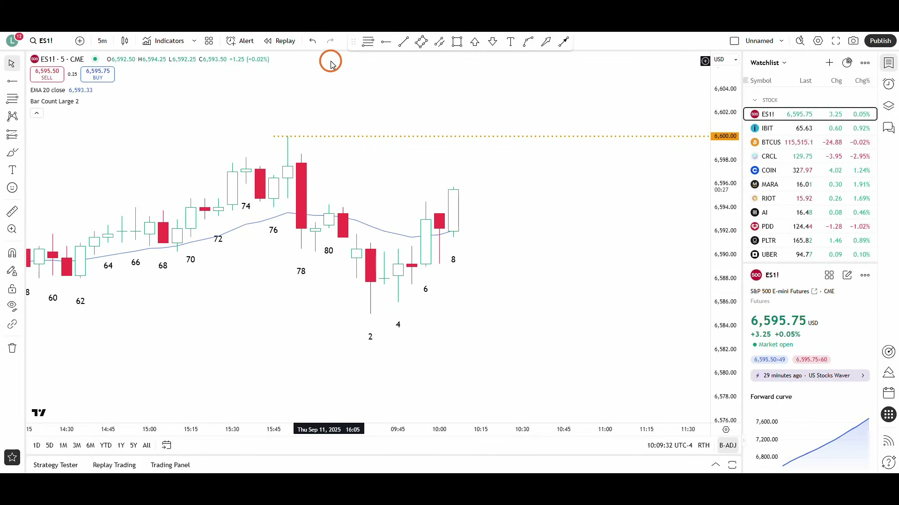
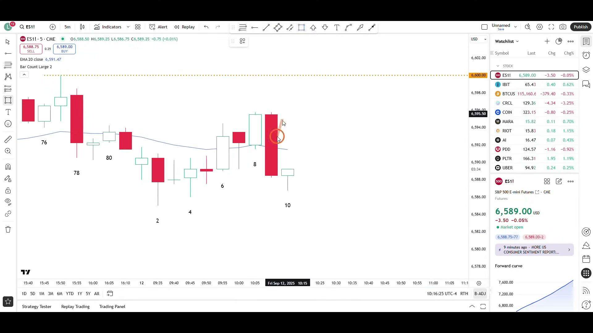
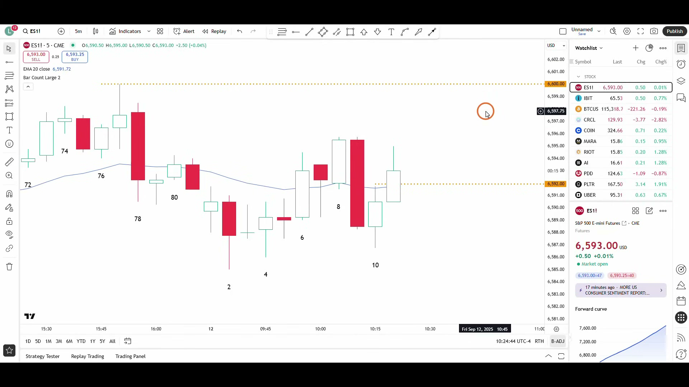
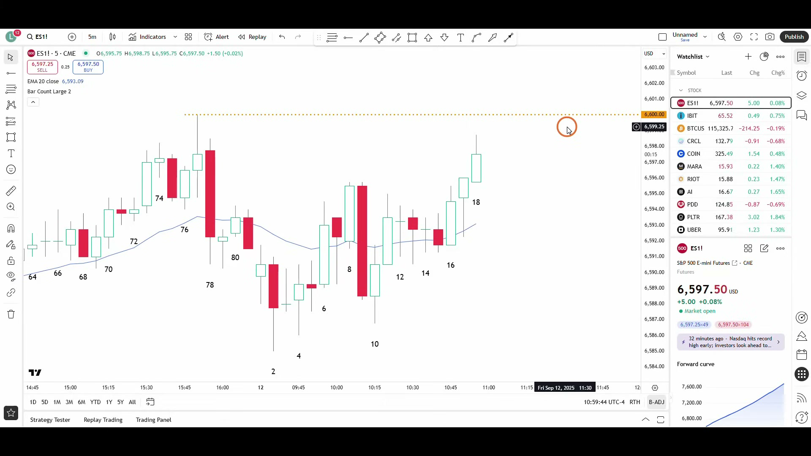
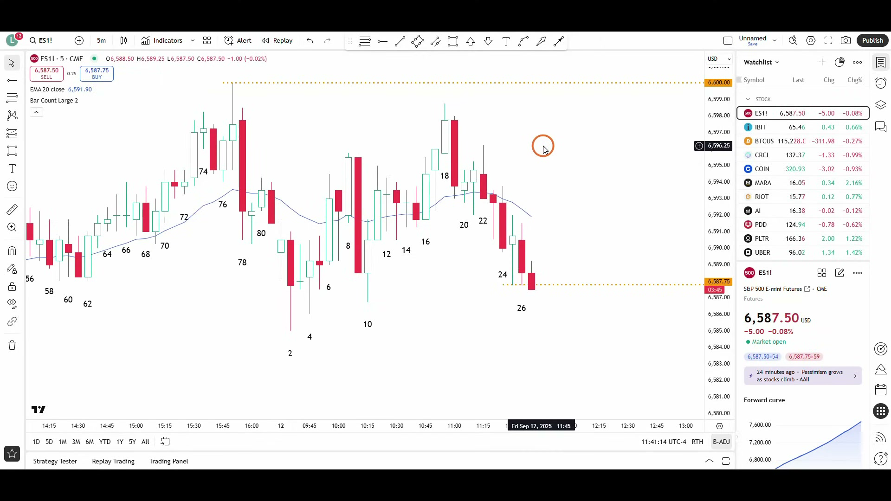
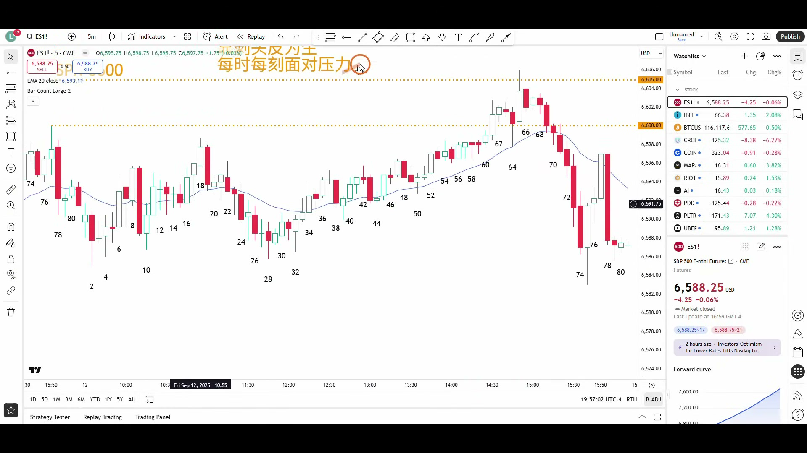

# 《【价格行为学】边做边讲(29): 标普股指早盘剥头皮 +$594，+$594，+$841，+$594，+$495》复盘笔记

视频链接：https://www.youtube.com/watch?v=Mtjvam8lQUY  
频道：方方土PriceAction  
发布时间：2025-09-13  
视频时长：37:40  
本地素材目录：`notes/assets/017-youtube-price-action-es-opening-scalp-review/`

## 核心结论

这期不是在鼓励频繁交易，而是在演示一个很具体的场景：

**当早盘判断为低波动、窄震荡区间日时，交易方式要从 `swing` 切换成 `scalp`：不追求拿大段，只在区间边缘用 limit order 反向吃一根平均 K 线高度，赚到就走。**

这期最值得复用的 5 条规则：

- 先判断今天更适合 `scalp` 还是 `swing`，不要用错交易模式。
- 窄区间里，大阳线收高位常是卖点，大阴线收低位常是买点。
- `scalp` 的目标不是“尽量多赚”，而是固定吃一根平均 K 线高度。
- 区间中间少做，边缘才有更好的反向空间。
- `scalp` 机会很多，但不代表每一两根 K 都必须交易。

## 本期术语表

- `scalp`：剥头皮交易，超短线快进快出。通常持仓不超过 1-5 根 K，多数在 1-2 根 K 内完成。
- `swing`：波段交易。不是赚一根 K 的高度，而是只要前提没坏就继续拿。
- `trading range day`：震荡区间日。日内上下空间有限，突破和跟随都差。
- `narrow range day`：窄区间日。震荡区间更窄，平均 K 线更小，目标也要缩小。
- `limit order`：限价单。区间里常用来高位卖、低位买。
- `stop order`：突破单。趋势里常用，但在区间里也可能只用于 scalp，而不是 swing。
- `average bar size`：平均 K 线高度。scalp 目标常参考当时平均 K 的大小。
- `gap fill`：补缺口。这里指两根 K 线之间的小空隙被回补，常作为 scalp 目标。
- `EMA20`：20 周期均线。趋势中有参考价值，横盘中常常用处不大。
- `straddle`：同时买入同执行价 call 和 put，押注波动变大。
- `strangle`：同时买入/卖出不同执行价 call 和 put，结构比 straddle 更宽。
- `zero-day option`：当天到期期权。时间损耗快，但几分钟级别 scalp 中影响相对有限。
- `buy climax`：买入高潮。上涨后期的大阳线，尤其打到强阻力位时，更可能是强多头止盈和强空头试空的位置。
- `vacuum test`：真空测试。价格被吸向关键价位或阻力/支撑，测试完后容易反向。

## 视频关键截图

### 1. 五笔 scalp 的成交记录

这张图先看结果：一共 5 笔，三笔做空、两笔做多，都是 99 张合约。重点不是金额，而是它们几乎都在几分钟内完成，符合 `scalp` 的交易定义。

### 2. 第一笔：窄区间上沿和 6600 阻力附近做空

从昨天下午开始就是震荡，标普期货 6600 点和现金指数 6600 点附近又是强阻力。区间里大阳线收高位，常常不是追多点，而是强多头止盈、空头 scalp 的区域。

### 3. 第二笔：大阴线后做多，目标是补小缺口

9 号 K 是大阴线，但在窄区间里，大阴线收低位常会被买回来。目标不是幻想反转成大多头，而是回补 9 的收盘与 8 的低点之间的小缺口。

### 4. 第三笔：波动变大，scalp 目标也稍微放大

scalp 目标不是死的。前面平均 K 较小，每张合约赚 6 美元；当 8、9、10 的波动变大，目标也可以稍微放宽，所以这笔每张赚到 8.5 美元。

### 5. 第四笔：第二段上涨后的 buy climax 做空

10、11 之后出现第二段上推，且加速到阻力区域。这里不是追多，而是区间里的 `second leg trap / buy climax`，适合高位做空 scalp。

### 6. 第五笔：区间下沿做多，但因为窄通道要快出

这笔是最不舒服的一笔：短线已经形成下降窄通道，买入后还继续小亏。但它处在区间低位，做多前提仍成立。后面只是赚到很小目标就走，因为窄通道后的第一次反弹不宜期待太远。

### 7. 尾盘补充：阻力位 buy climax 不是追多点

尾盘再次说明同一件事：大阳线打到强阻力位，弱多头容易追涨，弱空头容易止损；强多头更可能止盈，强空头会寻找至少 scalp 的做空机会。

## 这期的主线：先选交易模式

作者开头先判断：

- 今天大概率是低波动日。
- 可能是窄幅震荡区间。
- 不适合期待大波段。
- 更适合做 `scalp`。

这个判断比单笔入场更重要。

如果你把窄区间日当趋势日做，就会出现两个问题：

- 看到突破就追，结果很快被拉回。
- 明明赚到 scalp 目标，却幻想变成 swing，最后利润回吐。

这期真正的核心是：**同样一根 K，在 swing 交易里可能没价值，但在 scalp 交易里可以提供一笔 3-5 点的小机会。**

## 五笔交易复盘

### 第一笔：高位做空，吃回落

入场背景：

- 昨天下午以来一直是震荡。
- 昨日高点正好接近 ES 6600 整数位。
- 再往上几 points 对应现金指数 6600，同样是强阻力。
- 早盘大阳线收在高位，但缺少足够跟随。

执行：

- 在 6 号 K 高点上方用限价卖单做空。
- 持仓不到 3 分钟。
- 每张期权赚 6 美元。

交易含义：

在趋势里，大阳线收高位可能是追多信号；但在窄区间强阻力附近，它更像强多头止盈、空头 scalp 的位置。

### 第二笔：大阴线后反手做多，目标补缺口

入场背景：

- 9 号 K 是大阴线。
- 在区间里，大阴线收低位常常会被买回来。
- 9 的收盘价和 8 的低点之间有小缺口。

执行：

- 在 6/7 低点附近挂限价买单。
- 目标是回补缺口，接近 8 的低点。
- 持仓约 4 分钟。
- 每张期权赚 6 美元。

细节：

价格比 8 的低点多走了 1 tick，确保多头限价止盈单能够成交。这是很细的 scalp 执行差异：目标不是“看对方向”，而是要确保实际能成交。

### 第三笔：9 号大阴线 1/3 附近再做空

入场背景：

- 9 号是大阴线。
- 10 号反弹到 9 的上方 1/3 区域。
- 大阴线后，空头会期待至少有小的第二段下跌。
- 9 的 50% 附近也容易有空头卖出。

执行：

- 在 9 的上方 1/3 区域买 put 做空。
- 由于当时波动变大，目标不再只放到 10 的高点，而是再多拿一点。
- 持仓约两根 K、10 分钟。
- 每张期权赚 8.5 美元。

交易含义：

scalp 目标不是固定点数，而是跟随当时的 `average bar size` 调整。波动小就少拿，波动稍大就可以稍微放宽。

### 第四笔：第二段上涨后的抢购高潮做空

入场背景：

- 10、11 出现连续上涨。
- 13 是回调，随后走第二段上涨。
- 第二段上涨越走越快，靠近上方阻力。
- 在窄区间里，这更像 `second leg trap` 或 `buy climax`。

执行：

- 高位做空。
- 目标仍然只看一根平均 K 的高度。
- 持仓约 4 分钟。
- 每张期权赚 6 美元。

交易含义：

区间里的第二段上涨不等于趋势恢复。尤其位置靠近强阻力时，第二段越急，越容易成为多头止盈和空头 scalp 的位置。

### 第五笔：区间下沿做多，但快进快出

入场背景：

- 价格跌到区间下方区域。
- 但短线已经形成下降窄通道。
- 从 22 之后，高低点连续降低。
- 这个做多机会本身成立，但并不舒服。

执行：

- 在低位做多。
- 买入后继续小幅下跌，心理上会很不舒服。
- 后来小阳线反弹，作者降低止盈目标快速离场。
- 每张期权只赚 5 美元，总计约 495 美元。

为什么快出：

下降窄通道后的第一次做多，不能期待直接大反转。高 1 买点胜率不如第二次买点，高 2 才更可能有更好的反弹。

交易含义：

好交易不一定舒服。区间低位做多时，眼前 K 线可能很吓人；但如果位置和模式支持，它仍然可以做。只是因为前面有窄通道，目标要保守。

## 为什么今天不适合 swing

作者用几个证据判断当天是窄区间：

- 从前一天下午开始已经震荡。
- 关键整数位 6600 附近形成强阻力。
- 当天 SPY 平值 0DTE call 和 put 都约 70 多美元。
- 用 straddle 反推，市场隐含的当天突破幅度大约只有正负 0.3%。
- 实际尾盘也验证：全天最大上涨约 0.25%，下跌约 0.1%。

这意味着：

- 当天大波段概率不高。
- 区间边缘反向比追突破更合理。
- scalp 目标要缩小。
- 拿到目标就走，不幻想 trend day。

## scalp 和 swing 的核心差异

### scalp

- 目标是 1 根平均 K 线高度。
- 持仓通常 1-5 根 K。
- 赚到就走。
- 下一笔机会比上一笔多赚少赚更重要。
- 可以一两根 K 就出现新机会。

### swing

- 目标不是固定小利润。
- 只要交易前提没坏就继续持有。
- 更依赖趋势、跟随和结构延续。
- 不会因为赚到一根 K 的高度就自动离场。

这期最重要的提醒是：不要混用。

如果你做的是 scalp，却用 swing 的贪心去拿，会回吐；如果你做的是 swing，却用 scalp 的害怕去跑，会错过大段。

## 几个关键执行细节

### 1. 区间里大 K 线常常反向处理

在窄区间里：

- 大阳线收在高位，常常被卖。
- 大阴线收在低位，常常被买。

原因是没有足够跟随，强 K 更像短线情绪释放，而不是趋势启动。

### 2. 区间中间尽量少做

作者在中间位置明显减少交易，因为：

- 中间没有位置优势。
- 容易连续十字星。
- 往上往下都不够远。
- 很多机会需要加仓管理，不适合演示简单 scalp。

### 3. EMA 在横盘里用处不大

作者提到，横盘行情里 EMA20 基本横着走，不再提供很好的支撑/阻力。

所以这时更应该看：

- 区间上沿/下沿。
- 平均 K 线大小。
- 大 K 线后的缺口和 50% 回撤。
- 是否有连续性。

### 4. 连续性比单根 K 更重要

9 号大阴线虽然很大，但只是单根。

后面 22-28 形成下降窄通道，虽然单根跌幅没那么夸张，但因为连续多根高低点降低，趋势强度反而更值得重视。

所以第五笔做多要快出，因为短线空头连续性还在，第一次反弹不宜期待太远。

## 新手最容易误解的地方

### 误解 1：机会多，所以要一直交易

Al Brooks 说几乎每一两根 K 都有 scalp 机会，但不代表你每一两根 K 都要交易。

你要先能识别机会，再从里面挑适合自己的机会。

### 误解 2：scalp 很简单

看回放时，每个位置都像机会；实盘中，你会面对：

- 下单速度。
- 点差和限价单成交。
- 一买进去就浮亏的不舒服。
- 频繁判断下一笔机会。
- 不能纠结上一笔赚少了。

这就是为什么 Al Brooks 不推荐大多数人以 scalp 为主。

### 误解 3：不舒服就不是好交易

区间下沿做多时，价格可能还在下跌，内心会很抗拒。

但作者强调：内心舒不舒服，和这笔交易是不是好机会，是两回事。很多好交易本来就让人不舒服。

## 可以复用的执行规则

### 判断是否适合 scalp

- 当天预期波动很小。
- 市场已经进入窄区间。
- 关键阻力/支撑附近反复失败。
- 大 K 后没有跟随。
- 平均 K 线高度很小。

### scalp 入场

- 区间上沿高位卖。
- 区间下沿低位买。
- 大阳线收高位后，优先找卖点。
- 大阴线收低位后，优先找买点。
- 中间位置少做。

### scalp 目标

- 目标参考当前平均 K 线高度。
- 波动小时目标缩小。
- 波动变大时目标稍微放宽。
- 赚到就走，不纠结是否错过更大波段。

### scalp 出场

- 到目标就走。
- 窄通道后的第一次反向，只拿小目标。
- 如果入场后需要等待太久，说明机会质量可能下降。
- 不要把 scalp 拿成 swing。

## 常见错误

- 把窄区间日当趋势日做。
- 区间上沿追多，区间下沿追空。
- scalp 到目标后不走，幻想升级成 swing。
- 在区间中间频繁交易。
- 忽略波动率变化，目标固定不变。
- 用市价单追期权成交，忽略点差。
- 因为上一笔少赚了，就影响下一笔判断。
- 窄通道后第一次反弹就期待大反转。

## 复盘 checklist

以后遇到类似早盘，先问：

1. 今天更像趋势日，还是窄区间日？
2. 现在是否靠近关键整数位、前高前低、强阻力/支撑？
3. 大阳线/大阴线后有没有跟随？
4. 当前平均 K 线高度是多少？
5. 我这笔是 `scalp` 还是 `swing`？
6. 如果是 `scalp`，目标是不是只看一根平均 K？
7. 入场位置是在区间边缘，还是尴尬中间？
8. 这笔需要加仓管理吗？如果需要，我是否已经准备好？
9. 如果出现窄通道，第一次反向是不是应该快出？
10. 我是在向前找下一笔机会，还是在纠结上一笔少赚了？

## 对操作手册的更新判断

这期需要更新 `price-action-entry-manual.md`。

原因是它提供了一个明确的可复用场景：**窄震荡区间日里的 scalp 交易模式**。它不是普通的区间上沿做空/下沿做多，而是强调：先判断当天不适合 swing，再用平均 K 线高度定义目标，并在区间边缘快进快出。

