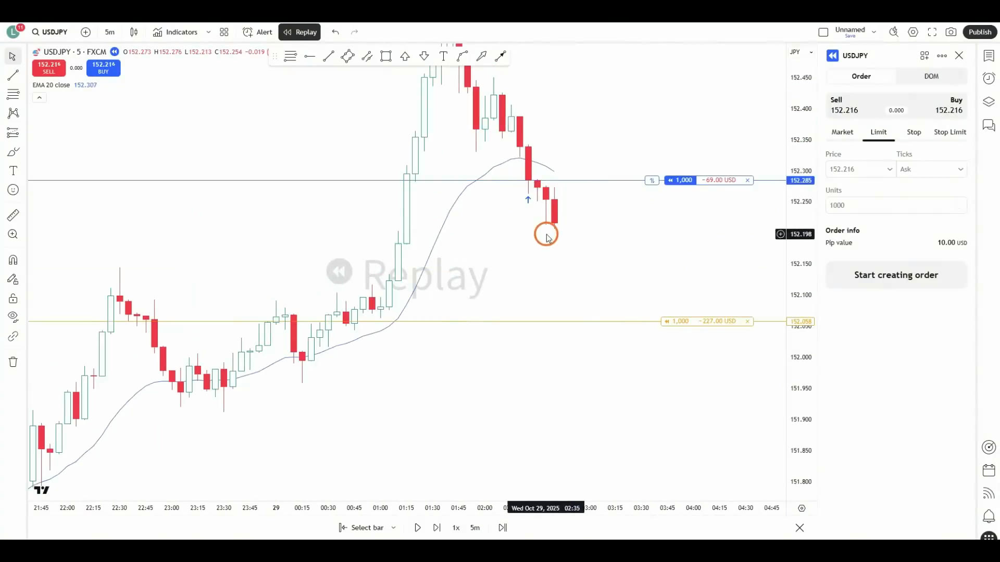
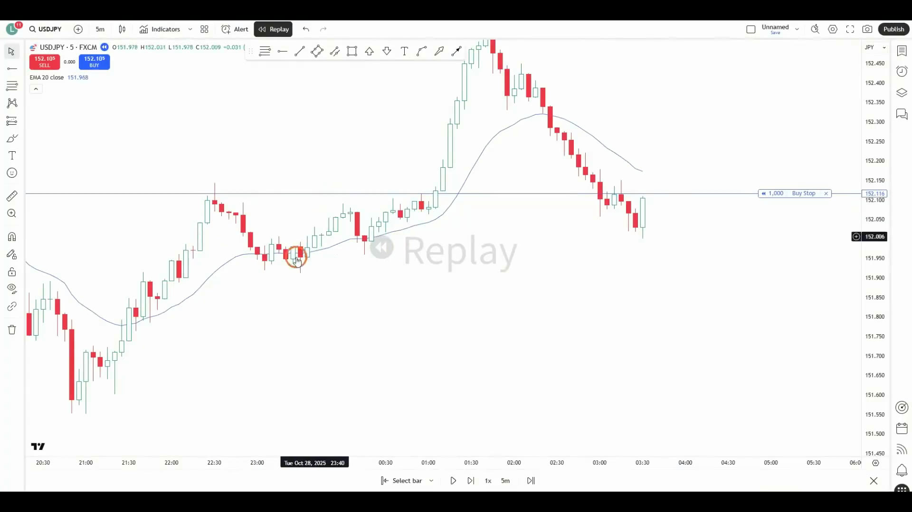
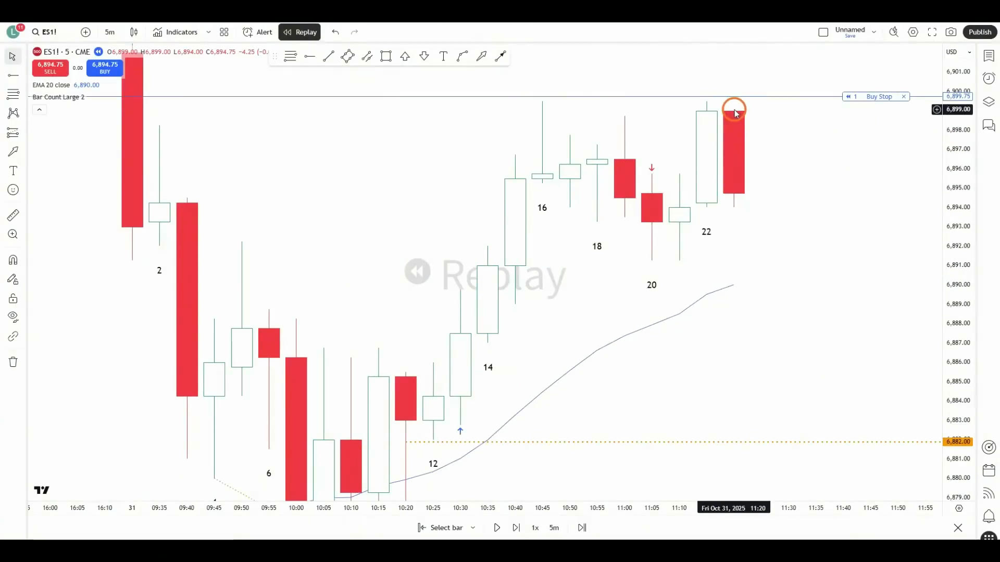
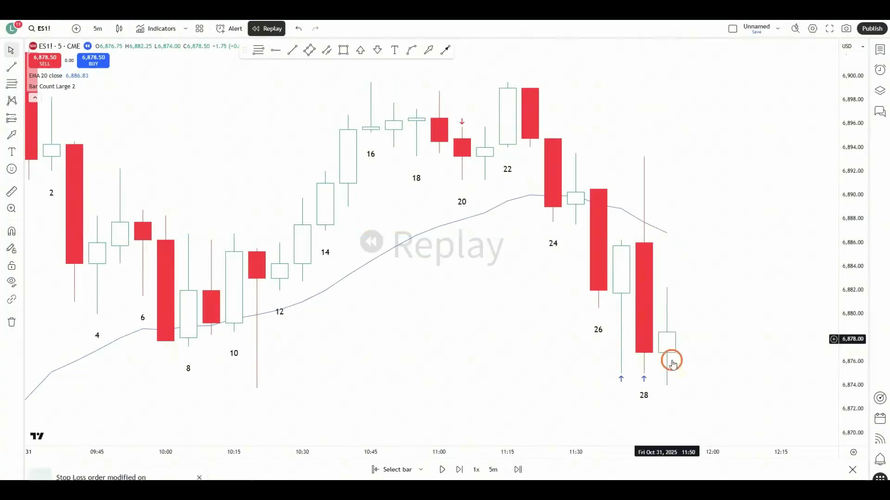
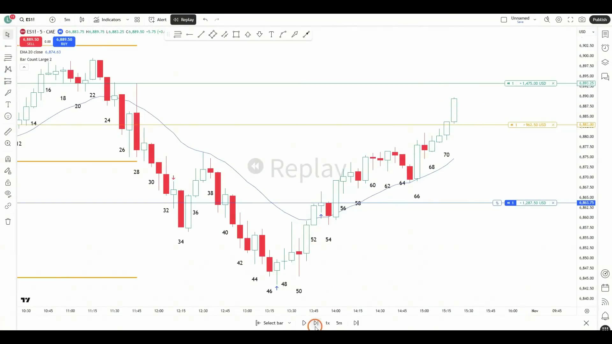

# 《【价格行为学】踏上交易之路(8): 杜绝大亏的入场规则》复盘笔记

视频链接：https://www.youtube.com/watch?v=nFKiwGHqpsA

频道：方方土PriceAction

发布时间：2025-11-12

视频时长：48:20

本地素材目录：`notes/assets/018-youtube-price-action-entry-rules-avoid-big-loss-review/`

## 核心结论

这期真正要解决的，不是“怎样让每一笔都赚钱”，而是：

**用固定规则切断 `随意入场 -> 不肯认错 -> 亏损加仓 / 连续报复性重进 -> 一次大亏吞掉前面利润` 这条链。**

规则不会让判断变成 100% 正确，但能把错误限制在单笔、可计算、可恢复的范围内。视频用两个逐根 K 线案例证明：

- 方向判断错了，不等于一定亏很多。
- 条件失效时主动退出，通常比等保护性止损被打更好。
- `stop order` 没有触发，本身就是一次成功的风险过滤。
- 合理亏损属于交易分布的一部分，不能因为一笔亏损立刻加仓或追单。
- 稳定盈利先依赖“不出现大伤”，再谈提高胜率和利润。

## 防止大亏的六条硬规则


### 规则一：强势信号 K + 突破单入场 + 保护性止损

做反转时，不因为“到了均线、50% 回调、整数位、指标超卖”就直接买入。至少要等：

1. 背景和位置支持反转。
2. 出现强势 `signal bar`。
3. 用 `buy stop / sell stop` 等待价格真正突破信号 K。
4. 成交后立即放好 `protective stop`。

突破单的价值不是保证成功，而是让市场先证明它愿意往你的方向走。没有触发，就没有交易，也没有亏损。

### 规则二：第二入场点入场，第二次反转时离场

在窄通道或强趋势里，第一次反转通常只是小回调，成功率偏低。

- 逆势入场优先等 `second entry`。
- 顺势持仓遇到第一次弱反转，不急着退出。
- 出现第二次反转，而且伴随合格反向信号 K，再考虑离场。

这条规则让入场和离场使用同一套逻辑，减少盘中临时改标准。

### 规则三：稳定盈利以前，不加仓

职业交易员可能在原交易前提仍成立时加仓，以提高总体胜率；新手常见的加仓恰好相反：

- 原前提已经失效。
- 不愿接受初始仓位的亏损。
- 想通过摊低成本把错误变成盈利。

禁止加仓以后，入场会自然变谨慎；出现亏损时，注意力也会从“怎样摊平”转向“怎样尽快、小亏退出”。

### 规则四：先算风险，再定仓位

仓位不是由信心决定，而是由止损距离和单笔允许亏损决定。

```text
仓位 = 单笔允许亏损金额 / 入场到止损的每单位风险
```

同一套 setup，如果止损变宽、事件风险变大，就必须缩仓。视频案例中，原本能做 5 手的交易，因为止损更远，只应做 2-3 手。

### 规则五：亏损以后，至少等待几根 K 再决定

止损后立刻重新入场，哪怕每次都设置止损，也可能在短时间内累积成一次大亏。

亏损后至少等待 2-3 根 K，并重新回答：

- 当前是趋势、通道还是震荡？
- 刚才的交易前提为什么失败？
- 新信号是独立 setup，还是只想把钱赚回来？

等待不是消极，而是把一次亏损和下一次决策隔离开。

### 规则六：避开重要事件

交易前先看经济日历。重大数据、利率决议等事件可能瞬间放大波动，普通交易者没有必要在这种环境里赌方向。

经济日历也无法覆盖突发新闻，所以事件发生后同样要先降仓位、等待结构重新形成，而不是追第一根异常大 K。

## 本期术语表

- `signal bar`：信号 K。用于触发入场的 K 线；反转交易尤其要求实体、收盘位置和背景足够强。
- `buy stop order`：突破某价格后触发的买入单。视频中主要挂在多头信号 K 高点上方 1 tick。
- `sell stop order`：跌破某价格后触发的卖出单。主要挂在空头信号 K 低点下方 1 tick。
- `protective stop`：保护性止损。防止意外和极端损失的最后防线，不代表必须被动等它触发。
- `second entry`：第二次入场。第一次反转失败后，再次出现的入场尝试，通常比强趋势中的第一次反转更可靠。
- `initial risk`：初始风险。入场价到初始保护性止损的距离。
- `actual risk`：实际风险。行情运行后，交易实际暴露过的风险，或按规则提前退出时真实亏掉的距离。
- `follow-through`：跟随。突破后是否继续同方向推进；没有跟随，突破质量要降级。
- `measured move`：测量目标。把区间或前一段行情高度向突破方向复制，估算合理目标位。
- `narrow channel`：窄通道。连续性强、回调浅；第一次逆势反转通常胜率低。

## 案例一：USDJPY 反转交易

### 1. 有背景，不等于可以直接入场

市场先有一段强上涨，随后回调到：

- 上涨段约 50% 回调。
- EMA20 附近。
- 更大周期的支撑区域。

这些理由能说明“这里可能有买盘”，但不能证明“现在就是新手的买点”。有经验的交易员可以限价买入并使用宽止损；新手如果还没有稳定判断力，就应等信号和触发。

### 2. 原前提失效，要在保护性止损前主动离场



假设已经在 50% 回调或 EMA20 附近买入，后面出现：

- 连续 4 根阴线收在 EMA20 下方。
- 新的大阴线几乎收在最低。
- 原本预期的“假跌破后恢复”没有发生。

此时 setup 已经失效。可以在大阴线收盘退出，或把 `sell stop` 放在它的低点下方；最终只是很小的亏损。

关键区别：

- `protective stop` 防意外。
- 条件失效处理正常失败。

如果已经知道前提不成立，还坚持等远处保护性止损被打，只是在扩大一个本可控制的错误。

### 3. 第一根阳线不够，等强势第二入场

连续约 10 根阴线后，第一根反转阳线：

- 实体不大。
- 有明显上影线。
- 没有收在最高。
- 属于强下跌后的第一次反转。

少数时候它会成功，但不是规则允许的新手 setup。

后面价格创新低后，出现大实体阳线，向上吞噬前面两根阴线；同时位于前期震荡区间支撑、更大周期 50% 回调和 EMA20 附近。这才是更合格的第二次做多尝试。



执行顺序：

1. 在大阳线高点上方 1 tick 挂 `buy stop`。
2. 触发后立即把止损放在信号 K 低点下方。
3. 因为仍是逆原下降趋势的反转，初始目标至少看 `2R`。

### 4. 胜率和盈亏比是一组交换

视频比较了两个入场位置：

- 较早的反转入场：胜率约 40%，但止损近、剩余空间大，所以追求 `2R`。
- 强突破后的较晚入场：胜率提高到约 60%，但止损更远、剩余空间更小，`1R` 左右也可能合理。

不能只比较谁入得更低。一个偏 `reward/risk`，一个偏 `probability`，两者都可能有正期望。

### 5. “40/60”不等于 60% 全部止损

视频对交易分布的解释是：

- 约 40% 的交易有机会拿到 `2R`。
- 其余约 60% 可能是小赚、小亏、打平，合计接近互相抵消。

所以系统不需要每笔都到 `2R`。真正破坏系统的，是把 60% 里的正常小亏拖成大亏。

## 案例二：ES 早盘判断错误，仍靠规则保持总体盈利

案例日期是 2025-10-31。作者最初判断当天波动范围还会扩大，并偏向向上突破；最终市场却向下突破。重点不是猜对方向，而是错误判断如何被规则限制。

### 1. 早盘前 6 根 K 先不做

ES 跳空高开，第一根 K 是收在低位的阴线，理论上可以下破做空。但规则要求早盘至少前 6 根 K，通常前 6-12 根 K，除非机会特别清楚，否则不做。

后面下跌没有连续跟随，市场逐渐显示出宽通道 / 震荡特征。等待让交易者没有被开盘第一印象绑住。

### 2. 突破单没有触发，就是成功过滤

10 号 K 在 EMA20 附近形成较好的多头反转信号。作者在其高点上方挂 `buy stop`，但下一根 K 没有触发，反而创新低。

如果直接在 10 的收盘市价买入，会很快被止损；突破单让这笔交易根本没有发生。后面 3 推楔形更清楚，订单可以保留在 10 高点上方，或移动到 11 高点上方，最终在 13 触发。

### 3. 第一次反转不走，第二次反转退出

入场后出现连续 5 根阳线上涨。16 号 K 虽然有长上影线，但不是强空头信号，而且只是第一次反转，因此继续持有。

19 号 K 不同：

- 前一次反转已经触发。
- 形成小双顶。
- 阴线实体更大。
- 属于第二次反转下跌。

因此把止损抬到 19 低点下方，下一根 K 跌破时离场，拿到小利润。

### 4. 提前离场后要能重进，但仍只用突破触发

退出不代表上涨趋势已经死亡。22 号 K 是强势大阳线、收在最高，说明上涨仍可能继续，因此在它的高点上方挂 `buy stop` 准备重进。



下一根 K 开盘后直接下跌，连向上 1 tick 都没有，买单没有成交，因此避开了大阴线套牢。

这段把突破单的产品价值讲得很清楚：它不提高你的预测能力，而是让“没有得到市场确认的想法”不进入账户。

### 5. 一笔计划内止损，不应触发报复性交易

突发新闻造成异常大阳线。按当时背景，在 26 上方做多并非完全不合理，但入场后立刻遇到大阴线，保护性止损被触发。



这笔属于 60% 分布里的正常亏损：

- 入场有规则。
- 止损提前放好。
- 没有加仓。
- 亏损金额通过仓位控制。

错误做法是在 28 附近立刻反手追空。此时既有突发事件，又刚刚亏损，且止损距离较远。更好的处理是等待至少 2-3 根 K。

### 6. 等待后，新的空头 setup 才独立成立

到 32 号 K 时，市场已经连续出现 3 根阴线，形成比前面更强的下降窄通道；区间也明确向下突破。

此时可以：

1. 在 32 低点下方挂 `sell stop`。
2. 止损放在这段下跌起点、30 高点上方。
3. 目标看区间的 `measured move`。
4. 目标约 `1.5R`，但胜率高于 50%，数学上仍合理。

35 号大阳线只是窄通道的第一次反转，空头不必急着退出。若选择打平离场，后面下跌恢复时必须能够在 38 下方重新入场。

### 7. 最后一笔反转多单：按强突破逐步抬止损

下跌达到 `measured move` 后，没有立刻在第一根小阳线抄底，而是等更好的 51 / 52 号信号。53 突破触发多单后：

- 初始止损放在 51 低点下方。
- 每次出现强势突破创新高，再把止损抬到最近可靠起涨点下方。
- 62 只是略创新高、跟随差，不算强突破，不应机械抬止损。
- 68-70 连续 3 根阳线创新高后，再明显保护利润。
- 接近震荡区间顶部又出现大阳线，视为可能的 `buy climax`，进一步收紧止损。



最终价格在约 72 号 K 达到 `2R`。72 以后进入尾盘最后 6 根 K，按规则不再寻找新交易。

## 初始风险与实际风险

视频反复区分：

- `initial risk` 决定最坏情况下的初始仓位。
- `actual risk` 反映交易真实承受过的风险，以及策略长期数学期望。

一笔交易初始止损很远，但成交后立即向有利方向走，实际风险可能很小。此时 `2 x actual risk` 也可以成为合理的管理目标。

但不能倒过来用：不能因为“我通常会提前走”，就忽略初始止损和尾部风险。正确顺序仍然是：

1. 先按初始止损计算仓位。
2. 持仓中按条件失效、实际风险和强突破管理。
3. 复盘时同时统计初始风险和实际风险。

## 新手最容易踩的坑

### 1. 把连续止损误认为“严格止损”

刚止损就急着重新进场，短时间连续亏损，本质上仍然是一次没有被切断的大亏。

### 2. 把支撑理由当成入场触发

EMA20、50% 回调、整数位、超卖和背离都只是背景。没有强势信号 K 和突破触发，新手不应直接反转入场。

### 3. 把保护性止损当成唯一出口

保护性止损是最后防线。入场条件已经失效时，主动退出通常能显著降低实际亏损。

### 4. 直接买信号 K 收盘，不等突破

信号 K 看起来再好，如果下一根连 1 tick 都没有向上，就说明市场没有确认。突破单能过滤这类交易。

### 5. 提前退出后不愿再次入场

为了保护利润提前退出没有问题，但如果趋势恢复，必须按新信号重新入场。做不到重进，就不要把止损抬得过紧。

### 6. 因为一次合理亏损否定规则

规则允许正常止损。长期优势来自交易分布，不是来自单笔结果；不能用一笔亏损证明 setup 无效，也不能用一次扛单回本证明加仓正确。

## 盘中执行清单

### 开盘前

- [ ] 查看经济日历，标记重大数据和利率事件
- [ ] 定好单笔最大亏损和当天最大亏损
- [ ] 明确稳定盈利以前不对亏损仓位加仓
- [ ] 对 ES 等早盘品种，明确前 6-12 根 K 的等待规则

### 入场前

- [ ] 当前是趋势、窄通道、宽通道还是震荡？
- [ ] 我是在做顺势，还是逆势反转？
- [ ] 如果是强趋势反转，是否等到第二次入场？
- [ ] 信号 K 是否足够强，位置是否合理？
- [ ] 能否用突破单让市场先确认？
- [ ] 初始止损和第一目标在哪里？
- [ ] 按止损距离反推后，仓位是否仍可接受？

### 持仓中

- [ ] 原入场前提是否仍成立？
- [ ] 条件已失效时，是否能在保护性止损前主动退出？
- [ ] 第一次反转是否真的足够强，还是应该等第二次？
- [ ] 强突破创新高 / 新低后，是否可以移动止损？
- [ ] 提前退出后，是否写清楚重新入场的触发条件？

### 亏损后

- [ ] 至少等待 2-3 根 K
- [ ] 重新判断市场周期，不沿用上一笔的方向偏见
- [ ] 新交易是否独立成立，而不是为了回本？
- [ ] 是否因止损更远或事件风险而缩小仓位？

### 复盘时

- [ ] 这笔属于 `2R` 盈利、小赚、小亏、打平还是正常止损？
- [ ] 记录初始风险和实际风险
- [ ] 检查是否出现加仓、报复性重进或临时改规则
- [ ] 评价过程，不用单笔结果倒推决策质量

## 一句话版本

**只用强势信号和突破单入场，成交即放保护性止损；强趋势等第二次反转，不加仓，按风险缩仓，亏损后等几根 K，重大事件不硬做。**

本笔记依据完整音轨转写与视频画面逐段复核整理；自动转写中的交易术语已按仓库现有词汇统一校正。
