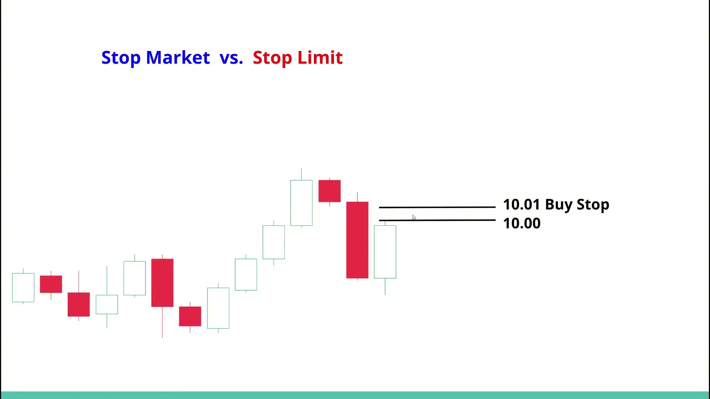
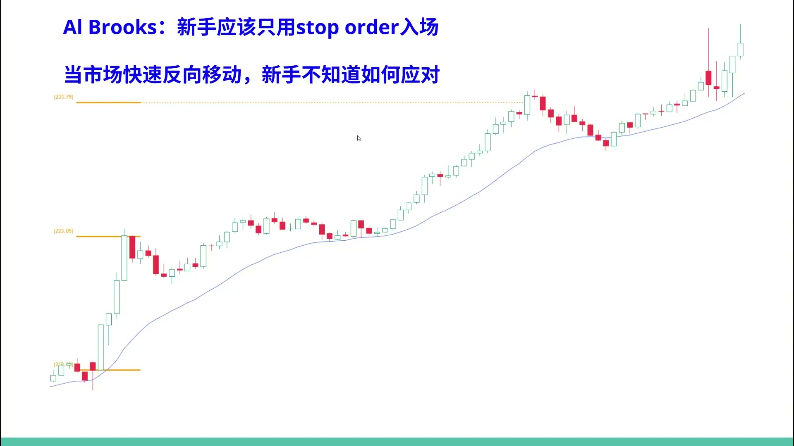
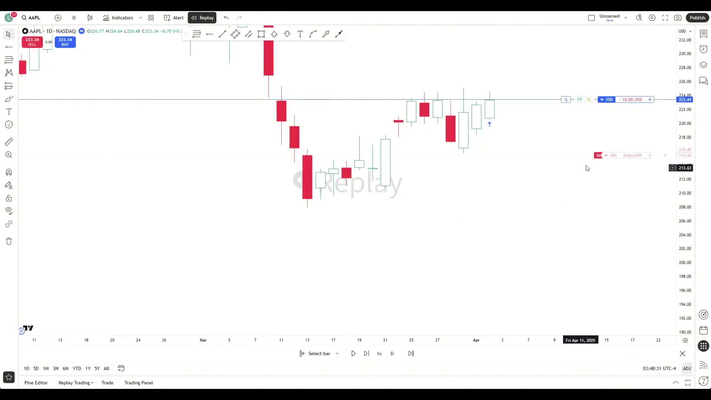
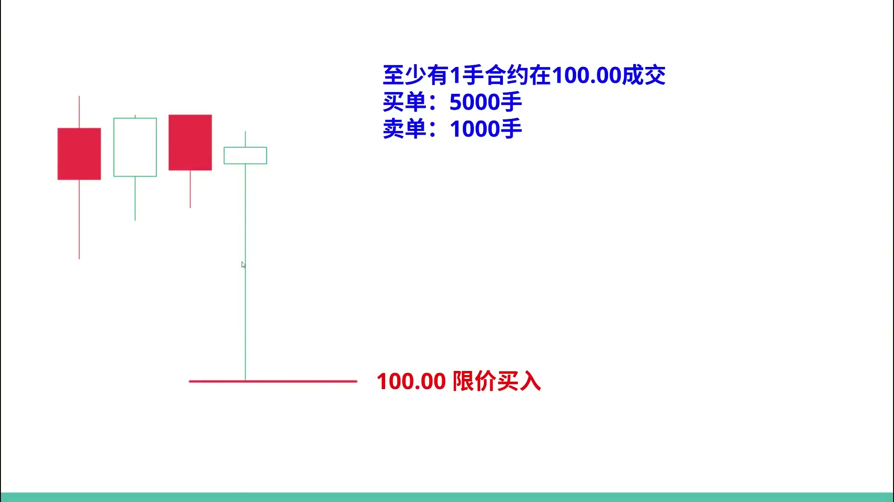
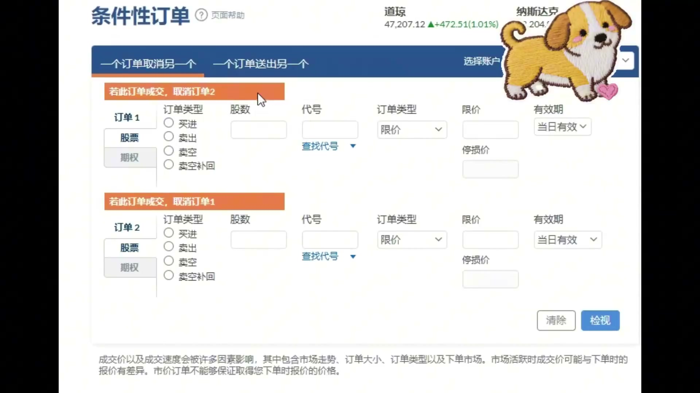
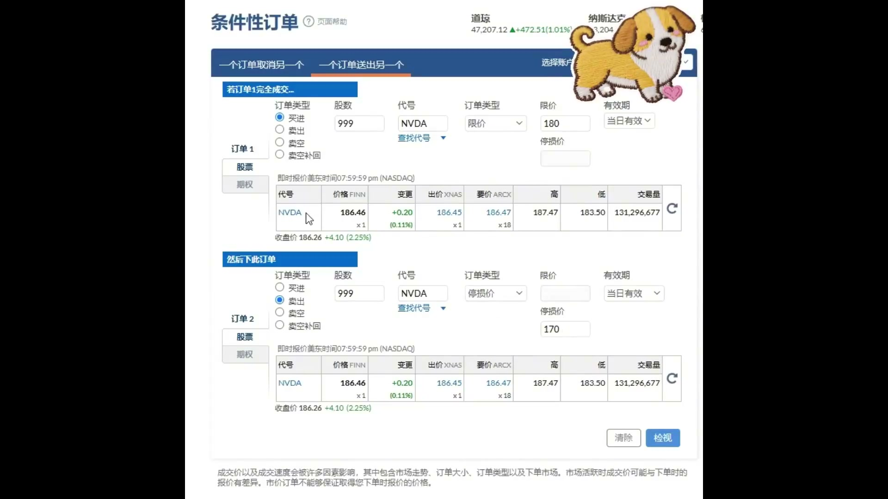

# 《【价格行为学】踏上交易之路(7): 各类订单及其用法》复盘笔记

视频链接：https://www.youtube.com/watch?v=BjN19kS-8ec&list=PLrCXUGuTXtGKrbsxteAGwDwVht1tghRe2&index=3

频道：方方土PriceAction

视频时长：43:24

本地素材目录：`notes/assets/019-youtube-price-action-order-types-review/`

## 核心结论

这期不是教人靠订单类型预测行情，而是把**进场确认、可接受的成交价格、保护性退出、以及预先定义的持仓管理**拆开。

对刚开始执行 Price Action 规则的人，最有价值的默认顺序是：

1. 有 setup 后，优先用 `stop order` 等市场沿计划方向突破再进场。
2. 成交后，马上把 `protective stop` 放在结构真正失效的位置；保护性退出优先考虑“能离场”，不能把 `stop limit` 当作无代价的止损替代品。
3. `limit order` 和 `market order` 不是不能用，但它们分别意味着逆着当前短线动量成交、或立刻接受当前价格，必须有更明确的使用条件。
4. `OCO`、`OTO` 只负责执行已经定义好的 stop / target，不能替代入场逻辑、仓位控制或期望值判断。

订单的功能，是把“我认为这里可能会涨/跌”变成可验证、可取消、可止损的执行条件；它不保证预测正确，也不保证极端行情会按理想价格成交。

## 订单类型总览

| 类型 | 触发后发生什么 | 视频中的主要用途 | 主要代价 / 风险 |
| --- | --- | --- | --- |
| `market order` | 立即以当时可得价格成交 | 连续强趋势中，按既定规则在收盘追随 | 点差、滑点；没有等待确认的过滤 |
| `stop market` / 普通 `stop order` | 到达触发价后转为市价单 | 突破入场；保护性止损 | 波动或跳空时成交价可能劣于触发价 |
| `stop limit` | 到达触发价后挂出限价单 | 入场时限制最差可接受价格 | 价格越过限价后可能完全不成交 |
| `limit order` | 只在指定价或更优价格成交 | 区间边缘、回调、计划内反转 | 是逆着当下短线动量成交；碰到价格也未必排到成交 |
| `OCO` / `bracket order` | 两个订单中一个成交，另一个自动撤销 | 一笔持仓同时挂 stop 与 target | 只在原始计划合理时降低情绪化干预 |
| `OTO` / `OTOCO` | 主订单成交后，才自动提交后续订单 | 入场成交后自动补 stop，或补成 stop + target 组合 | 各券商支持与语义不同，须先做模拟核验 |

## 一、`stop order`：让市场先给出突破确认



视频用 `10.00` 的信号 K 高点说明：多头 setup 不是在收盘直接买入，而是在高点上方一档，例如 `10.01 Buy Stop`，只有下一根 K 真正上破才成交。空头则对称地在信号 K 低点下方挂 `sell stop`。

这带来两个实际约束：

- 成交瞬间，价格正在向交易方向移动；这只是突破确认，不是胜率保证。
- 如果价格始终没有触发订单，这个想法没有进入账户。这不是“错过”，而是过滤了没有 `follow-through` 的 setup。
- 触发后立刻放 `protective stop`。止损应在交易逻辑被否定的位置外，而不是只为了缩小账面风险随意挪近。

视频的新人建议很明确：在尚未稳定盈利前，默认只用 `stop order` 做入场。其目的不是禁止所有限价和市价单，而是避免在价格快速反向时，因没有既定处理而摊低、加仓或把小亏拖成大亏。



### 不能由突破单推导出的结论

`stop order` 不是“正确订单”。如果所有多头 `buy stop` 都一定正确，那么相同价位的空头 `sell stop` 也会同时变成必亏交易，这显然不成立。它只把进场条件从主观判断改成了可观察的价格确认。

## 二、`Stop Market` 和 `Stop Limit`：保护性退出优先考虑能否离场

`stop market` 触发后以市价成交，因此会受到流动性、点差和跳空影响。平静且流动性充足的市场里，偏离通常有限；快速行情或隔夜跳空时，实际成交价可能显著差于止损触发价。

`stop limit` 多了一层价格边界。例如 `Buy Stop Limit` 在触发后只允许成交在设定的最高价以内；上涨过快直接越过该上限，订单会留在市场中，交易者可能因此错过整段行情。



两者并非谁“更安全”，而是交换了两类风险：

- **入场**：如果价格冲得太快，宁愿放弃追价时，`stop limit` 可以限制最差进场价，但要接受不成交。
- **保护性退出**：若把 `stop limit` 用作止损，跳空越过限价后，仓位可能仍然留在场内继续承受风险。这里通常应优先考虑 `stop market` 的成交确定性，并把仓位设计为能承受滑点和尾部风险。

视频还提到期权保护可应对长期持仓的极端跳空，但它是另一种付费的尾部风险工具，成本会受隐含波动率和事件前后波动收缩影响；不能把它误解为普通止损的替代品。

## 三、`limit order` 与 `market order`：不是价格碰到就一定成交

`limit order` 的典型逻辑是低买高卖：在 `trading range` 下沿买、上沿卖，或在计划内回调位置等待更好价格。此时你在成交瞬间通常是逆着当前很短线的价格方向操作，所以必须先有区间位置、失败突破或反转证据，不能只因为“已经涨/跌很多”就挂单。

触及限价不等于一定成交。价格在某价位发生过一笔交易，只能证明有人在该价成交；若你的订单排在大量同价委托之后，卖方数量不足时仍会轮不到你。视频把这种“碰到价格却未成交，随后立刻反向”的情况称为 `tick trap`。



`market order` 则接受立即成交。视频给出的例外是：已有规则的强趋势，例如连续 3-5 根实体强、收盘接近极值的同向 K，且波段目标足以覆盖一两个 tick 的点差和滑点。这时为了省一个 tick 去排队，反而可能错过趋势；但它仍应是明确定义的趋势追随规则，而不是怕错过时的临时追单。

## 四、`OCO`、`OTO`：让计划自动执行，不让情绪接管

### `OCO` / `bracket order`

`OCO`（One Cancels the Other）将两张订单绑定：一张成交，另一张自动撤销。视频的波段多头示例是：

1. `Buy Stop` 突破入场成交。
2. 在前低或旗形起点下方放 `Sell Stop` 作为失效退出。
3. 在预先计算的 `2R` 等目标位放 `Sell Limit`。
4. 止损或目标任一成交，系统撤销另一张订单。



视频把设完 stop 与 target 后不再盘中乱改，称为 `Walmart trade`：离开屏幕，稍后再看结果。这个做法的前提不是“永远不管理仓位”，而是入场、失效点、目标、胜率和 `reward/risk` 已在下单前形成了正期望的计划。若结构已被证伪，或原计划本就不完整，自动订单不能替你修复错误。

### `OTO` 与 `OTOCO`

`OTO`（One Triggers the Other）是主订单先成交，券商再自动提交第二张订单。视频举例：限价买入 NVDA 成交后，系统自动挂出预先设置的止损。将 `OTO` 与 `OCO` 组合成 `OTOCO`，就能在开仓成交后自动生成一组互斥的止损与止盈订单。



视频将这类联动更多放在极短线 `scalper` 场景；对有足够时间设置订单的波段交易者，先确认平台行为后手动提交也可以。关键不是功能有多复杂，而是任何时刻都清楚：持仓后的失效点在哪里、目标在哪里、哪些订单会自动撤销。

## 盘中可执行的订单选择卡

```text
先确认 setup 与位置，不让订单类型代替交易逻辑。

需要市场确认才进场：
  -> 在信号 K 外一档使用 stop order。

区间边缘 / 回调位置，且已接受逆短线动量：
  -> 才考虑 limit order；预期触价未必成交。

连续强趋势，已有“收盘追随”的规则：
  -> 才考虑 market order；接受点差与滑点。

保护性退出：
  -> 默认优先 stop market 的离场确定性；
     不把 stop limit 当作同义词。

已经定义 stop 与 target：
  -> 用 OCO 绑定，并在下单前确认触发、撤单与有效期规则。
```

## 常见错误与替代动作

| 错误 | 为什么危险 | 替代动作 |
| --- | --- | --- |
| 信号 K 收盘立刻追入 | 尚未确认是否有突破跟随 | 在高/低点外一档等待 `stop order` 触发 |
| 为了避免滑点，把保护性止损改为 `stop limit` | 跳空时可能根本无法离场 | 接受 `stop market` 的价格不确定性，并缩小仓位覆盖尾部风险 |
| 把“触价”记成“已成交” | 同价位有排队优先级 | 以实际成交回报为准，不因未成交而情绪化追价 |
| 进场后边看边改 target / stop | 交易计划被即时情绪取代 | 下单前定义失效点与目标；条件满足时用 `OCO` 执行 |
| 用订单自动化代替风险判断 | 自动化会准确执行错误计划 | 先验证 setup、仓位和期望值，再使用联动订单 |

## 使用边界

- 本文总结的是视频作者的 Price Action 执行框架，不构成投资建议。
- 订单名称、触发价判定、盘前盘后可用性、部分成交和自动撤单规则会因 broker、交易所、品种而不同。实盘前应在自己平台的模拟环境中核对。
- 视频原页面的 transcript 面板未能加载；正文依据同标题、明确标注原 YouTube 链接且时长一致的镜像进行完整本地时间戳转写，并以原视频页面的标题、频道和时长交叉核验。转写时间点允许有数秒误差。

## 来源

- 原视频：[YouTube - 【价格行为学】踏上交易之路(7): 各类订单及其用法](https://www.youtube.com/watch?v=BjN19kS-8ec&list=PLrCXUGuTXtGKrbsxteAGwDwVht1tghRe2&index=3)
- 内容核验与转写镜像：[Bilibili - 方方土PriceAction【价格行为学】踏上交易之路(7): 各类订单及其用法](https://www.bilibili.com/video/BV1Ti13BtEyL/)
