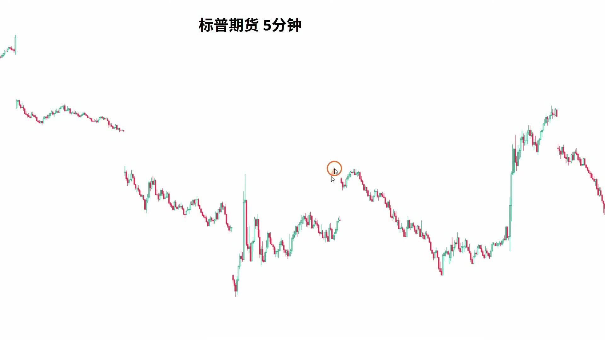

# Price Action 入场手册

这份手册不是按视频顺序复述，而是把现有笔记里反复出现的入场逻辑，整理成一套后续可以直接对照的执行框架。

使用方式：
- 先看每个场景下的“可以做 / 不该做 / 实战规则”
- 如果想回看原案例，直接看每段后面的 `来源笔记`
- 如果忘了术语含义，先跳到后面的 `专业名词注释`

## 核心结论

**什么时候可以做多做空，不是先看一根 K 线，而是先看 4 件事：**

1. 当前 market condition 是 `trend` 还是 `trading range`
2. 我现在所处的位置，是区间上沿、区间下沿，还是中间烂位置
3. 眼前这个动作是 `continuation`、`climax`，还是 `failed breakout`
4. 入场以后，我是按 `swing` 拿，还是按 `scalp` 处理

如果这 4 件事没先分清，单根漂亮 K 线本身不构成高质量入场理由。

## 专业名词注释

- `trading range`：震荡区间。不是顺畅单边，而是上去容易被卖、下来容易被买，位置通常比方向更重要。
- `bull trend`：上涨趋势。低点和高点整体往上抬，多头更容易拿到 `follow-through`。
- `bear trend`：下跌趋势。高点和低点整体往下压，空头更容易拿到延续。
- `Always In Long`：盘面已经明显偏多，默认优先找做多，而不是优先猜顶做空。
- `Always In Short`：盘面已经明显偏空，默认优先找做空，而不是优先猜底做多。
- `signal bar`：信号 K。不是随便一根阳线或阴线，而是能给出明确入场理由的触发 K。
- `follow-through`：跟随。突破以后有没有继续走出后手延续；没有跟随，突破质量通常要打折。
- `breakout`：突破。价格脱离原结构往外走，关键不是破没破，而是破完能不能持续。
- `failed breakout`：突破失败。刚突破就走不动，甚至很快反向，常常会把追突破的人套住。
- `inside bar`：内包 K。当前这根 K 完全收在前一根 K 的范围内，常代表动能收缩、市场开始犹豫。
- `overlap`：重叠。连续 K 线彼此互相包进来，说明趋势不流畅，市场更可能向 `trading range` 演变。
- `buy climax`：买入高潮。涨了很久以后又来一根特别大的 bull bar，更像最后一脚加速，不一定是最佳追多点。
- `sell climax`：抛售高潮。跌了很久以后又来一根特别大的 bear bar，更像最后一脚砸盘，不一定是最佳追空点。
- `measuring gap`：测量型缺口。更偏趋势中继，后面常常还有一段。
- `exhaustion gap`：衰竭型缺口。更偏趋势尾声，后面更容易回补。
- `gap fill`：补缺口。价格回到跳空前后的空白区域，把缺口补掉。
- `double top`：双顶。两次冲到差不多的位置都没过去，常是区间上沿或上涨衰竭信号。
- `double bottom`：双底。两次跌到差不多的位置都没跌穿，常是区间下沿或下跌衰竭信号。
- `third push`：第三推。趋势里已经连续推了几段，第三段往往更要警惕高潮或失败。
- `TBTL`：`Ten Bars Two Legs`，两段十 K。趋势到目标位或可能反转后，回调常常至少有两段、持续大约十根 K。
- `second entry`：第二次入场。强趋势后的第一次反转常失败，第二次尝试才更值得关注。
- `LLMTR`：`Lower Low Major Trend Reversal`。强下降趋势后，先突破趋势线，再回测前低附近，形成更有意义的大反转尝试。
- `higher low`：更高低点。回调低点抬高，偏多信号。
- `lower high`：更低高点。反弹高点压低，偏空信号。
- `scalp`：短线快进快出。目标近、持仓短、对节奏要求高。
- `swing`：波段持仓。目标更远，容忍更大回撤，但必须有更完整的背景支持。
- `initial stop`：初始止损。入场前就该想清楚的失效点，不是被吓到时才随手砍。
- `target`：目标位。这笔单合理先看到哪里，决定你是快出还是可以继续拿。
- `mean reversion`：均值回归。价格偏离均线后可能回归，但不等于马上反转；横盘也可以让均线追上价格。
- `spike and channel`：先快速突破，再进入通道推进。反转判断不能只看“推了几段”，还要看通道强弱和原趋势是否失败。
- `MTR`：`Major Trend Reversal`，大趋势反转。重点是先有强反向力量，再看原趋势恢复到前高/前低附近是否失败。
- `money stop`：固定金额或固定距离止损。适合给宽通道、震荡区间里的正常假突破留空间，但仓位必须跟着缩。
- `price action stop`：按价格行为放止损，比如放在 `measured move` 外、前高前低外、通道边界外。
- `actual risk`：实际风险。不是初始止损距离，而是根据真实出场行为统计出来的常见亏损幅度。
- `breakeven stop`：打平止损。浮盈后把止损移到入场价附近，适合某些管理场景，但不是所有交易的默认最佳解。
- `trailing stop`：追踪止损。随着价格向有利方向走，逐步移动止损，用来控制利润回撤。
- `limit order market`：限价单市场。震荡区间里常见，向上突破容易被卖，向下突破容易被买。
- `breakout order market`：突破单市场。趋势里常见，突破前高/前低后更容易继续跟随。
- `protective stop`：保护性止损单。可以限制正常行情里的亏损，但遇到跳空或无流动性，不保证按止损价成交。
- `position sizing`：仓位管理。根据账户风险、止损距离和交易系统稳定性决定做多少股或几手。
- `i don't care size`：亏了也不太在乎的仓位。它的目的不是让利润变小，而是让你能客观看盘。
- `broad channel`：宽通道。方向上有趋势，但上下摆动很大，本质更接近倾斜的震荡区间。
- `acceleration breakout`：加速突破。价格尝试脱离原通道，往趋势方向快速冲出去。
- `bull trap`：多头陷阱。向上突破吸引多头追入，但很快失败反转。
- `sell climax`：抛售高潮。长期下跌后出现特别大的阴线，常提示空头开始止盈。
- `narrow range day`：窄震荡日。全天波动很小，突破跟随差，更适合小目标 scalp 或干脆少做。
- `average bar size`：平均 K 线高度。scalp 的目标常参考当前平均 K 的大小，而不是固定死点数。
- `zero-day option`：当天到期期权。适合极短线表达，但时间损耗快，不能拿成 swing。

## 术语 -> 交易后果速查

| 术语 | 看到它先想到什么 | 常见交易后果 |
| --- | --- | --- |
| `trading range` | 先看位置，不先看方向 | 下沿偏多、上沿偏空、中间少动，突破更容易失败 |
| `Always In Long` | 默认优先找多，不急着猜顶 | 可以接受没那么完美的位置，但要等像样 trigger |
| `Always In Short` | 默认优先找空，不急着猜底 | 逆势做多要更谨慎，通常只配短打 |
| `signal bar` | 终于有 trigger 了 | 可以准备入场，但仍要结合背景和位置 |
| `follow-through` | 突破质量有没有被确认 | 有跟随才更像 continuation；没跟随就要警惕失败 |
| `failed breakout` | 追突破的人可能要被套 | 可以考虑反手，或至少不要再追原方向 |
| `inside bar` | 动能在收缩，市场开始犹豫 | 趋势预期下调，更容易进入整理或等下一次明确突破 |
| `overlap` | K 线开始互相重叠 | 盘面更像往 `trading range` 演变，不适合再按流畅趋势预期去拿 |
| `buy climax` | 这可能不是最佳追多点，而是最后一脚 | 优先警惕高位衰竭、回调、甚至区间化 |
| `sell climax` | 这可能不是最佳追空点，而是最后一脚 | 优先警惕空头尾声、反弹、甚至反转条件 |
| `measuring gap` | 趋势也许还没完 | 更适合按 continuation 逻辑拿更远目标 |
| `exhaustion gap` | 这段突破可能快走不动了 | 更容易先补 gap，趋势预期要下调 |
| `gap fill` | 缺口区域是很现实的目标位 | 区间行情里常适合当 first target |
| `double top` | 上面卖压明显，突破不顺 | 更偏做空或至少不追多 |
| `double bottom` | 下面买盘明显，跌破不顺 | 更偏做多或至少不追空 |
| `third push` | 趋势已经不新鲜了 | 越到第三推，越要防 `climax` 或失败 |
| `TBTL` | 回调可能还没走完 | 第一段反向不要急着判断结束，至少准备两段结构 |
| `second entry` | 第一次失败后，第二次更有交易价值 | 强趋势后做反转，通常等第二次信号更稳 |
| `LLMTR` | 强下降趋势后的大反转雏形 | 先等破趋势线，再看回测前低后的反转质量 |
| `higher low` | 多头回调质量还不错 | 是继续偏多的重要证据 |
| `lower high` | 空头压制还在 | 是继续偏空的重要证据 |
| `scalp` | 这笔单不是拿大段的 | 仓位、目标、出场都要更快 |
| `swing` | 这是要拿结构的 | 需要更完整背景，也要容忍更大回撤 |
| `initial stop` | 错了到底在哪里认错 | 入场前不想清楚，就容易盘中乱砍 |
| `target` | 对了先看到哪里 | 决定你该快走、减仓，还是继续拿 |
| `mean reversion` | 价格可能回到均线附近 | 不等于立刻反转，也可能横盘等均线追上 |
| `spike and channel` | 趋势从爆发进入通道推进 | 不急着反转，先看通道强弱和原趋势失败证据 |
| `MTR` | 大趋势反转的失败链条 | 先等强反向力量，再等原趋势恢复失败 |
| `money stop` | 给噪音留固定空间 | 止损变宽时必须缩仓 |
| `price action stop` | 按结构而不是固定点数止损 | 适合放在真正失效点外，而不是刚好前高前低外 1 tick |
| `actual risk` | 真实经常亏掉多少 | 用来复盘策略数学，不要只看初始止损 |
| `breakeven stop` | 心理上锁定不亏 | 对 `swing` 未必第一次回测就该走，对 `scalp` 则不能回吐太多 |
| `trailing stop` | 控制利润回撤 | 浮盈也当真实资金管理 |
| `limit order market` | 区间里突破容易失败 | 上沿偏卖、下沿偏买，不适合追突破 |
| `breakout order market` | 趋势里突破容易延续 | 可以用突破触发，但仍要看 `follow-through` |
| `protective stop` | 正常行情里的风险保护 | 遇到跳空可能失效，隔夜/事件风险不能只靠它 |
| `position sizing` | 这笔单到底能做多大 | 先定止损距离，再反推仓位 |
| `i don't care size` | 仓位是否会干扰判断 | 如果亏损金额会让你乱砍，仓位就太大 |
| `broad channel` | 趋势不顺滑，像倾斜区间 | 通道边缘和突破失败更重要，不要盲目追突破 |
| `acceleration breakout` | 价格想冲出原通道 | 宽通道末端要警惕 5 根 K 内失败 |
| `bull trap` | 追多的人可能被套 | 失败后可寻找反手空或至少不再追多 |
| `sell climax` | 空头可能正在最后一脚砸盘 | 空单要考虑分批止盈，不适合继续追空 |
| `narrow range day` | 今天可能没有大波段 | 不要硬做 swing，优先小目标或等待 |
| `average bar size` | 现在一根 K 大概能走多远 | scalp 目标跟着当前波动调，不要死拿 |
| `zero-day option` | 极短线工具，损耗很快 | 可以做几分钟 scalp，不适合拖成波段 |

## 一套统一的入场判断顺序

以后每次看盘，先按这个顺序问：

1. 这是 `bull trend`、`bear trend`，还是 `trading range`？
2. 现在位置在哪里？
3. 这根大阳线 / 大阴线是趋势延续，还是更像 `buy climax / sell climax`？
4. 有没有像样的 trigger，比如：
   - `signal bar`
   - `double top / double bottom`
   - `failed breakout`
   - `inside bar` 之后的失效或延续
5. 突破后有没有 `follow-through`？
6. 这笔单更适合做 `swing` 还是只配做 `scalp`？
7. 入场前有没有先定 `target` 和 `initial stop`？
8. 根据 `initial stop` 的距离，这笔仓位是否仍然是 `i don't care size`？

## 场景 1：`trading range` 里什么时候做多

### 可以做多的情况

- 价格在区间下沿，或者至少在区间下方三分之一附近
- 下跌后出现 `sell climax`，说明空头可能接近尾声
- 向下跌破没有像样 `follow-through`
- 出现 `failed breakout`、`higher low`、`bullish signal bar` 等反转触发

### 典型例子

- [005-youtube-price-action-stoploss-review.md](/Users/lincheng/WorkSpace/price-action/notes/005-youtube-price-action-stoploss-review.md)：区间下沿更偏买入区，不是多单最差离场区
- [008-youtube-price-action-spy-intraday-review.md](/Users/lincheng/WorkSpace/price-action/notes/008-youtube-price-action-spy-intraday-review.md)：向下 break 没有跟随时，可以反手抢极短多单
- [009-youtube-price-action-profit-drawdown-hold-review.md](/Users/lincheng/WorkSpace/price-action/notes/009-youtube-price-action-profit-drawdown-hold-review.md)：日线在区间下半部时，做多不是追涨，而是在低位拿反弹或趋势日机会

### 不该做多的情况

- 区间正中间，没有位置优势
- 只是因为跌很多了就想抄底，但还没看到空头失望
- 你明明做的是区间反弹，却想按趋势单去死拿

### 实战规则

- 在 `trading range` 里，做多优先看位置，再看 trigger
- 下沿附近做多，赢面来自“空头难顺畅延续”，不是来自“市场一定反转”
- 如果只是 `failed breakout scalp`，就不要幻想它会自动升级成全天大多头
- 区间下沿的大阴线不一定是追空理由；在 `limit order market` 里，它反而可能是限价买入区域
- 如果区间很宽、假突破很多，止损可以比前低外 1 tick 更宽，但必须通过缩仓控制总风险

来源笔记：
- [005-youtube-price-action-stoploss-review.md](/Users/lincheng/WorkSpace/price-action/notes/005-youtube-price-action-stoploss-review.md)
- [008-youtube-price-action-spy-intraday-review.md](/Users/lincheng/WorkSpace/price-action/notes/008-youtube-price-action-spy-intraday-review.md)
- [009-youtube-price-action-profit-drawdown-hold-review.md](/Users/lincheng/WorkSpace/price-action/notes/009-youtube-price-action-profit-drawdown-hold-review.md)
- [014-youtube-trading-stop-loss-part3-review.md](/Users/lincheng/WorkSpace/price-action/notes/014-youtube-trading-stop-loss-part3-review.md)

## 场景 2：`trading range` 里什么时候做空

### 可以做空的情况

- 价格在区间上沿，或者至少在区间上方三分之一附近
- 高开 / 急拉之后更像 `exhaustion gap`，不是 `measuring gap`
- 出现 `double top`、`third push` 尾声、`bear signal bar`
- 向上突破后没有真正延续，开始让多头失望

### 典型例子

- [003-youtube-price-action-strong-vs-weak-review.md](/Users/lincheng/WorkSpace/price-action/notes/003-youtube-price-action-strong-vs-weak-review.md)：`third push + huge bull bar + gap` 更像 `buy climax`，不是高质量追涨点
- [008-youtube-price-action-spy-intraday-review.md](/Users/lincheng/WorkSpace/price-action/notes/008-youtube-price-action-spy-intraday-review.md)：区间上沿的高开更像 `exhaustion gap`，所以更偏向先做空等回补

### 不该做空的情况

- 只是因为涨很多了、看起来贵，就想主观摸顶
- 明明已经脱离区间并且有强 `follow-through`，还在死找反手空
- 区间下沿附近才被吓得去卖，等于卖在最差位置

### 实战规则

- 区间里做空和做多一样，先看位置，再看失败
- 看到大阳线，不是先问“能不能追”，而是先问“这是 `continuation` 还是 `climax`”
- 在区间上沿空单里，`gap fill` 往往是更现实的第一目标
- 区间上沿的大阳线不一定是追多理由；在 `limit order market` 里，它可能只是给空头更好的价格
- 如果用宽止损处理假突破，先算仓位，再谈入场

来源笔记：
- [003-youtube-price-action-strong-vs-weak-review.md](/Users/lincheng/WorkSpace/price-action/notes/003-youtube-price-action-strong-vs-weak-review.md)
- [008-youtube-price-action-spy-intraday-review.md](/Users/lincheng/WorkSpace/price-action/notes/008-youtube-price-action-spy-intraday-review.md)
- [005-youtube-price-action-stoploss-review.md](/Users/lincheng/WorkSpace/price-action/notes/005-youtube-price-action-stoploss-review.md)
- [014-youtube-trading-stop-loss-part3-review.md](/Users/lincheng/WorkSpace/price-action/notes/014-youtube-trading-stop-loss-part3-review.md)

## 场景 3：明确转成 `Always In Long` 后，什么时候可以做多

### 可以做多的情况

- 市场已经不再只是区间，而是明显转成 `Always In Long`
- 大背景本来就偏多
- 小级别又给了一个像样的 `bullish signal bar` 或 pullback 买点
- 你接受“位置没有最低，但确定性更高”

### 典型例子

- [002-youtube-price-action-bull-trend-review.md](/Users/lincheng/WorkSpace/price-action/notes/002-youtube-price-action-bull-trend-review.md)：不是一开始乱追，而是先确认市场转成 `Always In Long`，才接受更差位置做多
- [006-youtube-price-action-btc-options-review.md](/Users/lincheng/WorkSpace/price-action/notes/006-youtube-price-action-btc-options-review.md)：`BTC` 日线先给方向，`MARA` 5 分钟再给具体 trigger，属于“方向先行，小结构入场”

### 不该做多的情况

- 还没确认 `Always In Long`，你就因为两根阳线开始追
- 只是大级别看多，就忽略当前标的根本没有 trigger
- 入场越来越差，但仓位还跟低位买点一样大

### 实战规则

- 真正好的顺势多单，不是“勇敢追涨”，而是“确认偏多后等一个像样理由”
- 入场越差，仓位越要保守
- 如果后面出现 `inside bar`、明显 `overlap`、不再创新高，就要开始下调趋势预期

来源笔记：
- [002-youtube-price-action-bull-trend-review.md](/Users/lincheng/WorkSpace/price-action/notes/002-youtube-price-action-bull-trend-review.md)
- [006-youtube-price-action-btc-options-review.md](/Users/lincheng/WorkSpace/price-action/notes/006-youtube-price-action-btc-options-review.md)
- [010-youtube-price-action-tsmc-gap-fill-review.md](/Users/lincheng/WorkSpace/price-action/notes/010-youtube-price-action-tsmc-gap-fill-review.md)

## 场景 4：大级别仍偏多，但短线可以做空的情况

### 可以做空的情况

- 更大级别长期仍偏多，但短线已经出现明显失望
- 关键整数位或重要压力位附近，连续 `failed breakout`
- 已经走出 `third push`
- 市场从顺畅上涨开始向 `trading range` 演变
- 你选的是更弱的标的来表达空头观点

### 典型例子

- [007-youtube-price-action-btc-short-review.md](/Users/lincheng/WorkSpace/price-action/notes/007-youtube-price-action-btc-short-review.md)：长期看多 `BTC`，但 `100,000` 附近连续失败后，短线可以用更弱的 `RIOT` 做空

### 不该做空的情况

- 只是因为觉得“太高了”
- 还没有真正失败，只是第一次摸到压力位
- 你选的工具太暴躁，但仓位没有跟着缩

### 实战规则

- 长期看多，不等于短线不能空
- 关键不是“反向”，而是有没有真正的 disappointment
- 逆大级别方向时，更要把 `instrument selection` 和 `position sizing` 分开想

来源笔记：
- [007-youtube-price-action-btc-short-review.md](/Users/lincheng/WorkSpace/price-action/notes/007-youtube-price-action-btc-short-review.md)

## 场景 5：`sell climax / exhaustion gap` 之后，什么时候可以反向做多

### 可以做多的情况

- 前面已经连续下跌很多根 K
- 又出现异常大的 bear bar，像最后一脚加速
- 跌破后的 `gap` 很快被补掉
- 这说明 downward breakout 更像 `exhaustion`，不是健康延续
- 大背景本来就不支持持续大跌，或者至少支持先回到前面起跌点

### 典型例子

- [006-youtube-price-action-btc-options-review.md](/Users/lincheng/WorkSpace/price-action/notes/006-youtube-price-action-btc-options-review.md)：`MARA` 一小时两根大阴线更像 `sell climax`，后面缺口迅速回补，做多的第一目标就可以看回起跌点

### 不该做多的情况

- 只是看到一根大阴线就条件反射抄底
- 还没看到 gap 被补、空头失望、或者像样的 bullish trigger
- 你把“先反弹一段”误判成“从此进入新上升趋势”

### 实战规则

- 先区分这是“跌得更狠”，还是“最后一脚”
- `sell climax` 本身不是入场点，它只是让你开始警惕反转条件
- 真正的入场，还是要等 trigger 和后手确认

来源笔记：
- [006-youtube-price-action-btc-options-review.md](/Users/lincheng/WorkSpace/price-action/notes/006-youtube-price-action-btc-options-review.md)
- [009-youtube-price-action-profit-drawdown-hold-review.md](/Users/lincheng/WorkSpace/price-action/notes/009-youtube-price-action-profit-drawdown-hold-review.md)

## 场景 6：`failed breakout` 之后，什么时候可以做反手 `scalp`

### 可以做多或做空的情况

- 市场本来就在 `trading range`
- 某一边刚刚试图突破，但没有 `follow-through`
- 失败来得很快，说明刚追进去的人容易立刻被套
- 这时可以做反手，但要明确它只是 `scalp`

### 典型例子

- [008-youtube-price-action-spy-intraday-review.md](/Users/lincheng/WorkSpace/price-action/notes/008-youtube-price-action-spy-intraday-review.md)：向下 break failed 后反手做 25 秒短多，不是在翻多，只是在吃失败那一下的回弹

### 不该做的情况

- 把 `failed breakout scalp` 当成趋势反转起点
- 明明只是抢一口，却用波段仓位
- 进场以后还不肯快出

### 实战规则

- `failed breakout` 是很好的反手理由，但前提是失败足够快、足够清楚
- 没有 `follow-through`，本身就是信息
- 一旦你定义它是 `scalp`，出场就必须比 `swing` 快得多

来源笔记：
- [008-youtube-price-action-spy-intraday-review.md](/Users/lincheng/WorkSpace/price-action/notes/008-youtube-price-action-spy-intraday-review.md)

## 场景 7：强趋势后，什么时候可以做反转

### 可以做反转的情况

- 强趋势已经持续很久
- 价格到达 `measured move`、通道边界、前高前低等重要目标位
- 第一次反转尝试已经出现并失败
- 第二次反转尝试出现更好的 signal bar
- 入场点到止损的距离足够小，目标又足够远
- 如果是 `spike and channel`，要先确认 channel 已经变宽、靠近目标位，并且原趋势恢复失败

### 典型例子

- [013-youtube-trading-stop-loss-part2-review.md](/Users/lincheng/WorkSpace/price-action/notes/013-youtube-trading-stop-loss-part2-review.md)：强下降趋势里，第一次高点抬高通常还是会失败；第二次高点抬高，尤其配合小双底和较好的阳线，才更像可以处理的反转机会。
- [014-youtube-trading-stop-loss-part3-review.md](/Users/lincheng/WorkSpace/price-action/notes/014-youtube-trading-stop-loss-part3-review.md)：`spike and channel` 后，不能因为第三推或止损小就做反转；要看通道强弱、目标位、原趋势恢复失败，以及是否形成真正的 `MTR` 链条。

### 不该做反转的情况

- 只是因为趋势跌很多 / 涨很多，就急着猜底猜顶
- 第一次反转信号刚出现，就认为趋势已经结束
- 只看到止损很小，却没有足够远的目标位
- 反转位置没有靠近支撑 / 阻力 / measured move 目标区
- 窄通道里只因为看到 `third push` 就反手

### 实战规则

- 强趋势第一次反转，大概率只是小反弹或小回调
- 做反转要等第二次尝试，尤其是 `second entry`
- 反转交易胜率通常低于顺势交易，所以必须靠更好的 `reward/risk` 补偿
- 如果只是小反弹机会，就按 `scalp` 处理，不要直接幻想大反转
- `MTR` 的重点不是形态名字，而是“反向力量出现 -> 原趋势恢复 -> 前高/前低附近失败”这条证据链
- 止损小只能说明成本低，不能说明概率高；目标和概率不清楚时，不算合格 setup

来源笔记：
- [013-youtube-trading-stop-loss-part2-review.md](/Users/lincheng/WorkSpace/price-action/notes/013-youtube-trading-stop-loss-part2-review.md)
- [014-youtube-trading-stop-loss-part3-review.md](/Users/lincheng/WorkSpace/price-action/notes/014-youtube-trading-stop-loss-part3-review.md)

## 场景 8：`broad channel` 加速突破失败后，什么时候可以做反转波段

### 可以做反转的情况

- 当前是 `broad channel`，不是窄通道强趋势
- 价格在通道末端尝试 `acceleration breakout`
- 突破后 5 根 K 内出现失败迹象
- 小周期已经转成 `Always In Short / Long`
- 入场前已经知道止损在哪里、目标先看哪里

### 典型例子

- [016-youtube-price-action-acceleration-failed-breakout-review.md](/Users/lincheng/WorkSpace/price-action/notes/016-youtube-price-action-acceleration-failed-breakout-review.md)：RIOT 一小时宽上涨通道尝试向上加速突破失败，5 分钟已经 `Always In Short`，所以可以用期权做空，目标先看 `TBTL`、宽通道下沿和最后买入高潮起涨点。

### 不该做反转的情况

- 通道很窄，趋势仍然强，突破并没有失败
- 只是看到涨得快 / 跌得快，就主观猜顶猜底
- 小周期还没有转向，仍然有强 `follow-through`
- 止损距离太远，但仓位没有按风险缩小

### 实战规则

- 宽通道的加速突破，不要默认按趋势延续追；先看 5 根 K 内能否持续
- 大周期负责 setup，小周期负责 trigger
- 反转后如果出现连续强 K 收在低位/高位，通常不要过早止盈，至少准备第二段
- 到区间中部或出现 `sell climax / buy climax` 时，要开始分批止盈

来源笔记：
- [016-youtube-price-action-acceleration-failed-breakout-review.md](/Users/lincheng/WorkSpace/price-action/notes/016-youtube-price-action-acceleration-failed-breakout-review.md)

## 场景 9：`narrow range day` 里什么时候只做 `scalp`

### 可以做 scalp 的情况

- 从前一交易时段开始就已经是震荡价格行为
- 当天隐含波动很低，预期上下空间有限
- 价格靠近强整数位、前高前低、区间上沿/下沿
- 大阳线或大阴线后没有足够 `follow-through`
- 当前平均 K 线很小，只适合拿一根 K 左右的目标

### 典型例子

- [017-youtube-price-action-es-opening-scalp-review.md](/Users/lincheng/WorkSpace/price-action/notes/017-youtube-price-action-es-opening-scalp-review.md)：ES 早盘判断为窄震荡区间日，不期待大 swing，而是在区间边缘用 limit order 反向做 5 笔 scalp，每笔只拿当前平均 K 线高度。

### 不该做的情况

- 把 scalp 机会拿成 swing，赚到目标后还不走
- 在区间中间频繁交易
- 看到大阳线就追多、看到大阴线就追空
- 明明需要加仓管理，却用完整仓位硬做
- 以为机会多就必须每一两根 K 都交易

### 实战规则

- 先判断今天是否适合 `scalp`，再谈入场
- `scalp` 的目标是当前 `average bar size`，不是越多越好
- 区间上沿优先卖、区间下沿优先买，中间少动
- 窄通道后的第一次反向，目标要更保守，不能直接幻想大反转
- 上一笔少赚了不重要，scalp 的注意力永远放在下一笔机会

来源笔记：
- [017-youtube-price-action-es-opening-scalp-review.md](/Users/lincheng/WorkSpace/price-action/notes/017-youtube-price-action-es-opening-scalp-review.md)

## 哪些情况先不做

- 看不清当前是 `trend` 还是 `trading range`
- 位置在中间，没有明显优势
- 你只能说“感觉很高 / 很低”，说不出 trigger
- 知道方向，但不知道拿到哪里、错了在哪里走
- 入场理由和持仓方式不匹配

## 入场前 checklist

每次准备下单前，至少过一遍这 12 个问题：

1. 现在的 market condition 是什么？
2. 我做的是区间逻辑、趋势逻辑，还是 `failed breakout` 逻辑？
3. 我现在的位置有优势吗？
4. 这根大 K 线是 `continuation` 还是 `climax`？
5. 有没有明确 trigger？
6. 突破后有没有 `follow-through`？
7. 这笔单是 `swing` 还是 `scalp`？
8. `target` 和 `initial stop` 我有没有在入场前先定好？
9. 如果我要用宽止损，仓位有没有按新的风险重新缩小？
10. 如果这笔单隔夜或跨事件，普通 `protective stop` 是否真的可靠？
11. 如果这是宽通道加速突破，我有没有等到突破失败和小周期转向？
12. 如果今天是窄区间日，我是不是还在用 swing 目标幻想大波段？

来源笔记：
- [012-youtube-trading-stop-loss-part1-review.md](/Users/lincheng/WorkSpace/price-action/notes/012-youtube-trading-stop-loss-part1-review.md)
- [005-youtube-price-action-stoploss-review.md](/Users/lincheng/WorkSpace/price-action/notes/005-youtube-price-action-stoploss-review.md)
- [010-youtube-price-action-tsmc-gap-fill-review.md](/Users/lincheng/WorkSpace/price-action/notes/010-youtube-price-action-tsmc-gap-fill-review.md)
- [014-youtube-trading-stop-loss-part3-review.md](/Users/lincheng/WorkSpace/price-action/notes/014-youtube-trading-stop-loss-part3-review.md)
- [015-youtube-trading-position-sizing-review.md](/Users/lincheng/WorkSpace/price-action/notes/015-youtube-trading-position-sizing-review.md)
- [016-youtube-price-action-acceleration-failed-breakout-review.md](/Users/lincheng/WorkSpace/price-action/notes/016-youtube-price-action-acceleration-failed-breakout-review.md)
- [017-youtube-price-action-es-opening-scalp-review.md](/Users/lincheng/WorkSpace/price-action/notes/017-youtube-price-action-es-opening-scalp-review.md)

## 一句话版本

- `trading range`：下沿找多，上沿找空，中间少动，失败优先
- `bull trend / Always In Long`：先确认偏多，再等 trigger，不要只因强势就乱追
- `buy climax / sell climax`：先警惕尾声，不要把最后一脚错当成最佳追单点
- `failed breakout`：没有跟随，本身就是反手信息，但通常先按 `scalp` 看
- `broad channel acceleration breakout`：宽通道末端加速突破，先防 5 根 K 内失败，再看反转波段
- `narrow range day scalp`：窄区间日不要硬拿 swing，边缘反向、小目标、赚到就走
- 任何入场：先定 `target` 和 `initial stop`，再谈勇气
- 任何仓位：先算最坏亏损，再决定能不能做；仓位太大，技术判断会变形
